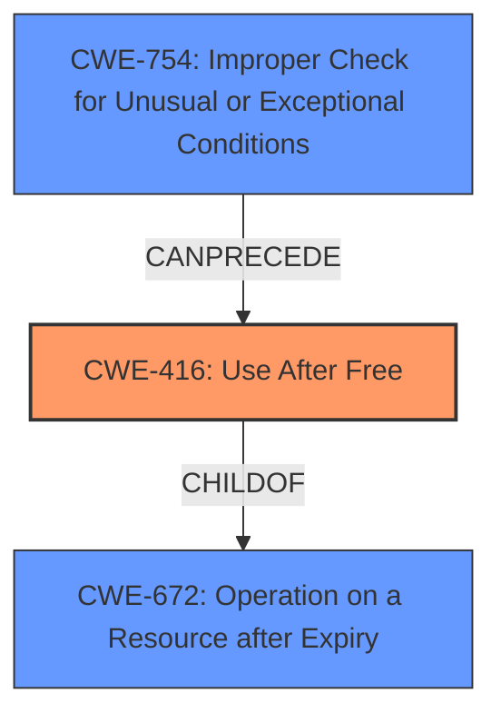

# Final Resolution for CVE-2022-0646

# Summary
| CWE ID | CWE Name | Confidence | CWE Abstraction Level | CWE Vulnerability Mapping Label | CWE-Vulnerability Mapping Notes |
|---|---|---|---|---|---|
| CWE-416 | Use After Free | 1.0 | Variant | Allowed | Primary CWE. The vulnerability is a **use-after-free** condition in the Linux kernel MCTP subsystem. |

## Evidence and Confidence

*   **Confidence Score:** 1.0
*   **Evidence Strength:** HIGH

## Relationship Analysis
The primary relationship that impacted the decision was the parent-child relationship between CWE-672 (Operation on Resource after Expiry) and CWE-416 (**Use After Free**). While CWE-672 is a parent of CWE-416, CWE-416 is more specific and therefore more appropriate. There's also a potential chain relationship where CWE-754 (Improper Check for Unusual or Exceptional Conditions) can precede CWE-416, but the evidence for this chain is weaker, and the primary cause is the **use-after-free** condition itself.

## Vulnerability Chain
The vulnerability chain starts with the improper timing of `cancel_work_sync` after `unregister_netdev`, leading to the use of an invalid net device pointer.
  - **Root Cause:** Improper timing of resource release and subsequent operation.
  - **Weakness:** **Use-after-free** (CWE-416).
  - **Impact:** System crash or privilege escalation.
There might be a missing link, such as a lack of proper checks (CWE-754) before calling `cancel_work_sync`, but this is not explicitly stated.

## Summary of Analysis
The initial analysis is accurate and well-justified. The vulnerability description clearly indicates a "**flaw use after free**" condition, making CWE-416 the most appropriate classification. The evidence strength is high due to the explicit mention of "**use-after-free**" and the CVE reference detailing the root cause and fix. The graph relationships support this decision, with CWE-416 being a more specific child of the broader CWE-672. The assessment is primarily based on the direct evidence provided in the vulnerability description.
The reasoning for selecting CWE-416 at the Variant level is due to its specificity in describing the **use-after-free** condition, which is the core of the vulnerability. Other potential CWEs, such as CWE-754, could be considered as contributing factors, but they are not the primary cause.