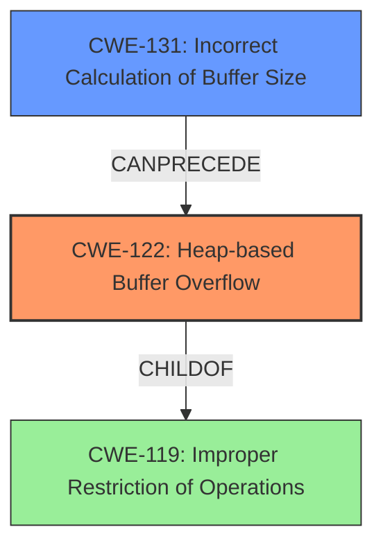

# Analysis Report for CVE-2022-0676

# Vulnerability Analysis Report: CVE-2022-0676

## Description

Heap-based Buffer Overflow in GitHub repository radareorg/radare2 prior to 5.6.4.

## Vulnerability Description Key Phrases

**Weakness:** Heap-based Buffer Overflow
**Product:** radareorg/radare2
**Version:** prior to 5.6.4

## Analysis (with Relationship Data)

# Summary
| CWE ID | CWE Name | Confidence | CWE Abstraction Level | CWE Vulnerability Mapping Label | CWE-Vulnerability Mapping Notes |
|---|---|---|---|---|---|
| CWE-122 | Heap-based Buffer Overflow | 0.95 | Variant | Primary | Allowed |
| CWE-131 | Incorrect Calculation of Buffer Size | 0.75 | Base | Secondary | Allowed |

## Evidence and Confidence

*   **Confidence Score:** 0.90
*   **Evidence Strength:** HIGH

- **Analysis and Justification:**  
  - *Explanation:* The vulnerability is described as a "**Heap-based Buffer Overflow**" in radare2. The "CVE Reference Links Content Summary" elaborates that the **root cause** is an "**incorrect calculation of the size of data** to be read while parsing the dyldcache." This aligns directly with CWE-122 (Heap-based Buffer Overflow), which is a buffer overflow occurring in the heap portion of memory. The description also mentioned "**incorrect calculation of the size of data**", which aligns with CWE-131. CWE-122 is chosen as the primary CWE because the description explicitly mentions "Heap-based Buffer Overflow." The Retriever Results also list CWE-122 with high scores.
  
  - *Relationship Analysis:* CWE-122 is a variant of CWE-119 (Improper Restriction of Operations within the Bounds of a Memory Buffer). CWE-131 (Incorrect Calculation of Buffer Size) can precede CWE-119 and hence CWE-122.

- **Confidence Score:**  
  - *Example:* Confidence: 0.95 (High confidence due to explicit mention of "Heap-based Buffer Overflow" and supporting details about size calculation errors).

---

## Criticism of Analysis

Okay, I've reviewed the analysis of the heap-based buffer overflow vulnerability in radare2 using the provided CWE specifications. Here's my critique:

**Overall Assessment:**

The analysis correctly identifies the primary vulnerability as CWE-122 (Heap-based Buffer Overflow).  The inclusion of CWE-131 (Incorrect Calculation of Buffer Size) as a secondary CWE is also appropriate and strengthens the analysis by highlighting the root cause. The confidence scores are reasonable.

**Detailed Critique:**

*   **CWE-122: Heap-based Buffer Overflow**

    *   **Correctness:** The mapping to CWE-122 is accurate and well-supported by the vulnerability description, which explicitly mentions "Heap-based Buffer Overflow." The description in the "CVE Reference Links Content Summary" confirms the location of the overflow in the heap.
    *   **Abstraction Level:** CWE-122 is a Variant, which is the preferred abstraction level for mapping to root causes, as stated in the CWE specification's "Mapping Guidance."
    *   **Mitigation:** The analysis doesn't explicitly mention mitigations. The CWE specification for CWE-122 suggests mitigations such as:
        *   Using a language or compiler with automatic bounds checking.
        *   Using an abstraction library for risky APIs.
        *   Using automatic buffer overflow detection mechanisms.
        These could be added to the analysis for completeness.
    *   **Observed Examples:** The list of observed examples helps validate the mapping, showing similar vulnerabilities that have been categorized as CWE-122.
*   **CWE-131: Incorrect Calculation of Buffer Size**

    *   **Correctness:** The mapping to CWE-131 is also accurate. The "CVE Reference Links Content Summary" clearly states that the vulnerability is caused by an "incorrect calculation of the size of data to be read."
    *   **Abstraction Level:** CWE-131 is a Base CWE, which aligns with the goal of identifying the root cause.
    *   **Mapping Notes:** The analysis correctly identifies that CWE-131 can precede CWE-119 (and therefore CWE-122).
    *   **Mitigation:** The analysis doesn't explicitly mention mitigations for CWE-131. According to the CWE specification, potential mitigations include:
        *   Allocating enough memory for the largest possible encoding when transforming data.
        *   Understanding the programming language's underlying representation and how it interacts with numeric calculations.
        *   Performing input validation on any numeric input to ensure it's within the expected range.
        These mitigations could be added.
    *   **Observed Examples:** The examples provided are valid and demonstrate scenarios where CWE-131 leads to memory corruption.
*   **CWE-787**
    *   While the analysis doesn't explicitly mention CWE-787, and I'm not suggesting to add it. The Retriever Results list it as a top CWE. It is worth noting the relationships between CWE-122 and CWE-787 which are out-of-bounds write and heap-based buffer overflow respectively. According to CWE Specifications, CWE-122 is a child of CWE-787.

**Suggested Improvements:**

1.  **Explicitly Mention Mitigations:** Add a section on potential mitigations for both CWE-122 and CWE-131, drawing from the CWE specifications.  This enhances the analysis's practical value.
2.  **Expanded Explanation of CWE-131's Role:** While the analysis correctly identifies CWE-131, consider elaborating on *how* the incorrect size calculation leads to the overflow.  What specific calculation was wrong? What input values could trigger the error?  This makes the analysis more concrete.
3.  **Consider Chaining Relationships:** The analysis notes that CWE-131 *can precede* CWE-122. Explicitly stating this chain in the summary table could be useful: "CWE-131: Incorrect Calculation of Buffer Size -> CWE-122: Heap-based Buffer Overflow"
4.  **Review Retriever Results:** Although the primary and secondary CWEs are well-justified, the Retriever Results list other potentially relevant CWEs. While they might not be the *best* fit, consider briefly discussing *why* they are not more appropriate, especially the top results like CWE-805 (Buffer Access with Incorrect Length Value) and CWE-130 (Improper Handling of Length Parameter Inconsistency). What distinguishes this case from those CWEs?

**Example Additions:**

*Mitigation (CWE-122):*
"To mitigate this vulnerability, developers should employ automatic buffer overflow detection mechanisms, utilize languages with automatic bounds checking, and consider using abstraction libraries for memory management."

*Mitigation (CWE-131):*
"To prevent this vulnerability, developers should ensure that buffer sizes are calculated correctly, paying close attention to potential integer overflows or truncations. Input validation should be performed on any numeric input used in size calculations."

**Revised Summary Table:**

| CWE ID  | CWE Name                               | Confidence | CWE Abstraction Level | CWE Vulnerability Mapping Label | CWE-Vulnerability Mapping Notes                                                                |
| :------ | :------------------------------------- | :--------- | :---------------------- | :------------------------------ | :--------------------------------------------------------------------------------------------- |
| CWE-122 | Heap-based Buffer Overflow               | 0.95       | Variant                 | Primary                         | Allowed                                                                                        |
| CWE-131 | Incorrect Calculation of Buffer Size | 0.75       | Base                    | Secondary                       | Allowed, Contributes to the root cause of the overflow. CWE-131 -> CWE-122                            |

**In conclusion,** the analysis is strong, particularly in identifying the primary and secondary weaknesses. Adding more detail about mitigations and discussing other potentially relevant CWEs from the Retriever Results would further enhance its completeness and practical value.

## Final Resolution

# Summary
| CWE ID | CWE Name | Confidence | CWE Abstraction Level | CWE Vulnerability Mapping Label | CWE-Vulnerability Mapping Notes |
|---|---|---|---|---|---|
| **CWE-122** | Heap-based Buffer Overflow | 0.95 | Variant | Primary | Allowed |
| **CWE-131** | Incorrect Calculation of Buffer Size | 0.75 | Base | Secondary | Allowed, Contributes to the root cause of the overflow. **CWE-131** -> **CWE-122** |

## Evidence and Confidence

*   **Confidence Score:** 0.92
*   **Evidence Strength:** HIGH

## Relationship Analysis
The primary weakness is **CWE-122 (Heap-based Buffer Overflow)**, a variant of **CWE-119 (Improper Restriction of Operations within the Bounds of a Memory Buffer)**, indicating a memory corruption issue on the heap. The secondary weakness, **CWE-131 (Incorrect Calculation of Buffer Size)**, is a base CWE and can precede **CWE-122**, thus contributing to the root cause.

## Vulnerability Chain
The vulnerability chain starts with **CWE-131 (Incorrect Calculation of Buffer Size)**, where an incorrect size is calculated for a buffer allocation. This leads to **CWE-122 (Heap-based Buffer Overflow)** when data larger than the allocated buffer is written to the heap, causing a buffer overflow.

## Summary of Analysis
The initial analysis correctly identified **CWE-122 (Heap-based Buffer Overflow)** as the primary issue, supported by the explicit mention of "Heap-based Buffer Overflow" in the vulnerability description. The identification of **CWE-131 (Incorrect Calculation of Buffer Size)** as a secondary issue is also appropriate, as the "CVE Reference Links Content Summary" states the root cause is an "**incorrect calculation of the size of data**".

The relationships between the CWEs, particularly **CWE-131** preceding **CWE-122**, reinforce the classification. **CWE-122** is a Variant, which is a preferred level of abstraction, while **CWE-131** is a Base CWE, suitable for identifying the root cause.

The criticism suggested adding mitigations and explaining how the incorrect size calculation leads to the overflow. The suggestion of considering other potentially relevant CWEs from the Retriever Results is also valuable. The Retriever Results list **CWE-787 (Out-of-bounds Write)** as a top CWE. While **CWE-787** is related to **CWE-122**, **CWE-122** is more specific, as it indicates that the out-of-bounds write is a heap-based buffer overflow. **CWE-130 (Improper Handling of Length Parameter Inconsistency)** and **CWE-805 (Buffer Access with Incorrect Length Value)** were also listed as top results. **CWE-130** is too generic and less descriptive than **CWE-131**, while **CWE-805** describes the consequence but not the cause, which is the incorrect calculation of the buffer size.

Therefore, the selected CWEs are at the optimal level of specificity and provide a clear understanding of the vulnerability.

*Report generated on 2025-03-18 06:15:24*
