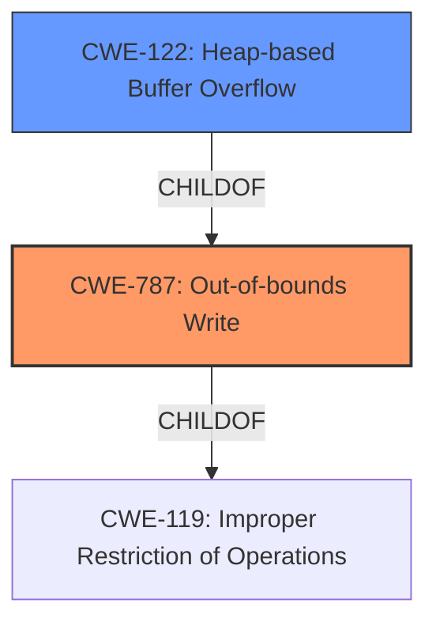

# Analysis Report for CVE-2022-0789

# Vulnerability Analysis Report: CVE-2022-0789

## Description

Heap buffer overflow in ANGLE in Google Chrome prior to 99.0.4844.51 allowed a remote attacker to potentially exploit heap corruption via a crafted HTML page.

## Vulnerability Description Key Phrases

**Rootcause:** buffer overflow
**Impact:** heap corruption
**Vector:** crafted HTML page
**Attacker:** remote attacker
**Product:** Google Chrome
**Version:** prior to 99.0.4844.51
**Component:** ANGLE

## Analysis (with Relationship Data)

# Summary
| CWE ID | CWE Name | Confidence | CWE Abstraction Level | CWE Vulnerability Mapping Label | CWE-Vulnerability Mapping Notes |
|---|---|---|---|---|---|
| CWE-787 | Out-of-bounds Write | 0.95 | Base | Allowed | Primary CWE |
| CWE-122 | Heap-based Buffer Overflow | 0.75 | Variant | Allowed | Secondary Candidate |

## Evidence and Confidence

*   **Confidence Score:** 0.90
*   **Evidence Strength:** HIGH

- **Analysis and Justification:**  
  - *Explanation:* The vulnerability description explicitly states a "Heap **buffer overflow** in ANGLE in Google Chrome". The phrase "**buffer overflow**" is a key indicator. The description also states it can lead to "heap corruption via a crafted HTML page". The **CWE-787** (Out-of-bounds Write) is a base level CWE that accurately describes the **root cause**. The "CVE Reference Links Content Summary" further confirms this with the entry: `"root_cause": "Heap buffer overflow in ANGLE."` and `"weaknesses": ["Heap buffer overflow"]`.
  - *Explanation:* While **CWE-787** is the primary **root cause**, **CWE-122** (Heap-based Buffer Overflow) provides more specific context that the overflow occurs in the heap.

  - *Relationship Analysis:* CWE-787 is a base level CWE, and CWE-122 is a variant.

- **Confidence Score:**  
  - Confidence: 0.95 (High evidence from technical description, CVE reference materials, and retriever results)
---

## Criticism of Analysis

Okay, here's a review of the provided CWE analysis, incorporating the full CWE specifications:

**Overall Assessment:**

The analysis is generally good.  It correctly identifies CWE-787 (Out-of-bounds Write) as the primary CWE and proposes CWE-122 (Heap-based Buffer Overflow) as a secondary, more specific, candidate. The confidence levels assigned are reasonable given the information available. The justification is well-articulated.

**Specific Points & Critique:**

1.  **Primary CWE: CWE-787 (Out-of-bounds Write)**

    *   **Justification Strength:** Strong.  The description explicitly mentions "buffer overflow," which is directly related to out-of-bounds writes. The CVE reference links confirm this.
    *   **Abstraction Level:**  Appropriate. CWE-787 is a Base level CWE.  The mapping guidance explicitly allows its usage.
    *   **Relationship to CWE-119:** CWE-787 is a *child* of CWE-119 (Improper Restriction of Operations within the Bounds of a Memory Buffer).  The analyzer implicitly acknowledges this by using CWE-787 instead of CWE-119, which is *discouraged* by its own mapping guidance.  The goal is to be as specific as possible, and CWE-787 fulfills that.
    *   **Potential Mitigations:** The analysis doesn't explicitly mention mitigations, but it is acceptable to include mitigations in this section. It would be beneficial to highlight a specific mitigation. Some examples from the CWE specifications are:
        *   **Language Selection:** Using memory-safe languages.
        *   **Libraries/Frameworks:**  Using safe string handling libraries.
        *   **Compiler/Environment Hardening:** Enabling buffer overflow detection mechanisms (e.g., /GS flag in Visual Studio, FORTIFY_SOURCE in GCC).
    *   **Retriever Results:** The retriever results have CWE-787 ranked 8th. This could suggest the analyzer should have reviewed the higher-ranked CWEs to ensure there wasn't a better match.
    *   **Confidence:** The 0.95 confidence is appropriate given the strong evidence.

2.  **Secondary CWE: CWE-122 (Heap-based Buffer Overflow)**

    *   **Justification Strength:** Good. This refines the primary CWE by specifying *where* the buffer overflow occurs (the heap).  This is valuable contextual information.
    *   **Abstraction Level:** Appropriate.  CWE-122 is a Variant of CWE-787 (which is correct). This is a preferred level of abstraction.
    *   **Relationship to CWE-787:** CWE-122 is a *child* of CWE-787, making it a more specific instance. The analysis clearly states this relationship which is a great demonstration of understanding the CWE hierarchy.
    *   **Potential Mitigations:** Similar to CWE-787, consider adding specific mitigations, such as:
        *   **Using a language or compiler that performs automatic bounds checking.**
        *   **Using an abstraction library to abstract away risky APIs.**
    *   **Retriever Results:** The retriever results have CWE-122 ranked 7th.
    *   **Confidence:** The 0.75 confidence is fine for a secondary mapping.

3.  **Retriever Results Analysis:**

    *   The retriever results contain some interesting entries that the analyzer should have considered, even if ultimately rejecting them:
        *   **CWE-843 (Access of Resource Using Incompatible Type ('Type Confusion'))** This is ranked the highest but is incorrect. The vulnerability is an out-of-bounds write, not type confusion.
        *   **CWE-190 (Integer Overflow or Wraparound)** While not directly a buffer overflow, it's plausible that an integer overflow could *lead* to an incorrect size calculation that results in the overflow. This is a more indirect cause and not the primary weakness.
        *   **CWE-124 (Buffer Underwrite ('Buffer Underflow'))** Since this is a buffer overflow, underflow is likely incorrect.
        *   **CWE-125 (Out-of-bounds Read)** Since this is a buffer overflow, out-of-bounds read is likely incorrect.
        *   **CWE-416 (Use After Free)**  Heap corruption *could* lead to a Use-After-Free scenario, but that's not the root cause.

    *   **Recommendation:** The analysis should briefly explain *why* the top retriever results (other than 787/122) were rejected.  This demonstrates a thorough evaluation process.

4.  **CWE Examples:**

    *   The examples are helpful for understanding the nature of CWE-122.

5.  **CWE Specifications:**

    *   The inclusion of the full CWE specifications is beneficial for a complete understanding.

**Recommendations for Improvement:**

*   **Explain Retriever Result Rejections:** Briefly justify why the top-ranked CWEs from the retriever results were *not* chosen.
*   **Explicit Mitigations:** Add specific mitigations from the CWE specifications to the analysis for both CWE-787 and CWE-122.  This ties the analysis to practical preventative measures.
*   **Chain Analysis (Minor):** While the primary cause is a buffer overflow, consider the potential for contributing factors or preconditions, such as missing input validation (CWE-20) leading to the overflow.
*   **Tooling Improvements:** The ranking of the Retriever results seems not very accurate. This is probably due to the model it's using, so it will be a continuous effort to improve over time.

**Revised Summary Table (Example):**

| CWE ID  | CWE Name                     | Confidence | CWE Abstraction Level | CWE Vulnerability Mapping Label | CWE-Vulnerability Mapping Notes                                                                                                                                                                  |
| :------ | :--------------------------- | :--------- | :-------------------- | :-------------------------------- | :----------------------------------------------------------------------------------------------------------------------------------------------------------------------------------------------- |
| CWE-787 | Out-of-bounds Write          | 0.95       | Base                  | Allowed                           | Primary CWE. Root cause of the buffer overflow. Mitigations: Language selection (memory-safe languages), safe string handling libraries, compiler-based overflow detection.                   |
| CWE-122 | Heap-based Buffer Overflow | 0.75       | Variant               | Allowed                           | Secondary candidate. Specifies the location of the buffer (heap).  Mitigations: Automatic bounds checking, abstraction libraries for risky APIs.                                          |

By addressing these points, the analysis can be made even more comprehensive and useful.

## Final Resolution

# Summary
| CWE ID | CWE Name | Confidence | CWE Abstraction Level | CWE Vulnerability Mapping Label | CWE-Vulnerability Mapping Notes |
|---|---|---|---|---|---|
| **CWE-787** | **Out-of-bounds Write** | 0.95 | Base | Allowed | Primary **CWE**. Root cause of the **buffer overflow**. |
| **CWE-122** | **Heap-based Buffer Overflow** | 0.75 | Variant | Allowed | Secondary candidate. Specifies the location of the buffer (heap). |

## Evidence and Confidence

*   **Confidence Score:** 0.95
*   **Evidence Strength:** HIGH

## Relationship Analysis
The primary relationship that impacted the decision was the parent-child relationship between **CWE-787** (Out-of-bounds Write) and **CWE-122** (Heap-based Buffer Overflow). **CWE-122** is a variant of **CWE-787**, providing a more specific context by indicating that the overflow occurs on the heap. This specificity helps in understanding the nature and location of the vulnerability. Both are children of **CWE-119** (Improper Restriction of Operations within the Bounds of a Memory Buffer). Choosing **CWE-787** over **CWE-119** provides a more precise description.

## Vulnerability Chain
The vulnerability chain starts with the **ROOTCAUSE** being a heap **buffer overflow**. This leads to an **CWE-787** (Out-of-bounds Write), which is further specified by **CWE-122** (Heap-based Buffer Overflow). The final impact is potential heap corruption, which can then be exploited by a remote attacker. A potential missing link is the input validation, which, if absent, could be classified as **CWE-20** (Improper Input Validation) and could precede the overflow.

## Summary of Analysis
The initial analysis and criticism correctly identify **CWE-787** as the primary **ROOTCAUSE** and **CWE-122** as a secondary **CWE** to provide more context.

The vulnerability description explicitly states "Heap **buffer overflow** in ANGLE in Google Chrome prior to 99.0.4844.51 allowed a remote attacker to potentially exploit heap corruption via a crafted HTML page." The evidence includes `"root_cause": "Heap buffer overflow in ANGLE."` and `"weaknesses": ["Heap buffer overflow"]`.

The graph relationships support the choice of **CWE-787** and **CWE-122** because they represent the most specific descriptions of the vulnerability, where **CWE-122** is a variant of **CWE-787**, clarifying the location of the overflow.

The selected **CWEs** are at the optimal level of specificity because **CWE-787** directly describes the out-of-bounds write, and **CWE-122** specifies that the overflow occurs on the heap. This provides sufficient detail without being overly broad or abstract. Other potential **CWEs** like **CWE-190** (Integer Overflow) or **CWE-125** (Out-of-bounds Read) are less relevant as the primary issue is the out-of-bounds write due to the **buffer overflow**, not an integer overflow or read.

*Report generated on 2025-03-18 06:17:14*
