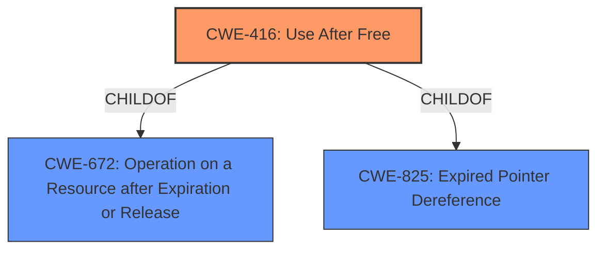

# Final Resolution for CVE-2022-0794

# Summary
| CWE ID | CWE Name | Confidence | CWE Abstraction Level | CWE Vulnerability Mapping Label | CWE-Vulnerability Mapping Notes |
|---|---|---|---|---|---|
| CWE-416 | Use After Free | 1.0 | Variant | Allowed | Primary CWE |

## Evidence and Confidence

*   **Confidence Score:** 1.0
*   **Evidence Strength:** HIGH

## Relationship Analysis
The primary relationship considered was the parent-child relationship between CWE-416 (**Use After Free**) and its parents, particularly CWE-672 (Operation on Resource After Expiry). While CWE-672 is a broader class, CWE-416 provides a more specific description that aligns perfectly with the vulnerability. Other potential relationships, such as those involving race conditions (CWE-362) or double frees (CWE-415), were considered but deemed less relevant as the core issue is the use of freed memory. The Variant level of CWE-416 is ideal for accurately representing the root cause.

## Vulnerability Chain
The vulnerability chain starts with the **ROOTCAUSE** being a **CWE-416 (Use After Free)** condition. The freed memory is then potentially reallocated and reused, leading to **heap corruption**, as stated in the vulnerability description. This **heap corruption** can have various impacts, including arbitrary code execution, which is not explicitly stated but a common consequence. The chain is: CWE-416 -> Heap Corruption -> Potential for other CWEs like Out-of-bounds Write (CWE-787) or Write-What-Where Condition (CWE-123), potentially leading to code execution.

## Summary of Analysis
The initial analysis correctly identified **CWE-416 (Use After Free)** as the primary weakness. The vulnerability description explicitly mentions "**use after free**" and "**heap corruption**," providing strong evidence for this classification. The analysis also considered other CWEs from the retriever results but correctly determined that **CWE-416** is the most specific and accurate representation of the **ROOTCAUSE**.

The graph relationships influenced the decision by highlighting the parent-child relationship between **CWE-416** and **CWE-672 (Operation on a Resource after Expiration or Release)**. While **CWE-672** is related, it is a class-level CWE, and **CWE-416**, being a variant, provides a more precise characterization of the vulnerability. The selection of **CWE-416** is at the optimal level of specificity, as it directly addresses the core issue of using memory after it has been freed, leading to potential **heap corruption**. The evidence from the vulnerability description and the retriever scores strongly support this decision. The vulnerability description mentions "Use after free in WebShare in Google Chrome prior to 99.0.4844.51 allowed a remote attacker who convinced a user to engage in specific user interaction to potentially exploit heap corruption via a crafted HTML page."