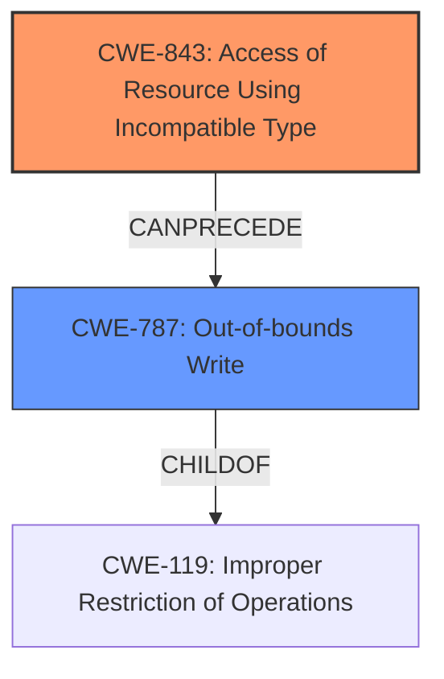

# Final Resolution for CVE-2022-0795

# Summary
| CWE ID | CWE Name | Confidence | CWE Abstraction Level | CWE Vulnerability Mapping Label | CWE-Vulnerability Mapping Notes |
|---|---|---|---|---|---|
| CWE-843 | Access of Resource Using Incompatible Type ('Type Confusion') | 0.95 | Base | Allowed | Primary CWE |
| CWE-787 | Out-of-bounds Write | 0.50 | Base | Allowed | Secondary Candidate |

## Evidence and Confidence

*   **Confidence Score:** 0.80
*   **Evidence Strength:** MEDIUM

## Relationship Analysis
The primary relationship considered is the potential chain from **CWE-843** to **CWE-787**. **CWE-843** describes the **WEAKNESS** of type confusion, which can lead to memory corruption, often manifesting as an out-of-bounds write (**CWE-787**). While **CWE-416** was initially considered, the evidence for it is weaker than for **CWE-787**, given that the vulnerability description explicitly mentions "heap corruption". **CWE-787** is a child of **CWE-119**, which is a broader term that is not recommended to use directly.

## Vulnerability Chain
The vulnerability chain starts with **CWE-843**, the **ROOTCAUSE** of type confusion in Blink Layout. This leads to heap corruption, which can manifest as **CWE-787**, an out-of-bounds write. The sequence is: Type Confusion -> Heap Corruption -> Out-of-bounds Write. There is no explicit mention of a use-after-free condition (**CWE-416**), making **CWE-787** a more likely secondary candidate.

## Summary of Analysis
The initial analysis correctly identified **CWE-843** as the primary **WEAKNESS**. The criticism highlighted the speculative nature of **CWE-416** and suggested considering **CWE-787** or **CWE-122** as alternatives. The final determination favors **CWE-787** because heap corruption often manifests as an out-of-bounds write, which is a more direct consequence than a use-after-free.

The assessment is based on the provided evidence, including the vulnerability description ("Type confusion in Blink Layout...allowed a remote attacker to potentially exploit heap corruption") and the CVE Reference Links Content Summary ("Type confusion, which occurs when a program attempts to use a data object as a type different from the one it was declared as").

The graph relationships influenced the final selection by emphasizing the chain from type confusion to heap corruption and then to an out-of-bounds write.

**CWE-843** and **CWE-787** are at the optimal level of specificity because they are both Base level CWEs that accurately describe the **ROOTCAUSE** and a likely consequence of the vulnerability.