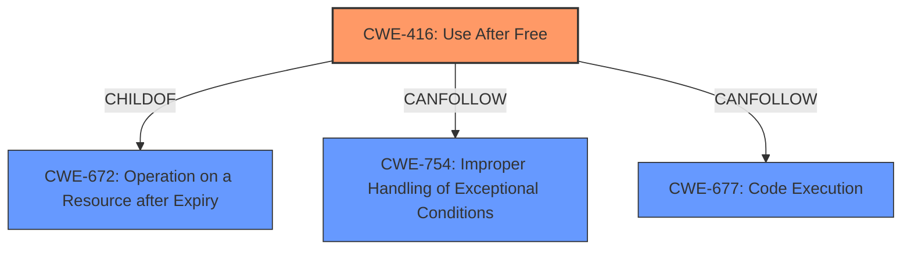

# Analysis Report for CVE-2022-0796

# Vulnerability Analysis Report: CVE-2022-0796

## Description

Use after free in Media in Google Chrome prior to 99.0.4844.51 allowed a remote attacker to potentially exploit heap corruption via a crafted HTML page.

## Vulnerability Description Key Phrases

**Weakness:** use after free
**Impact:** heap corruption
**Vector:** crafted HTML page
**Attacker:** remote attacker
**Product:** Google Chrome
**Version:** prior to 99.0.4844.51
**Component:** Media

## Analysis (with Relationship Data)

# Summary
| CWE ID | CWE Name | Confidence | CWE Abstraction Level | CWE Vulnerability Mapping Label | CWE-Vulnerability Mapping Notes |
|---|---|---|---|---|---|
| CWE-416 | Use After Free | 1.0 | Variant | Allowed | The vulnerability is a use-after-free, and this CWE is a direct match. |

## Evidence and Confidence

*   **Confidence Score:** 1.0
*   **Evidence Strength:** HIGH

- **Analysis and Justification:**  
  - *Explanation:* "The vulnerability description clearly states a **use after free** condition in the Media component of Google Chrome. The 'CVE Reference Links Content Summary' confirms this as the root cause. CWE-416 (Use After Free) is a Variant level CWE that precisely describes this type of weakness, where memory is reused or referenced after it has been freed. The crafted HTML page is the attack vector, and the heap corruption is the impact. Given the direct match in the vulnerability description and summary, CWE-416 is the most appropriate mapping. The MITRE mapping guidance for CWE-416 indicates that its usage is ALLOWED."
  
  - *Relationship Analysis:* "CWE-416 is a variant of CWE-672 (Operation on a Resource after Expiry). The relationships indicate that CWE-416 can lead to CWE-754 (Improper Handling of Exceptional Conditions)."

- **Confidence Score:**  
  - Confidence: 1.0 (The vulnerability description and summary directly indicate a use-after-free condition.)

## Criticism of Analysis

Okay, here's a detailed review of the analysis provided, incorporating the full CWE specifications:

**Overall Assessment:**

The analysis correctly identifies CWE-416 (Use After Free) as the primary weakness.  The reasoning is sound, and the confidence score of 1.0 is justified based on the information available. The provided evidence is high, and the explanation is clear.

**Detailed Breakdown:**

*   **Summary Table:**  The summary table is well-formatted and clearly states the primary CWE and its confidence level. The "CWE Abstraction Level" correctly identifies it as a Variant. The "CWE Vulnerability Mapping Label" is correct as "Allowed." The note clearly and succinctly explains why the mapping is appropriate.

*   **Evidence and Confidence:**
    *   **Confidence Score:** 1.0 - Appropriate and justified.
    *   **Evidence Strength:** HIGH - Correct. The description and content summary directly align with the definition of a use-after-free vulnerability.
    *   **Analysis and Justification:**
        *   The explanation is well-written and accurately connects the vulnerability description to the definition of CWE-416.  It highlights the key phrases like "use after free condition," "Media component," "crafted HTML page," and "heap corruption" and explains their relevance.
        *   The MITRE mapping guidance for CWE-416 is also correctly cited.
    *   **Relationship Analysis:**
        *   The relationship analysis is accurate.  CWE-416 is indeed a child of CWE-672 (Operation on a Resource after Expiry) and can precede CWE-754 (Improper Handling of Exceptional Conditions).

*   **CWE Examples from Database:**  The inclusion of known examples is helpful in demonstrating real-world instances of CWE-416. These examples are well-chosen and relevant.

*   **Relevant CWE Specifications:** The full CWE specifications provided are crucial for understanding the context and nuances of each potential CWE.

**Critique of Retriever Results and Potential Alternative CWEs:**

While CWE-416 is the most appropriate primary CWE, let's examine why other CWEs from the Retriever Results list were *not* chosen and whether they might play a secondary role or be part of a vulnerability chain:

1.  **CWE-366: Race Condition within a Thread:** The description doesn't explicitly mention threads or concurrency.  Without that, this CWE is not a direct fit.  However, it's *possible* that the "Media component" uses multiple threads internally, and a race condition could contribute to the use-after-free.  If more information emerges about threading within the Media component, this could be a *contributing* factor, but not the primary weakness. It's important to note that some "use-after-free" conditions are a result of a race.

2.  **CWE-843: Access of Resource Using Incompatible Type ('Type Confusion'):** Type confusion is not directly mentioned, so it's correctly excluded.  A UAF can *lead* to type confusion if the freed memory is reallocated with a different type and then accessed using the original pointer. But this is a *consequence* of the UAF, not the root cause.

3.  **CWE-415: Double Free:**  The vulnerability description indicates a *use* after a free, not a double free, so this is correctly excluded.  These two often coexist in a program, but the main vulnerability is the Use-After-Free.

4.  **CWE-356: Product UI does not Warn User of Unsafe Actions, and CWE-451: User Interface (UI) Misrepresentation of Critical Information:**  These relate to UI vulnerabilities, which is not what is being described in the original analysis. These would be completely unrelated.

5.  **CWE-122: Heap-based Buffer Overflow:** While heap corruption is mentioned as an impact, the root cause is the use of freed memory, not writing beyond the bounds of an allocated buffer.  A UAF can *lead* to heap corruption, potentially including a buffer overflow, if the freed memory is reallocated.

6.  **CWE-125: Out-of-bounds Read:** Similar to CWE-122, this could be a consequence of the UAF if the freed memory is reallocated and then read out of bounds using the dangling pointer. But this is not the root cause.

7.  **CWE-367: Time-of-check Time-of-use (TOCTOU) Race Condition:** This is a more specific type of race condition, and without any indication of a check-then-use scenario related to the freed memory, it's not applicable.

8.  **CWE-190: Integer Overflow or Wraparound:** No mention of integers or calculations, so this is unrelated.

**Potential Mitigations (based on the CWE specifications):**

The provided analysis does not include mitigations, but it is good to provide relevant mitigations for CWE-416.

*   **CWE-416 Mitigations:**
    *   **Language Selection (Architecture & Design):** Choosing a language with automatic memory management (e.g., Java, Go, Rust with appropriate lifetime management) can prevent UAF vulnerabilities.  This is a strong mitigation at the design level.
    *   **Setting Pointers to NULL (Implementation, Defense in Depth):**  After freeing memory, setting the pointer to `NULL` makes it less likely that the program will accidentally dereference the freed memory.  However, this relies on all code paths that might access the pointer to check for `NULL`.

**Recommendations:**

1.  **Consider Secondary CWEs in the Chain (with Lower Confidence):**  If there's evidence of concurrency in the vulnerable Media component, adding CWE-366 as a secondary, contributing CWE with a lower confidence score (e.g., 0.3) might be appropriate. However, this requires further investigation.
2.  **Add Potential Mitigations:**  Include the relevant mitigations for CWE-416 in the analysis. This would add practical value to the assessment.
3.  **Clarify Impact:** While heap corruption is mentioned, it would be helpful to further elaborate on the potential impact.  Specifically, mention the potential for arbitrary code execution.
4.   **Consider Adding relationships for Code Execution:**  Because Use-After-Free can lead to code execution, it would be helpful to note the relationship with CWE-677:  (Operation on a Deallocated Resource) --> CWE-677: (Code Execution).
5.  **Briefly Address Unlikely But Still Top CWEs:** Justify why other top CWEs from the Retriever results are not applicable, even if briefly.

**Revised Summary Table (Example with Added Mitigation):**

| CWE ID  | CWE Name         | Confidence | CWE Abstraction Level | CWE Vulnerability Mapping Label | CWE-Vulnerability Mapping Notes                                                                                                                                                                                                                                                            |
| :------- | :--------------- | :--------- | :-------------------- | :----------------------------- | :------------------------------------------------------------------------------------------------------------------------------------------------------------------------------------------------------------------------------------------------------------------------------------------------- |
| CWE-416 | Use After Free   | 1.0        | Variant               | Allowed                        | The vulnerability is a use-after-free, and this CWE is a direct match.  Mitigation:  After freeing memory, set the pointer to NULL to help prevent accidental dereferences. Consider automatic memory management languages in future designs.                                                           |
| (Optionally) CWE-366 | Race Condition within a Thread   | 0.3        | Base               | Allowed-with-Review                        | The vulnerability *may* be affected by a race condition within the media processing. Additional analysis needed to determine if multiple threads access the freed resource without proper synchronization.                                                           |

By incorporating these suggestions, the analysis will become more comprehensive and actionable. The core assessment of CWE-416 remains correct and well-supported.

## Final Resolution

# Summary
| CWE ID | CWE Name | Confidence | CWE Abstraction Level | CWE Vulnerability Mapping Label | CWE-Vulnerability Mapping Notes |
|---|---|---|---|---|---|
| CWE-416 | Use After Free | 1.0 | Variant | Allowed | The vulnerability is a **use-after-free**, and this CWE is a direct match. Mitigation: After freeing memory, set the pointer to NULL to help prevent accidental dereferences. Consider automatic memory management languages in future designs. |

## Evidence and Confidence

*   **Confidence Score:** 1.0
*   **Evidence Strength:** HIGH

## Relationship Analysis
The primary CWE is CWE-416, which is a variant of CWE-672 (Operation on a Resource after Expiry). CWE-416 can precede CWE-754 (Improper Handling of Exceptional Conditions) and can lead to code execution (CWE-677).

## Vulnerability Chain
The vulnerability chain starts with a **use-after-free** (**CWE-416**) in the Media component of Google Chrome, triggered by a crafted HTML page. This leads to heap corruption, potentially resulting in arbitrary code execution (**CWE-677**).

## Summary of Analysis
The initial analysis correctly identifies **CWE-416** as the primary weakness. The vulnerability description explicitly states a **use-after-free** condition, which aligns directly with the definition of **CWE-416**. The provided evidence is strong, and the reasoning is sound.

The criticism provided a detailed review and suggests considering secondary CWEs such as **CWE-366** (Race Condition within a Thread) if there is evidence of concurrency in the vulnerable Media component. However, without further evidence of concurrency, it is not appropriate to include **CWE-366**. The criticism also suggests adding potential mitigations for **CWE-416**, which has been incorporated into the summary table. The suggestion to clarify the impact and note the relationship with code execution (**CWE-677**) is also valuable. The retriever results show that several other CWEs such as **CWE-415**, **CWE-122**, **CWE-125**, **CWE-190** could be applicable, but are not because the **root cause** described is **CWE-416**, and the other vulnerabilities may be consequences of this vulnerability.

The selected CWE is at the optimal level of specificity because **CWE-416** is a Variant level CWE that precisely describes the **use-after-free** condition.

*Report generated on 2025-03-18 06:20:32*
