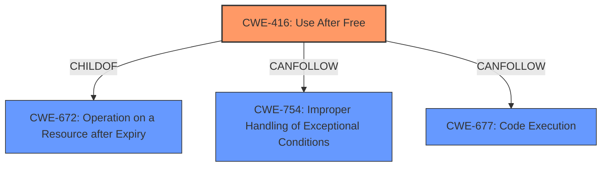

# Final Resolution for CVE-2022-0796

# Summary
| CWE ID | CWE Name | Confidence | CWE Abstraction Level | CWE Vulnerability Mapping Label | CWE-Vulnerability Mapping Notes |
|---|---|---|---|---|---|
| CWE-416 | Use After Free | 1.0 | Variant | Allowed | The vulnerability is a **use-after-free**, and this CWE is a direct match. Mitigation: After freeing memory, set the pointer to NULL to help prevent accidental dereferences. Consider automatic memory management languages in future designs. |

## Evidence and Confidence

*   **Confidence Score:** 1.0
*   **Evidence Strength:** HIGH

## Relationship Analysis
The primary CWE is CWE-416, which is a variant of CWE-672 (Operation on a Resource after Expiry). CWE-416 can precede CWE-754 (Improper Handling of Exceptional Conditions) and can lead to code execution (CWE-677).

## Vulnerability Chain
The vulnerability chain starts with a **use-after-free** (**CWE-416**) in the Media component of Google Chrome, triggered by a crafted HTML page. This leads to heap corruption, potentially resulting in arbitrary code execution (**CWE-677**).

## Summary of Analysis
The initial analysis correctly identifies **CWE-416** as the primary weakness. The vulnerability description explicitly states a **use-after-free** condition, which aligns directly with the definition of **CWE-416**. The provided evidence is strong, and the reasoning is sound.

The criticism provided a detailed review and suggests considering secondary CWEs such as **CWE-366** (Race Condition within a Thread) if there is evidence of concurrency in the vulnerable Media component. However, without further evidence of concurrency, it is not appropriate to include **CWE-366**. The criticism also suggests adding potential mitigations for **CWE-416**, which has been incorporated into the summary table. The suggestion to clarify the impact and note the relationship with code execution (**CWE-677**) is also valuable. The retriever results show that several other CWEs such as **CWE-415**, **CWE-122**, **CWE-125**, **CWE-190** could be applicable, but are not because the **root cause** described is **CWE-416**, and the other vulnerabilities may be consequences of this vulnerability.

The selected CWE is at the optimal level of specificity because **CWE-416** is a Variant level CWE that precisely describes the **use-after-free** condition.