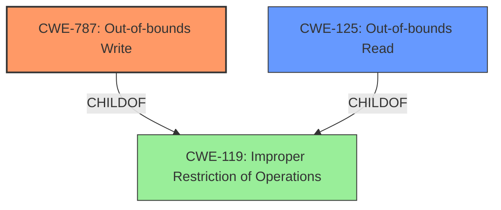

# Analysis Report for CVE-2022-0797

# Vulnerability Analysis Report: CVE-2022-0797

## Description

Out of bounds memory access in Mojo in Google Chrome prior to 99.0.4844.51 allowed a remote attacker to perform an out of bounds memory write via a crafted HTML page.

## Vulnerability Description Key Phrases

**Rootcause:** out of bounds memory access
**Weakness:** memory write
**Vector:** crafted HTML page
**Attacker:** remote attacker
**Product:** Google Chrome
**Version:** prior to 99.0.4844.51
**Component:** Mojo

## Analysis (with Relationship Data)

```markdown
# Summary
| CWE ID | CWE Name | Confidence | CWE Abstraction Level | CWE Vulnerability Mapping Label | CWE-Vulnerability Mapping Notes |
|---|---|---|---|---|---|
| CWE-787 | Out-of-bounds Write | 0.95 | Base | Allowed | Primary CWE |
| CWE-125 | Out-of-bounds Read | 0.70 | Base | Allowed | Secondary Candidate CWE |

## Evidence and Confidence

*   **Confidence Score:** 0.90
*   **Evidence Strength:** HIGH

- **Analysis and Justification:**  
  - *Explanation:* The vulnerability description explicitly states "Out of bounds **memory write** in Mojo in Google Chrome prior to 99.0.4844.51 allowed a remote attacker to perform an out of bounds **memory write** via a crafted HTML page." This directly corresponds to CWE-787, which is defined as "The product writes data past the end, or before the beginning, of the intended buffer." The CVE Reference Links Content Summary also highlights "Out of bounds memory access" as the root cause and "Out of bounds memory access" as a weakness. Given the explicit mention of a **memory write** and the root cause, CWE-787 is the most appropriate primary classification. The MITRE mapping guidance for CWE-787 is ALLOWED, solidifying this choice.
  
  - *Relationship Analysis:* CWE-787 is a base level CWE. It is a child of CWE-119 (Improper Restriction of Operations within the Bounds of a Memory Buffer). CWE-787 is also related to other buffer overflow/underflow conditions.

- **Confidence Score:**  
  - Confidence: 0.95 (High confidence due to direct match with vulnerability description and confirmation from CVE reference).

---
- **Analysis and Justification:**  
  - *Explanation:* While the primary issue is a write, the vulnerability description mentions "Out of bounds memory access" which could also imply a read. CWE-125 (Out-of-bounds Read) is defined as "The product reads data past the end, or before the beginning, of the intended buffer." It is included as a secondary candidate CWE because the initial memory access could have been a read that resulted in the condition that lead to the out-of-bounds write. However, the clear statement of an out-of-bounds **memory write** leads to it being classified as a secondary weakness.
  
  - *Relationship Analysis:* CWE-125 is a base level CWE and child of CWE-119. It is related to other memory access issues.

- **Confidence Score:**  
  - Confidence: 0.70 (Lower confidence because the vulnerability description focuses on the write.)
```

## Criticism of Analysis

Okay, I've reviewed the analysis provided against the full CWE specifications for the identified weaknesses. Here's a breakdown of my critique:

**Overall Assessment:**

The analysis is generally well-reasoned and makes a strong case for CWE-787 (Out-of-bounds Write) as the primary weakness. The inclusion of CWE-125 (Out-of-bounds Read) as a secondary candidate is also justifiable, given the broader context of "out of bounds memory access". The confidence levels assigned seem appropriate.

**Detailed Critique:**

*   **CWE-787: Out-of-bounds Write**

    *   **Confidence:** The analysis assigns a confidence of 0.95, which is reasonable given the clear statement of "memory write" in the vulnerability description.
    *   **Justification:** The explanation is well-structured and highlights the direct match between the vulnerability description and CWE-787's definition. It also correctly points out that the MITRE mapping guidance is ALLOWED.
    *   **Relationship Analysis:** The analysis accurately describes CWE-787's relationship to CWE-119 (Improper Restriction of Operations within the Bounds of a Memory Buffer) as a child.
    *   **Mitigations:** The analysis doesn't explicitly mention mitigations, but it could be strengthened by suggesting potential mitigation strategies based on CWE-787's specification. For example:

        *   Using memory-safe languages (Mitigation 1 from CWE-787).
        *   Using secure string handling libraries (Mitigation 2 from CWE-787).
        *   Employing compiler-based buffer overflow detection mechanisms (Mitigation 3 from CWE-787).

*   **CWE-125: Out-of-bounds Read**

    *   **Confidence:** The analysis assigns a confidence of 0.70. This is a sensible level, considering that the primary evidence points to a write.
    *   **Justification:** The justification for including CWE-125 is that the initial "out of bounds memory access" *could* have started with a read. This is a reasonable assumption, as a read might have led to a miscalculation or condition that subsequently caused the write. However, it is an assumption, hence the lower confidence.
    *   **Relationship Analysis:** Correctly identifies the relationship with CWE-119.
    *   **Mitigations:**  Similar to CWE-787, adding potential mitigations from the CWE-125 specification would improve the analysis. For example:

        *   Input Validation: Especially validating length arguments, buffer size calculations and offsets. Also, careful reliance of sentinels in untrusted inputs.
        *   Language selection: Using languages that provide appropriate memory abstractions.

*   **Retriever Results Analysis**

    *   The Retriever Results provide a broader context of potential CWEs. While CWE-787 and CWE-125 are the top choices and well justified, some of the other high-ranking CWEs from the Retriever Results could be considered in a more detailed analysis, particularly if more context was available.
    *   **CWE-823:** Use of Out-of-range Pointer Offset might be relevant if the out-of-bounds access involved pointer arithmetic with a controlled or incorrect offset.
    *   **CWE-843:** Access of Resource Using Incompatible Type ('Type Confusion') could apply if the vulnerability involved misinterpreting data due to type mismatches, ultimately leading to the memory access issue. However, without more information, these are less likely than CWE-125.
    *   **Low Scores:** The other Retriever results (CWE-416, CWE-366, etc.) are less likely, given the information available.
*   **CWE-119: Improper Restriction of Operations within the Bounds of a Memory Buffer**

    *   It's good that the analysis directly maps to the more specific CWEs instead of stopping at CWE-119. The analysis correctly states the mapping guidance for CWE-119 is Discouraged, with a comment to "Look at CWE-119's children and consider mapping to CWEs such as CWE-787: Out-of-bounds Write, CWE-125: Out-of-bounds Read, or others."

**Recommendations for Improvement:**

1.  **Mitigation Suggestions:** Explicitly include potential mitigation strategies for both CWE-787 and CWE-125, drawing from the CWE specifications. This will make the analysis more practical and actionable.
2.  **Chain Analysis Consideration:** Briefly explore potential chains of events leading to the out-of-bounds write, even if only to rule them out. For example, was there a prior integer overflow (CWE-190) that affected buffer size calculation? Was there a prior use of untrusted data without validation (CWE-20) in calculations of offsets. Acknowledging these possibilities and explaining *why* they are less likely in this specific case strengthens the analysis.
3.  **Consider alternative CWEs:** Even if ultimately rejected, provide a short justification for why other high scoring Retriever Result CWEs were not selected (e.g. CWE-823, CWE-843).
4.  **More precise details:** If more information about the vulnerability is available (e.g., stack vs. heap allocation, specific API calls involved), use the appropriate Variant-level CWEs (e.g., CWE-121 or CWE-122).

**In summary,** the analysis is sound and well-justified. The recommendations above aim to enhance its completeness and provide a more thorough understanding of the vulnerability within the context of the CWE framework.

## Final Resolution

# Summary
| CWE ID | CWE Name | Confidence | CWE Abstraction Level | CWE Vulnerability Mapping Label | CWE-Vulnerability Mapping Notes |
|---|---|---|---|---|---|
| **CWE-787** | **Out-of-bounds Write** | 0.95 | Base | Allowed | Primary CWE |
| CWE-125 | Out-of-bounds Read | 0.70 | Base | Allowed | Secondary Candidate CWE |

## Evidence and Confidence

*   **Confidence Score:** 0.95
*   **Evidence Strength:** HIGH

## Relationship Analysis
The primary relationship that impacted the decision was the parent-child relationship between CWE-787 (**Out-of-bounds Write**) and CWE-119 (Improper Restriction of Operations within the Bounds of a Memory Buffer). CWE-787 is a more specific type of CWE-119. Similarly, CWE-125 (Out-of-bounds Read) is also a child of CWE-119. The fact that both CWE-787 and CWE-125 are children of CWE-119 suggests that the core issue is related to improper memory boundary handling. Because the description specifically mentions a "memory write", CWE-787 is the more appropriate primary weakness. There may have been a read that led to the write. The abstraction level of Base for both CWE-787 and CWE-125 indicates that they are at an appropriate level of specificity.



## Vulnerability Chain
The vulnerability chain starts with an unspecified initial condition that leads to an out-of-bounds memory access. The primary impact is an **out-of-bounds write** (CWE-787). A possible contributing factor could be an **out-of-bounds read** (CWE-125) that resulted in a miscalculation or incorrect state, subsequently leading to the write. However, the vulnerability description focuses on the write, making it the primary weakness. The chain, therefore, is: Initial Condition -> CWE-125 (possible) -> CWE-787 -> Impact (arbitrary code execution).

## Summary of Analysis
The initial analysis and criticism were both well-reasoned. The vulnerability description explicitly states "Out of bounds **memory write** in Mojo in Google Chrome prior to 99.0.4844.51 allowed a remote attacker to perform an out of bounds **memory write** via a crafted HTML page." This provides strong evidence for CWE-787 (**Out-of-bounds Write**) as the primary **weakness**. The inclusion of CWE-125 (**Out-of-bounds Read**) as a secondary candidate is also justifiable, given the broader context of "out of bounds memory access". The analysis correctly identifies that both are children of CWE-119 (Improper Restriction of Operations within the Bounds of a Memory Buffer).

The suggestion to consider other high-scoring Retriever Result CWEs is reasonable. CWE-823 (Use of Out-of-range Pointer Offset) could be relevant if pointer arithmetic was involved, and CWE-843 (Access of Resource Using Incompatible Type ('Type Confusion')) could apply if type mismatches contributed. However, with the current evidence, these are less likely than CWE-125. It is difficult to determine from the information provided if an integer overflow (CWE-190) was involved as suggested.

The selected CWEs (CWE-787 and CWE-125) are at the optimal level of specificity because they directly describe the observed behavior. The vulnerability description focuses on the **memory write**, making CWE-787 the most appropriate primary classification. The other CWE suggestions are less likely, given the available information.


*Report generated on 2025-03-18 06:21:16*
