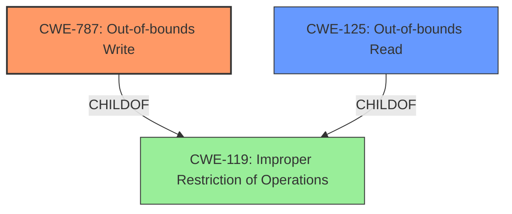

# Final Resolution for CVE-2022-0797

# Summary
| CWE ID | CWE Name | Confidence | CWE Abstraction Level | CWE Vulnerability Mapping Label | CWE-Vulnerability Mapping Notes |
|---|---|---|---|---|---|
| **CWE-787** | **Out-of-bounds Write** | 0.95 | Base | Allowed | Primary CWE |
| CWE-125 | Out-of-bounds Read | 0.70 | Base | Allowed | Secondary Candidate CWE |

## Evidence and Confidence

*   **Confidence Score:** 0.95
*   **Evidence Strength:** HIGH

## Relationship Analysis
The primary relationship that impacted the decision was the parent-child relationship between CWE-787 (**Out-of-bounds Write**) and CWE-119 (Improper Restriction of Operations within the Bounds of a Memory Buffer). CWE-787 is a more specific type of CWE-119. Similarly, CWE-125 (Out-of-bounds Read) is also a child of CWE-119. The fact that both CWE-787 and CWE-125 are children of CWE-119 suggests that the core issue is related to improper memory boundary handling. Because the description specifically mentions a "memory write", CWE-787 is the more appropriate primary weakness. There may have been a read that led to the write. The abstraction level of Base for both CWE-787 and CWE-125 indicates that they are at an appropriate level of specificity.

## Vulnerability Chain
The vulnerability chain starts with an unspecified initial condition that leads to an out-of-bounds memory access. The primary impact is an **out-of-bounds write** (CWE-787). A possible contributing factor could be an **out-of-bounds read** (CWE-125) that resulted in a miscalculation or incorrect state, subsequently leading to the write. However, the vulnerability description focuses on the write, making it the primary weakness. The chain, therefore, is: Initial Condition -> CWE-125 (possible) -> CWE-787 -> Impact (arbitrary code execution).

## Summary of Analysis
The initial analysis and criticism were both well-reasoned. The vulnerability description explicitly states "Out of bounds **memory write** in Mojo in Google Chrome prior to 99.0.4844.51 allowed a remote attacker to perform an out of bounds **memory write** via a crafted HTML page." This provides strong evidence for CWE-787 (**Out-of-bounds Write**) as the primary **weakness**. The inclusion of CWE-125 (**Out-of-bounds Read**) as a secondary candidate is also justifiable, given the broader context of "out of bounds memory access". The analysis correctly identifies that both are children of CWE-119 (Improper Restriction of Operations within the Bounds of a Memory Buffer).

The suggestion to consider other high-scoring Retriever Result CWEs is reasonable. CWE-823 (Use of Out-of-range Pointer Offset) could be relevant if pointer arithmetic was involved, and CWE-843 (Access of Resource Using Incompatible Type ('Type Confusion')) could apply if type mismatches contributed. However, with the current evidence, these are less likely than CWE-125. It is difficult to determine from the information provided if an integer overflow (CWE-190) was involved as suggested.

The selected CWEs (CWE-787 and CWE-125) are at the optimal level of specificity because they directly describe the observed behavior. The vulnerability description focuses on the **memory write**, making CWE-787 the most appropriate primary classification. The other CWE suggestions are less likely, given the available information.