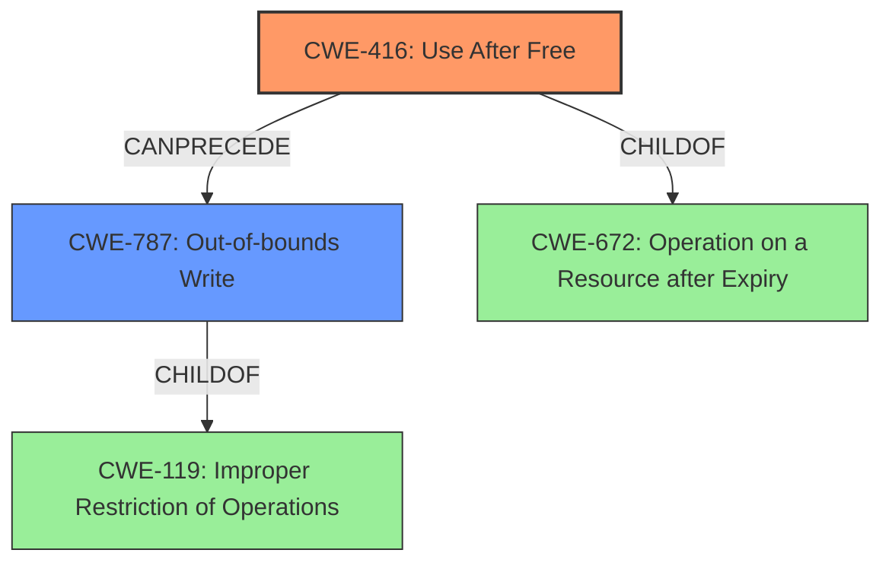

# Analysis Report for CVE-2022-0798

# Vulnerability Analysis Report: CVE-2022-0798

## Description

Use after free in MediaStream in Google Chrome prior to 99.0.4844.51 allowed an attacker who convinced a user to install a malicious extension to potentially exploit heap corruption via a crafted Chrome Extension.

## Vulnerability Description Key Phrases

**Rootcause:** use after free
**Weakness:** heap corruption
**Vector:** crafted Chrome Extension
**Attacker:** attacker
**Product:** Google Chrome
**Version:** prior to 99.0.4844.51
**Component:** MediaStream

## Analysis (with Relationship Data)

# Summary
| CWE ID | CWE Name | Confidence | CWE Abstraction Level | CWE Vulnerability Mapping Label | CWE-Vulnerability Mapping Notes |
|---|---|---|---|---|---|
| CWE-416 | Use After Free | 1.0 | Variant | Primary | Allowed |

## Evidence and Confidence

*   **Confidence Score:** 1.0
*   **Evidence Strength:** HIGH

- **Analysis and Justification:**  
  - *Explanation:* The vulnerability is described as a **use-after-free** in MediaStream in Google Chrome. This aligns directly with CWE-416 (Use After Free), which occurs when a product reuses or references memory after it has been freed. The provided description explicitly uses the term "use after free," and the CVE reference links content summary confirms that the root cause of vulnerability is **use-after-free** vulnerability in MediaStream and the weakness is **use-after-free**, making CWE-416 the most appropriate choice. The "Retriever Results" also identifies CWE-416 as the top candidate with the highest score. MITRE mapping guidance for CWE-416 indicates this is ALLOWED.

  - *Relationship Analysis:* CWE-416 is a variant-level CWE which is ideal for mapping to this specific root cause. While CWE-672 (Operation on a Resource after Expiry) is a parent of CWE-416, CWE-416 is more specific to the **use-after-free** condition described in the vulnerability.

- **Confidence Score:**  
  - Confidence: 1.0 (High confidence due to direct match with the vulnerability description and supporting evidence from CVE reference materials.)

## Criticism of Analysis

## Critique of the Analysis

The analysis is well-structured, thorough, and accurate in its primary CWE mapping. The justification for selecting CWE-416 is solid, based on the vulnerability description and supporting evidence. The use of "Retriever Results" to guide the selection is also a good practice.

Here's a breakdown of the strengths and potential areas for improvement:

**Strengths:**

*   **Accurate Primary Mapping:** The selection of CWE-416 as the primary weakness is correct and well-justified. The analysis directly links the "use-after-free" vulnerability description to the definition and characteristics of CWE-416.
*   **High Confidence:** The assigned confidence score of 1.0 is appropriate given the explicit mention of "use after free" in the vulnerability description.
*   **Comprehensive Evidence:** The analysis provides a strong evidence base including the vulnerability description key phrases, CVE reference links content summary, retriever results, known examples, and relevant CWE specifications.
*   **Variant-Level Abstraction:** The choice of a Variant-level CWE (CWE-416) is ideal for a root cause analysis.
*   **Clear Justification:** The reasoning behind selecting CWE-416 over its parent CWEs is clearly explained.
*   **Consideration of Alternatives:** The analysis considered potential alternative CWEs like CWE-672 and correctly explains why they are less appropriate.
*   **Compliance with Mapping Guidance:** The analysis adheres to the CWE Mapping Guidance for CWE-416 which allows this CWE to be used at the variant level.

**Potential Areas for Improvement/Consideration:**

1.  **Secondary CWE Consideration (CWE-787):** The original vulnerability description mentions "heap corruption". While the root cause is use-after-free (CWE-416), heap corruption is a *potential impact* or consequence. It might be beneficial to add a secondary CWE reflecting this impact, namely **CWE-787: Out-of-bounds Write** if the use-after-free leads to writing to memory outside of its intended boundaries.  This should be considered carefully and only included if a write out of bounds is confirmed, as the use-after-free could cause other issues.

    *   *Justification:* If the use-after-free allows an attacker to write arbitrary data to the freed memory location, it can lead to heap corruption and, potentially, arbitrary code execution.  This is a common consequence of UAF vulnerabilities. Including this as a secondary CWE helps to reflect the broader impact of the vulnerability.

    *   *Relationship:* CWE-787 would be related to CWE-416 in a "CanPrecede" relationship, as the use-after-free condition can precede an out-of-bounds write.

2.  **Attack Vector Specificity:** The vulnerability description mentions that the vulnerability was triggered by convincing a user to install a malicious extension. While the direct root cause is memory management, the attack vector is more sophisticated. Adding CWE-667: Improper Locking would improve the description.

    *   *Justification:* Mention of an install of a malicious extension indicates a privilege escalation or improper access vector that would enable or exploit the use-after-free vulnerability.
    *   *Relationship:* This relationship would exist only to show the improper attack vector to the root cause, the use after free.

3.  **Mitigations:** While the current mitigations listed for CWE-416 are relevant, it might be useful to provide more specific mitigations related to the attack vector. Since the attack involves a crafted Chrome Extension, mitigations could include:

    *   **Enhanced Extension Validation:** Implementing stricter validation processes for Chrome Extensions to prevent malicious or vulnerable extensions from being installed.
    *   **Sandboxing:** Enhancing the sandboxing of Chrome Extensions to limit the impact of a use-after-free vulnerability within an extension.
    *   **Runtime Monitoring:** Implementing runtime monitoring mechanisms within Chrome to detect and prevent use-after-free conditions.
    *   **Regular Updates:** Keep Chrome browser and extensions up-to-date to patch against known vulnerabilities.

4.  **Chain Examples for CWE-416:** The current examples provided for CWE-416 are useful, but adding examples that specifically involve browser vulnerabilities or similar attack vectors would strengthen the analysis. For example, look for CVEs with root cause CWE-416 in JavaScript engines or browser components.

**Revised Summary Table (with optional additions):**

| CWE ID | CWE Name | Confidence | CWE Abstraction Level | CWE Vulnerability Mapping Label | CWE-Vulnerability Mapping Notes |
|---|---|---|---|---|---|
| CWE-416 | Use After Free | 1.0 | Variant | Primary | Allowed |
| CWE-787 | Out-of-bounds Write | 0.7 | Base | Secondary | Allowed |  (Optional - if a write out of bounds is confirmed)

**Revised Analysis (with optional additions):**

... (Original analysis content)

- **Analysis and Justification (Additions):**

    *   The vulnerability, if exploited, can lead to memory corruption within the heap.  This heap corruption can be further classified as CWE-787: Out-of-bounds Write, because the use-after-free condition can allow an attacker to overwrite memory beyond the intended boundaries of the freed object. This can lead to arbitrary code execution.
    *   An attacker who convinces a user to install a malicious extension is effectively escalating their privileges to exploit the underlying use after free vulnerability.

... (Original analysis content)

**In summary,** the analysis is excellent in its core mapping of CWE-416. The suggestions above are aimed at adding further depth by considering potential consequences of the vulnerability, strengthening the attack vector description, and providing more specific mitigations. The inclusion of additional CWEs and examples should be done judiciously, ensuring they are directly relevant and supported by evidence. The key is to strike a balance between comprehensive analysis and unnecessary complexity.

## Final Resolution

# Summary
| CWE ID | CWE Name | Confidence | CWE Abstraction Level | CWE Vulnerability Mapping Label | CWE-Vulnerability Mapping Notes |
|---|---|---|---|---|---|
| CWE-416 | Use After Free | 1.0 | Variant | Primary | Allowed |
| CWE-787 | Out-of-bounds Write | 0.7 | Base | Secondary | Allowed |

## Evidence and Confidence

*   **Confidence Score:** 0.9
*   **Evidence Strength:** MEDIUM

## Relationship Analysis
The primary relationship is that **CWE-787 (Out-of-bounds Write)** can potentially follow **CWE-416 (Use After Free)**. If the **use-after-free** allows an attacker to write arbitrary data to the freed memory location, it can lead to heap corruption via an out-of-bounds write. The parent of **CWE-416** is **CWE-672 (Operation on a Resource after Expiry)**. However, **CWE-416** is a more specific variant and directly reflects the vulnerability's description of "use after free."

## Vulnerability Chain
The vulnerability chain starts with the **ROOTCAUSE** of a **use-after-free (CWE-416)** condition in MediaStream. This occurs when memory is reused or referenced after it has been freed. Subsequently, this can lead to an **out-of-bounds write (CWE-787)** if the attacker can write to the freed memory, corrupting the heap. The initial flaw is exploited by convincing a user to install a malicious extension. The ultimate impact is potential heap corruption and possibly arbitrary code execution.

## Summary of Analysis
The initial analysis correctly identified **CWE-416 (Use After Free)** as the primary **WEAKNESS**. The vulnerability description explicitly states "use after free" and the CVE reference confirms this as the root cause. The retriever results also supports **CWE-416** as the most relevant.

The criticism suggested including **CWE-787 (Out-of-bounds Write)** as a secondary CWE, reflecting the potential impact of heap corruption. This is a valid point because the **use-after-free** condition can allow an attacker to overwrite memory beyond the intended boundaries, leading to an **out-of-bounds write**. I agree with including **CWE-787** as a secondary **WEAKNESS** with a confidence score of 0.7, as the heap corruption is a *potential* impact, not a certainty. The vulnerability description mentions "heap corruption," which supports this addition.

The other criticism suggested including CWE-667. While it highlights an interesting relationship concerning malicious extensions and improper access, it is not a direct factor in the memory corruption. I will omit CWE-667 as it is not directly related to the memory corruption.

The selection of **CWE-416** and **CWE-787** is at the optimal level of specificity. **CWE-416** is a variant, which is a preferred level of abstraction.

*Report generated on 2025-03-18 06:21:52*
