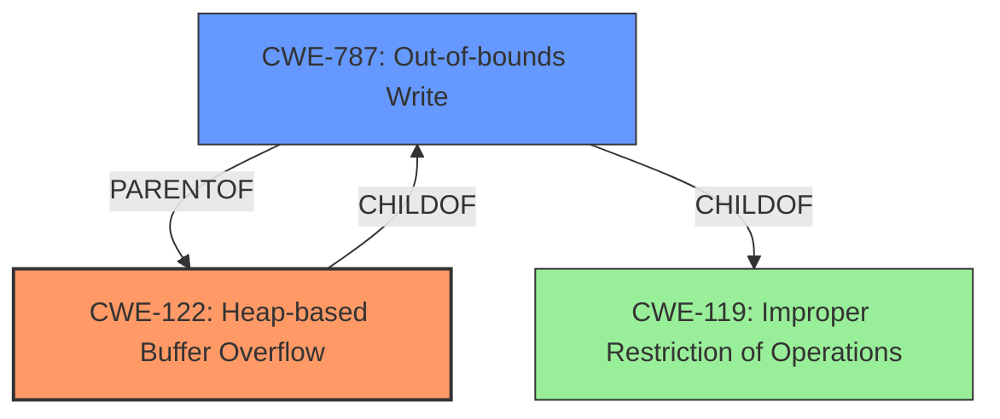

# Analysis Report for CVE-2022-0800

# Vulnerability Analysis Report: CVE-2022-0800

## Description

Heap buffer overflow in Cast UI in Google Chrome prior to 99.0.4844.51 allowed a remote attacker who convinced a user to engage in specific user interaction to potentially exploit heap corruption via a crafted HTML page.

## Vulnerability Description Key Phrases

**Rootcause:** buffer overflow
**Impact:** heap corruption
**Vector:** crafted HTML page
**Attacker:** remote attacker
**Product:** Google Chrome
**Version:** prior to 99.0.4844.51
**Component:** Cast UI

## Analysis (with Relationship Data)

# Summary
| CWE ID | CWE Name | Confidence | CWE Abstraction Level | CWE Vulnerability Mapping Label | CWE-Vulnerability Mapping Notes |
|---|---|---|---|---|---|
| CWE-122 | Heap-based Buffer Overflow | 0.9 | Variant | Allowed | Primary CWE. The vulnerability is specifically described as a heap buffer overflow. |
| CWE-787 | Out-of-bounds Write | 0.7 | Base | Allowed | Secondary CWE. A buffer overflow leads to writing outside the intended buffer. |

## Evidence and Confidence

*   **Confidence Score:** 0.9
*   **Evidence Strength:** HIGH

- **Analysis and Justification:**  
  - *Explanation:* The vulnerability description clearly states "Heap **buffer overflow** in Cast UI". This directly maps to CWE-122 (Heap-based Buffer Overflow), which is a Variant level CWE, providing a more specific classification than the more general CWE-787 (Out-of-bounds Write). The CVE Reference Links Content Summary confirms "**root_cause**: Heap buffer overflow in Cast UI." and "**weaknesses**: [Heap buffer overflow]". This provides strong evidence for selecting CWE-122 as the primary CWE. CWE-787 is included as a secondary CWE because a buffer overflow inherently involves writing beyond the boundaries of allocated memory.
  
  - *Relationship Analysis:* CWE-122 is a variant of CWE-119 (Improper Restriction of Operations within the Bounds of a Memory Buffer) and a parent of CWE-787 (Out-of-bounds Write). Since the vulnerability is a heap-based buffer overflow, CWE-122 is more specific and thus more appropriate than its parent CWE-119. CWE-787 is added as a secondary CWE because it describes the general condition resulting from the overflow.

- **Confidence Score:**  
  - Confidence: 0.9 (High confidence due to direct mention of "heap buffer overflow" in both the vulnerability description and CVE reference summary.)

## Criticism of Analysis

Okay, I have reviewed the provided analysis against the full CWE specifications you provided. Here's my critique:

**Overall Assessment:**

The analysis is generally good and arrives at the correct primary CWE (CWE-122). The reasoning is sound, and the high confidence level is justified. The inclusion of CWE-787 as a secondary CWE is also appropriate.

**Strengths:**

*   **Clear Justification:** The analysis provides a clear and well-reasoned explanation for selecting CWE-122 as the primary weakness, directly referencing the vulnerability description and CVE reference summary which explicitly mention "Heap buffer overflow".
*   **Accurate Hierarchy Awareness:** The analysis demonstrates understanding of the CWE hierarchy by correctly identifying the relationship between CWE-122, CWE-119, and CWE-787. The explanation of why CWE-122 is the more specific and appropriate choice is well articulated.
*   **High Confidence:** The assigned confidence scores reflect the high degree of certainty in the mappings, supported by the clear evidence from the vulnerability description.
*   **Secondary CWE Rationale:** The justification for adding CWE-787 as a secondary CWE is sensible, recognizing that a buffer overflow implies an out-of-bounds write.
*   **Use of Examples:** Linking CVEs to the weakness definitions helps solidify the mapping.

**Areas for Improvement / Considerations:**

1.  **CWE-119 Discussion:** While the analysis mentions CWE-119, it could benefit from explicitly referencing the "Mapping Guidance" section of CWE-119, which states: **"Usage: Discouraged"** and encourages mapping to more specific children of CWE-119 like CWE-787 or CWE-122. This would further strengthen the justification for *not* choosing CWE-119 as the primary CWE.
2.  **Retrieval Results Analysis:** The "Retriever Results" list includes CWEs with significantly higher combined scores (e.g., CWE-843, CWE-366, CWE-416) than CWE-787. While the direct description points to a heap overflow, briefly addressing why these higher-scoring CWEs from the retriever results are *not* applicable could add depth to the analysis. For example:
    *   **CWE-843 (Type Confusion):** While heap corruption *could* lead to type confusion issues as a *consequence*, the primary root cause described is a buffer overflow, not an inherent type confusion vulnerability.
    *   **CWE-366 (Race Condition):** There's no mention of concurrency or threading issues in the vulnerability description, making this unlikely.
    *   **CWE-416 (Use After Free):** The description focuses on writing beyond buffer boundaries, rather than reusing memory after it's been freed.
3.  **Mitigation Considerations (CWE-122):** The analysis could briefly touch on *why* certain mitigations for CWE-122 might be relevant or irrelevant in the specific context of the Chrome Cast UI. For example:
    *   Languages with Automatic Bounds Checking: Mentioning if the Cast UI is implemented in C/C++ or a memory-safe language like Rust/Java.
    *   Compiler Flags: Mentioning if /GS or similar flags are used and how they can mitigate the risk.
4.  **Extended CWE-787 Justification:** The reasoning for including CWE-787 could be slightly strengthened. It's not just *any* out-of-bounds write, but an out-of-bounds write that is directly caused by, and is an inherent part of, the buffer overflow. That's why it's a relevant *secondary* CWE.
5.  **Relationship to CWE-788:** It could be mentioned that CWE-788, Access of Memory Location After End of Buffer, is a parent of CWE-122, but is marked as discouraged.

**Revised Analysis (incorporating suggestions):**

# Summary
| CWE ID | CWE Name | Confidence | CWE Abstraction Level | CWE Vulnerability Mapping Label | CWE-Vulnerability Mapping Notes |
|---|---|---|---|---|---|
| CWE-122 | Heap-based Buffer Overflow | 0.9 | Variant | Allowed | Primary CWE. The vulnerability is specifically described as a heap buffer overflow. |
| CWE-787 | Out-of-bounds Write | 0.7 | Base | Allowed | Secondary CWE. A buffer overflow leads to writing outside the intended buffer, causing an out-of-bounds write. |

## Evidence and Confidence

*   **Confidence Score:** 0.9
*   **Evidence Strength:** HIGH

- **Analysis and Justification:**  
  - *Explanation:* The vulnerability description clearly states "Heap **buffer overflow** in Cast UI". This directly maps to CWE-122 (Heap-based Buffer Overflow), which is a Variant level CWE, providing a more specific classification than the more general CWE-787 (Out-of-bounds Write). The CVE Reference Links Content Summary confirms "**root_cause**: Heap buffer overflow in Cast UI." and "**weaknesses**: [Heap buffer overflow]". This provides strong evidence for selecting CWE-122 as the primary CWE. CWE-787 is included as a secondary CWE because a buffer overflow inherently involves writing beyond the boundaries of allocated memory.
  
  - *Relationship Analysis:* CWE-122 is a variant of CWE-119 (Improper Restriction of Operations within the Bounds of a Memory Buffer) and a child of CWE-787 (Out-of-bounds Write). Since the vulnerability is a heap-based buffer overflow, CWE-122 is more specific and thus more appropriate than its parent CWE-119. The Mapping Guidance for CWE-119 explicitly discourages its use when more specific child CWEs are available, which further supports selecting CWE-122. CWE-787 is added as a secondary CWE because it describes the general condition resulting from the overflow, and is directly caused by it. While CWE-788 (Access of Memory Location After End of Buffer) is a parent of CWE-122, it is marked as discouraged, and CWE-787 provides more specific information about the out-of-bounds write.

  - *Relevance of Retrieval Results:* The retriever results include CWEs with higher scores, such as CWE-843 (Type Confusion), CWE-366 (Race Condition), and CWE-416 (Use After Free). However, these are less relevant because the core issue is a buffer overflow. While heap corruption (caused by the overflow) *could* potentially lead to type confusion, it is a secondary consequence. Similarly, there's no evidence of race conditions or use-after-free in the initial vulnerability description.

- **Confidence Score:**  
  - Confidence: 0.9 (High confidence due to direct mention of "heap buffer overflow" in both the vulnerability description and CVE reference summary.)

# CWE Examples from Database

## Known Examples for CWE-122: Heap-based Buffer Overflow
### Observed Examples
- **CVE-2021-43537** [https://www.cve.org/CVERecord?id=CVE-2021-43537](https://www.cve.org/CVERecord?id=CVE-2021-43537): Chain: in a web browser, an unsigned 64-bit integer is forcibly cast to a 32-bit integer (CWE-681) and potentially leading to an integer overflow (CWE-190). If an integer overflow occurs, this can cause heap memory corruption (CWE-122)
- **CVE-2007-4268** [https://www.cve.org/CVERecord?id=CVE-2007-4268](https://www.cve.org/CVERecord?id=CVE-2007-4268): Chain: integer signedness error (CWE-195) passes signed comparison, leading to heap overflow (CWE-122)
- **CVE-2009-2523** [https://www.cve.org/CVERecord?id=CVE-2009-2523](https://www.cve.org/CVERecord?id=CVE-2009-2523): Chain: product does not handle when an input string is not NULL terminated (CWE-170), leading to buffer over-read (CWE-125) or heap-based buffer overflow (CWE-122).
- **CVE-2021-29529** [https://www.cve.org/CVERecord?id=CVE-2021-29529](https://www.cve.org/CVERecord?id=CVE-2021-29529): Chain: machine-learning product can have a heap-based buffer overflow (CWE-122) when some integer-oriented bounds are calculated by using ceiling() and floor() on floating point values (CWE-1339)
- **CVE-2010-1866** [https://www.cve.org/C

## Final Resolution

# Summary
| CWE ID | CWE Name | Confidence | CWE Abstraction Level | CWE Vulnerability Mapping Label | CWE-Vulnerability Mapping Notes |
|---|---|---|---|---|---|
| CWE-122 | Heap-based Buffer Overflow | 0.9 | Variant | Allowed | Primary CWE. The vulnerability is specifically described as a heap buffer overflow. |
| CWE-787 | Out-of-bounds Write | 0.7 | Base | Allowed | Secondary CWE. A buffer overflow leads to writing outside the intended buffer, causing an out-of-bounds write. |

## Evidence and Confidence

*   **Confidence Score:** 0.9
*   **Evidence Strength:** HIGH

## Relationship Analysis
The analysis correctly identifies CWE-122 as a variant of CWE-119 and a child of CWE-787. This hierarchical relationship is crucial in selecting the most specific CWE. The analysis also highlights the discouraged usage of CWE-119 when more specific children like CWE-122 are applicable. The inclusion of CWE-787 as a secondary CWE acknowledges the out-of-bounds write resulting from the buffer overflow.

## Vulnerability Chain
The vulnerability chain starts with a crafted HTML page convincing a user to engage in specific user interaction, which leads to a heap buffer overflow (**CWE-122**). This overflow then results in an out-of-bounds write (**CWE-787**), potentially leading to heap corruption and further exploitation.

## Summary of Analysis
The initial analysis, along with the provided criticism, offers a well-justified classification of the vulnerability. The core argument rests on the direct mention of "heap buffer overflow" in the vulnerability description and CVE reference summary, which strongly supports the selection of **CWE-122** (Heap-based Buffer Overflow) as the primary **WEAKNESS**.

The analysis effectively addresses the potential relevance of other CWEs suggested by the retriever results, such as **CWE-843** (Type Confusion), **CWE-366** (Race Condition), and **CWE-416** (Use After Free), by explaining why they are less likely to be the **ROOTCAUSE** in this specific scenario. The reasoning is sound, as these issues would be secondary consequences of the primary buffer overflow.

The graph relationships reinforce the decision to choose **CWE-122** due to its specificity as a variant of **CWE-119** and a child of **CWE-787**. The analysis also acknowledges that **CWE-119** is discouraged when more specific children are available.

The inclusion of **CWE-787** as a secondary CWE is appropriate because it directly represents the out-of-bounds write resulting from the buffer overflow. The analysis rightly points out that this isn't just any out-of-bounds write, but one that is directly caused by the heap overflow.

The evidence supporting the primary classification is strong, with a high confidence score of 0.9. The analysis considers and justifies the choice of **CWE-122** as the optimal level of specificity, given the available information.

*Report generated on 2025-03-18 06:22:45*
