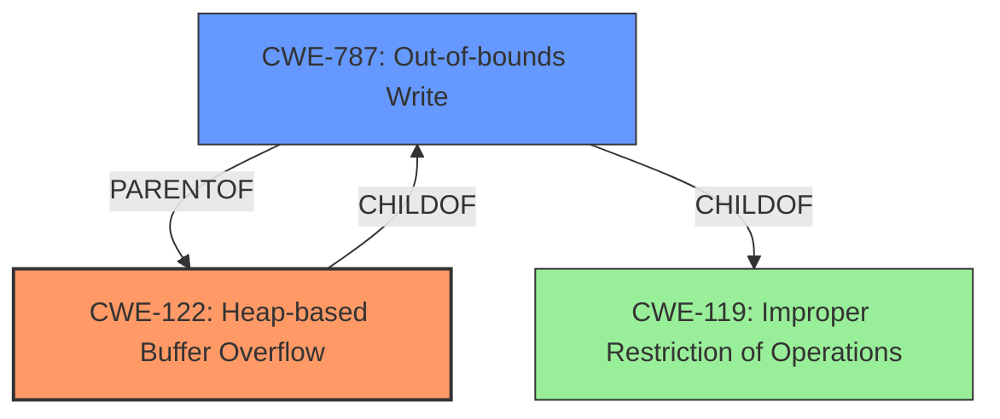

# Final Resolution for CVE-2022-0800

# Summary
| CWE ID | CWE Name | Confidence | CWE Abstraction Level | CWE Vulnerability Mapping Label | CWE-Vulnerability Mapping Notes |
|---|---|---|---|---|---|
| CWE-122 | Heap-based Buffer Overflow | 0.9 | Variant | Allowed | Primary CWE. The vulnerability is specifically described as a heap buffer overflow. |
| CWE-787 | Out-of-bounds Write | 0.7 | Base | Allowed | Secondary CWE. A buffer overflow leads to writing outside the intended buffer, causing an out-of-bounds write. |

## Evidence and Confidence

*   **Confidence Score:** 0.9
*   **Evidence Strength:** HIGH

## Relationship Analysis
The analysis correctly identifies CWE-122 as a variant of CWE-119 and a child of CWE-787. This hierarchical relationship is crucial in selecting the most specific CWE. The analysis also highlights the discouraged usage of CWE-119 when more specific children like CWE-122 are applicable. The inclusion of CWE-787 as a secondary CWE acknowledges the out-of-bounds write resulting from the buffer overflow.

## Vulnerability Chain
The vulnerability chain starts with a crafted HTML page convincing a user to engage in specific user interaction, which leads to a heap buffer overflow (**CWE-122**). This overflow then results in an out-of-bounds write (**CWE-787**), potentially leading to heap corruption and further exploitation.

## Summary of Analysis
The initial analysis, along with the provided criticism, offers a well-justified classification of the vulnerability. The core argument rests on the direct mention of "heap buffer overflow" in the vulnerability description and CVE reference summary, which strongly supports the selection of **CWE-122** (Heap-based Buffer Overflow) as the primary **WEAKNESS**.

The analysis effectively addresses the potential relevance of other CWEs suggested by the retriever results, such as **CWE-843** (Type Confusion), **CWE-366** (Race Condition), and **CWE-416** (Use After Free), by explaining why they are less likely to be the **ROOTCAUSE** in this specific scenario. The reasoning is sound, as these issues would be secondary consequences of the primary buffer overflow.

The graph relationships reinforce the decision to choose **CWE-122** due to its specificity as a variant of **CWE-119** and a child of **CWE-787**. The analysis also acknowledges that **CWE-119** is discouraged when more specific children are available.

The inclusion of **CWE-787** as a secondary CWE is appropriate because it directly represents the out-of-bounds write resulting from the buffer overflow. The analysis rightly points out that this isn't just any out-of-bounds write, but one that is directly caused by the heap overflow.

The evidence supporting the primary classification is strong, with a high confidence score of 0.9. The analysis considers and justifies the choice of **CWE-122** as the optimal level of specificity, given the available information.