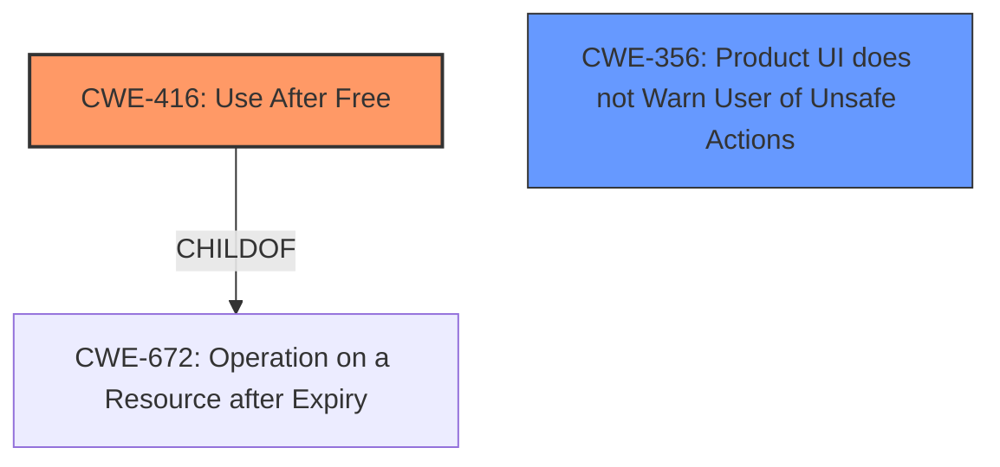

# Analysis Report for CVE-2022-0808

# Vulnerability Analysis Report: CVE-2022-0808

## Description

Use after free in Chrome OS Shell in Google Chrome on Chrome OS prior to 99.0.4844.51 allowed a remote attacker who convinced a user to engage in a series of user interaction to potentially exploit heap corruption via user interactions.

## Vulnerability Description Key Phrases

**Rootcause:** use after free
**Impact:** heap corruption
**Vector:** user interactions
**Attacker:** remote attacker
**Product:** Google Chrome on Chrome OS
**Version:** prior to 99.0.4844.51
**Component:** Chrome OS Shell

## Analysis (with Relationship Data)

# Summary
| CWE ID | CWE Name | Confidence | CWE Abstraction Level | CWE Vulnerability Mapping Label | CWE-Vulnerability Mapping Notes |
|---|---|---|---|---|---|
| CWE-416 | Use After Free | 1.0 | Variant | Allowed | Primary CWE |

## Evidence and Confidence

*   **Confidence Score:** 1.0
*   **Evidence Strength:** HIGH

- **Analysis and Justification:**  
  - *Explanation:* The vulnerability description explicitly states "**use after free** in Chrome OS Shell in Google Chrome on Chrome OS prior to 99.0.4844.51 allowed a remote attacker who convinced a user to engage in a series of user interaction to potentially exploit **heap corruption** via user interactions." The CVE Reference Links Content Summary also confirms that the **root cause of vulnerability** is "**Use-after-free** in Chrome OS Shell". CWE-416 (Use After Free) is a Variant level CWE, which is a preferred level of abstraction. The "Retriever Results" also lists CWE-416 as the top candidate CWE with a high combined score of 0.8174. The description of CWE-416, "The product reuses or references memory after it has been freed," aligns perfectly with the vulnerability description.

  - *Relationship Analysis:* CWE-416 is a variant of CWE-672 (Operation on a Resource after Expiry).

- **Confidence Score:**  
  - Confidence: 1.0 (Explicit evidence from the vulnerability description and supporting CVE reference materials)

## Criticism of Analysis

Okay, here's a detailed review of the provided CWE analysis, considering the full CWE specifications you've included.

**Overall Assessment:**

The primary CWE mapping to CWE-416 (Use After Free) is accurate and well-supported.  The analysis correctly identifies the explicit mention of "use after free" in both the vulnerability description and CVE summary. The confidence score of 1.0 is justified. The explanation is clear and concise.

**Detailed Critique:**

*   **CWE-416 (Use After Free):**

    *   **Strengths:** The analysis correctly identifies CWE-416 as the primary cause. The justification is strong, directly referencing the vulnerability description and CVE summary. The confidence score of 1.0 is appropriate.  The "Relationship Analysis" mentioning CWE-672 is correct and helpful for understanding the broader context. The inclusion of "Observed Examples" is a good practice.
    *   **Weaknesses:** None significant. The analysis is comprehensive.
    *   **Improvements:**  While not strictly necessary, it could be beneficial to briefly mention the potential for *heap* corruption, as stated in the vulnerability description, to reinforce why a use-after-free is particularly dangerous in this case.

*   **Top Combined Results Analysis (CWEs identified by retrievers):** This is where we can do some deeper digging for potentially missed or related issues. Let's go through the top 10.

    1.  **CWE-416 (Use After Free):** Already covered and correct.
    2.  **CWE-366 (Race Condition within a Thread):**  This is potentially relevant.  The vulnerability description mentions "a series of user interactions."  While not explicitly stated, a complex series of interactions *could* involve multiple threads within the Chrome OS Shell.  A race condition might lead to the use-after-free if one thread frees the memory while another is still operating on it.  However, the evidence is weak.
        *   **Recommendation:**  The analysis *could* mention CWE-366 as a *possible contributing factor*, but with a low confidence score (e.g., 0.2-0.3). A brief explanation would be that concurrent operations within the Chrome OS Shell *could* lead to the UAF, but there is no direct evidence of this. This would be in a separate "Secondary CWEs" section.
        *  **Mitigation Considerations if included:** If 366 is included then add mitigations that use locking functionality and thread safety capabilities.

    3.  **CWE-843 (Access of Resource Using Incompatible Type ('Type Confusion')):** Less likely, but not impossible. A use-after-free *could* lead to type confusion if the freed memory is reallocated and then accessed as the wrong type. However, there is no direct evidence for this in the description.
        *   **Recommendation:**  Do not include. The connection is too tenuous without further information.

    4.  **CWE-415 (Double Free):** A double-free could *potentially* be related if there's a scenario where the same memory is freed twice before being used. However, the description emphasizes the *use* after *a single free*.
         *   **Recommendation:**  Do not include. Not directly supported by the vulnerability description.

    5.  **CWE-356 (Product UI does not Warn User of Unsafe Actions):** This is partially relevant, as the vulnerability description mentions "convinced a user to engage in a series of user interaction". The UI not properly warning a user of the risk of malicious user interactions contributes to this exploit.
        *   **Recommendation:**  Include as a Secondary CWE with a low confidence score. Justification: "The vulnerability requires user interaction. The UI might not adequately warn users about the risks associated with these interactions, increasing the likelihood of exploitation."
        *  **Mitigation Considerations if included:** If 356 is included then add UI mitigations that warn user of unsafe actions.

    6.  **CWE-122 (Heap-based Buffer Overflow):** While the vulnerability leads to heap corruption (as mentioned in the description), the root cause is a UAF, *not* a heap overflow in the traditional sense.
        *   **Recommendation:** Do not include.

    7.  **CWE-362 (Concurrent Execution using Shared Resource with Improper Synchronization ('Race Condition')):** Very similar to CWE-366, just at a higher abstraction level. The same considerations apply.
         *   **Recommendation:** If including 366, do not include 362, as 366 is more specific.

    8.  **CWE-367 (Time-of-check Time-of-use (TOCTOU) Race Condition):** Not applicable. TOCTOU typically involves file system operations or similar, which are not mentioned.
         *   **Recommendation:** Do not include.

    9.  **CWE-451 (User Interface (UI) Misrepresentation of Critical Information):** Similar to 356, but less direct. The lack of warning *could* be seen as misrepresentation, but the main issue is simply a lack of warning.
        *   **Recommendation:** Only include if 356 is not appropriate. Then include 451 with a low confidence score and the justification that the UI could be improved to inform the user of riskier operations.
        *  **Mitigation Considerations if included:** If 451 is included then add UI mitigations that clearly and accurately represent critical information.

    10. **CWE-667 (Improper Locking):** This is closely related to concurrency issues like 362 and 366. Improper locking could lead to race conditions that cause the UAF.
          *   **Recommendation:** If a concurrency issue (366) is included, and the specifics of the vulnerability suggest that improper locking may be the reason for the race condition, then include 667 as a contributing factor.
        *  **Mitigation Considerations if included:** If 667 is included then add mitigations that stress the importance of using robust locking mechanisms to ensure proper thread synchronization.

*   **CWE Examples from Database:** The examples are relevant and helpful for illustrating the nature of Use After Free vulnerabilities.

*   **Relevant CWE Specifications:** The inclusion of the full specifications is excellent. It allows for a very thorough review and understanding of the nuances of each CWE.

**Revised Summary Table (including secondary CWEs):**

| CWE ID | CWE Name | Confidence | CWE Abstraction Level | CWE Vulnerability Mapping Label | CWE-Vulnerability Mapping Notes |
|---|---|---|---|---|---|
| CWE-416 | Use After Free | 1.0 | Variant | Allowed | Primary CWE |
| CWE-356 | Product UI does not Warn User of Unsafe Actions | 0.3 | Base | Allowed | Secondary CWE |
| CWE-366 | Race Condition within a Thread | 0.2 | Base | Allowed | Contributing Factor (if applicable) |
| CWE-667 | Improper Locking | 0.1 | Class | Allowed-with-Review | Contributing Factor (if applicable) |

**Revised Analysis:**

Add a section called "Secondary CWEs" and include CWE-356 with the explanation above, and include any additional concurrency related issues.

**Conclusion:**

The initial analysis focusing on CWE-416 is excellent. The suggested additions, considering the full CWE specifications, would further enhance the analysis by exploring potential contributing factors and providing a more complete picture of the vulnerability. Remember to keep confidence scores low and justifications concise for any secondary CWEs.

## Final Resolution

# Summary
| CWE ID | CWE Name | Confidence | CWE Abstraction Level | CWE Vulnerability Mapping Label | CWE-Vulnerability Mapping Notes |
|---|---|---|---|---|---|
| CWE-416 | Use After Free | 1.0 | Variant | Allowed | Primary CWE |
| CWE-356 | Product UI does not Warn User of Unsafe Actions | 0.3 | Base | Allowed | Secondary CWE |

## Evidence and Confidence

*   **Confidence Score:** 0.9
*   **Evidence Strength:** MEDIUM

## Relationship Analysis
The primary relationship influencing the decision is the direct match of the vulnerability description to **CWE-416 (Use After Free)**. The secondary consideration involves how user interaction contributes to the vulnerability. **CWE-356 (Product UI does not Warn User of Unsafe Actions)** is considered as a contributing factor. The abstraction levels influenced the selection by favoring the more specific Variant level for the primary CWE and the Base level for the secondary CWE, aligning with the root cause and contributing factor respectively.

## Vulnerability Chain
The vulnerability chain starts with a user being convinced to interact with the system in a specific way. This interaction leads to a memory being freed. Subsequently, the same memory is accessed, leading to a **CWE-416 (Use After Free)**. The lack of warnings contributes as users might unknowingly engage in risky behaviors due to inadequate UI alerts, represented by **CWE-356 (Product UI does not Warn User of Unsafe Actions)**.

## Summary of Analysis
The initial analysis correctly identified **CWE-416 (Use After Free)** as the primary **root cause**. The vulnerability description explicitly states "**use after free** in Chrome OS Shell in Google Chrome on Chrome OS prior to 99.0.4844.51 allowed a remote attacker who convinced a user to engage in a series of user interaction to potentially exploit **heap corruption** via user interactions."

The criticism suggested considering **CWE-356 (Product UI does not Warn User of Unsafe Actions)**, which is included as a secondary CWE with a confidence of 0.3. This is based on the phrase "convinced a user to engage in a series of user interaction," suggesting the UI may not adequately warn users of potential risks.

The graph relationships influenced the selection by highlighting the direct link between the vulnerability description and **CWE-416 (Use After Free)**. The abstraction levels guided the choice of a Variant level CWE for the primary cause and a Base level CWE for the contributing factor.

The selected CWEs are at the optimal level of specificity, as **CWE-416 (Use After Free)** precisely describes the technical **weakness**, and **CWE-356 (Product UI does not Warn User of Unsafe Actions)** captures the contributing factor related to user interaction.

*Report generated on 2025-03-18 06:24:02*
