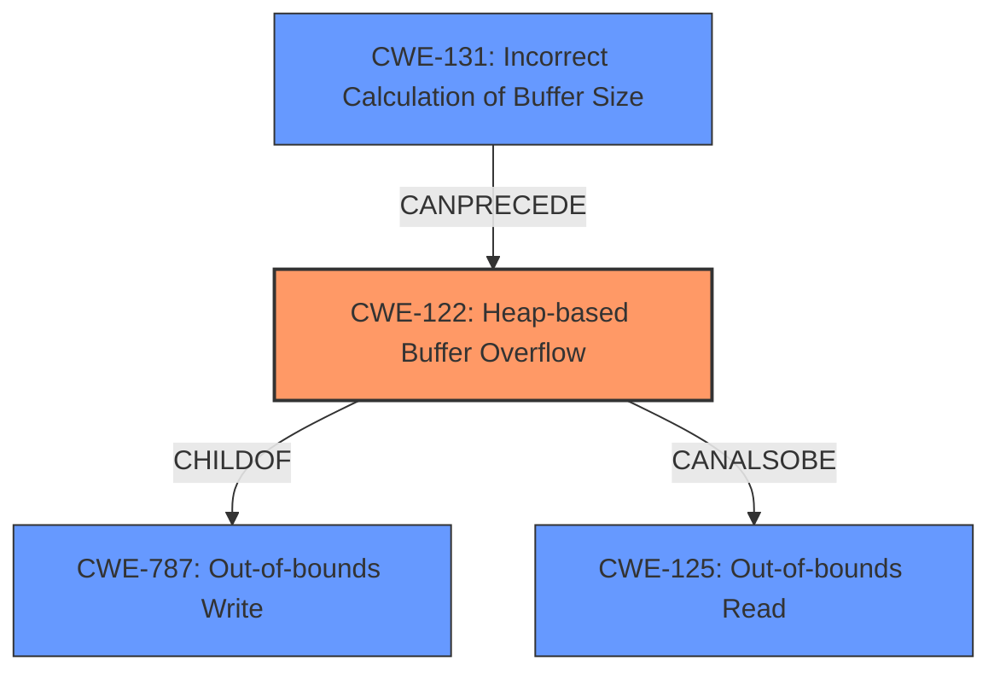

# Final Resolution for CVE-2022-0891

# Summary
| CWE ID | CWE Name | Confidence | CWE Abstraction Level | CWE Vulnerability Mapping Label | CWE-Vulnerability Mapping Notes |
| :----- | :------- | :--------- | :-------------------- | :------------------------------ | :----------------------------- |
| CWE-122 | Heap-based Buffer Overflow | 0.95 | Variant | Allowed | Primary CWE |
| CWE-125 | Out-of-bounds Read | 0.60 | Base | Allowed | Secondary Candidate |
| CWE-787 | Out-of-bounds Write | 0.65 | Base | Allowed | Secondary Candidate |
| CWE-131 | Incorrect Calculation of Buffer Size | 0.50 | Base | Allowed | Secondary Candidate |

## Evidence and Confidence

*   **Confidence Score:** 0.85
*   **Evidence Strength:** HIGH

## Relationship Analysis
The primary CWE is CWE-122 (Heap-based Buffer Overflow) which is a variant of CWE-787 (Out-of-bounds Write). CWE-122 represents a more specific case of out-of-bounds write, occurring specifically in the heap. The vulnerability can also be related to CWE-125 (Out-of-bounds Read) if the overflow leads to reading data beyond the buffer's boundaries. CWE-131 (Incorrect Calculation of Buffer Size) can potentially precede the overflow by causing an undersized buffer to be allocated in the first place.

## Vulnerability Chain
The vulnerability chain starts with a potential **incorrect calculation of buffer size** (**ROOTCAUSE**: CWE-131). This leads to allocating a buffer that is too small. Subsequently, a **heap-based buffer overflow** occurs (**WEAKNESS**: CWE-122) when data is written beyond the allocated buffer's boundaries. The overflow can potentially result in an **out-of-bounds read** (**WEAKNESS**: CWE-125) if the program attempts to access memory beyond the buffer. The ultimate impact includes application crash, potential information disclosure, or other context-dependent consequences.

## Summary of Analysis
The initial analysis correctly identifies CWE-122 (Heap-based Buffer Overflow) as the primary weakness based on the vulnerability description stating "A **heap buffer overflow** in ExtractImageSection function". The confidence in CWE-122 remains high (0.95) because it directly reflects the described **root cause**. The confidence scores for the secondary candidates were adjusted to reflect the level of direct evidence. CWE-125 (Out-of-bounds Read) is plausible but not explicitly mentioned, so the confidence was reduced to 0.60. CWE-787 (Out-of-bounds Write) is a parent of CWE-122, making it less specific, with a confidence of 0.65. CWE-131 (Incorrect Calculation of Buffer Size) is a possible contributing factor, but without direct evidence, the confidence was set to 0.50. The graph relationships confirm the hierarchical relationship between CWE-122 and CWE-787, as well as the potential for CWE-131 to precede CWE-122. These selected CWEs are at the optimal level of specificity based on the available evidence.