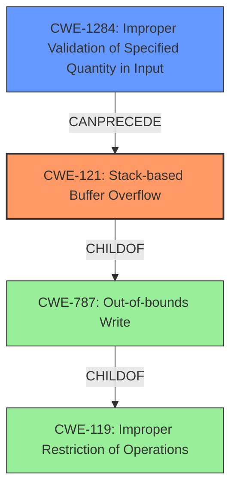

# Final Resolution for CVE-2022-0903

# Summary
| CWE ID | CWE Name | Confidence | CWE Abstraction Level | CWE Vulnerability Mapping Label | CWE-Vulnerability Mapping Notes |
|---|---|---|---|---|---|
| CWE-121 | Stack-based Buffer Overflow | 0.75 | Variant | Allowed | Primary CWE |
| CWE-1284 | Improper Validation of Specified Quantity in Input | 0.50 | Base | Allowed | Contributes to vulnerability by allowing malicious input. Chained: CWE-1284 -> CWE-121 |

## Evidence and Confidence

*   **Confidence Score:** 0.75
*   **Evidence Strength:** MEDIUM

## Relationship Analysis
The primary relationship is a chain where **CWE-1284 (Improper Validation of Specified Quantity in Input)** can precede **CWE-121 (Stack-based Buffer Overflow)**. **CWE-121 (Stack-based Buffer Overflow)** is a variant of **CWE-787 (Out-of-bounds Write)**, which in turn is a child of **CWE-119 (Improper Restriction of Operations within the Bounds of a Memory Buffer)**. Abstraction levels influenced the selection, favoring the more specific Variant level CWE-121, while also considering the Base level CWE-1284 for the input validation issue.

## Vulnerability Chain
The vulnerability chain starts with **CWE-1284 (Improper Validation of Specified Quantity in Input)**. A maliciously crafted POST body contains a quantity, such as a size or length, that is not properly validated. This leads to **CWE-121 (Stack-based Buffer Overflow)** because the unvalidated size is then used in an operation that writes data to the stack without proper bounds checking, ultimately causing a server crash. The **ROOTCAUSE** is the improper input validation and the **WEAKNESS** is the stack-based buffer overflow.

## Summary of Analysis
The initial analysis correctly identified **CWE-121 (Stack-based Buffer Overflow)** as the primary **WEAKNESS**, given the vulnerability description explicitly mentions a "stack overflow" bug. The confidence level of 0.75 remains appropriate.

The criticism highlighted the need to consider chained CWEs, particularly related to input validation. The analysis now includes **CWE-1284 (Improper Validation of Specified Quantity in Input)** as a contributing factor. The phrase "maliciously crafted POST body" strongly suggests that the server is not properly validating the input, and **CWE-1284 (Improper Validation of Specified Quantity in Input)** is more specific than the more general **CWE-20 (Improper Input Validation)**. **CWE-1284 (Improper Validation of Specified Quantity in Input)** aligns well with the scenario where the size or length parameter is not validated in the POST body.

The vulnerability description explicitly mentions "a maliciously crafted POST body", supporting the inclusion of **CWE-1284 (Improper Validation of Specified Quantity in Input)** in the vulnerability chain.

The decision to include **CWE-1284 (Improper Validation of Specified Quantity in Input)** and keep **CWE-121 (Stack-based Buffer Overflow)** is based on both the content of the vulnerability description and the CWE relationships. **CWE-121 (Stack-based Buffer Overflow)** is kept as the primary as it is the direct technical cause of the crash, where **CWE-1284 (Improper Validation of Specified Quantity in Input)** allowed the crafted post body to get to the vulnerable code and exploit the overflow. Both CWEs are at acceptable levels of abstraction for mapping, with **CWE-121 (Stack-based Buffer Overflow)** being a variant, and **CWE-1284 (Improper Validation of Specified Quantity in Input)** being base.