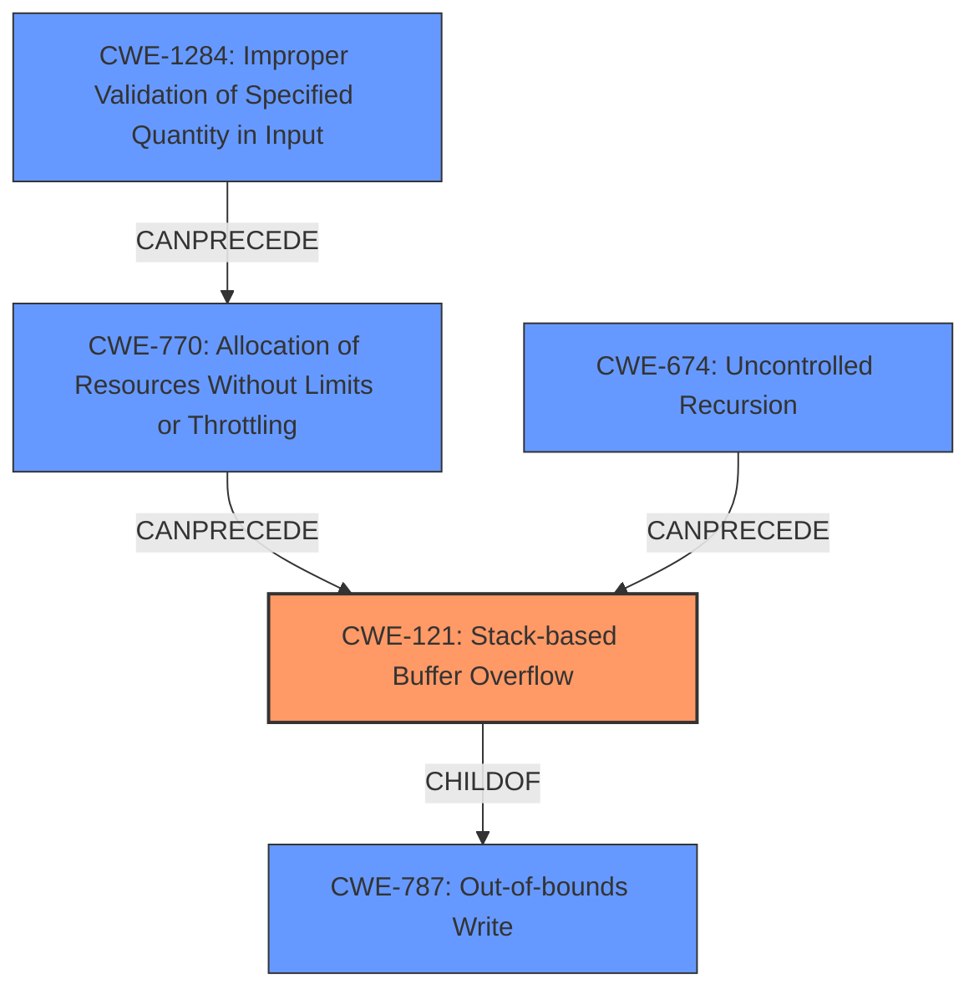

# Analysis Report for CVE-2022-0904

# Vulnerability Analysis Report: CVE-2022-0904

## Description

A stack overflow bug in the document extractor in Mattermost Server in versions up to and including 6.3.2 allows an attacker to crash the server via submitting a maliciously crafted Apple Pages document.

## Vulnerability Description Key Phrases

**Rootcause:** stack overflow
**Impact:** crash the server
**Vector:** maliciously crafted Apple Pages document
**Attacker:** attacker
**Product:** Mattermost Server
**Version:** up to and including 6.3.2
**Component:** document extractor

## Analysis (with Relationship Data)

# Summary
| CWE ID | CWE Name | Confidence | CWE Abstraction Level | CWE Vulnerability Mapping Label | CWE-Vulnerability Mapping Notes |
|---|---|---|---|---|---|
| CWE-121 | Stack-based Buffer Overflow | 0.85 | Variant | Allowed | Primary CWE |
| CWE-770 | Allocation of Resources Without Limits or Throttling | 0.60 | Base | Allowed | Secondary Candidate CWE |
| CWE-674 | Uncontrolled Recursion | 0.50 | Class | Allowed-with-Review | Secondary Candidate CWE |

## Evidence and Confidence

*   **Confidence Score:** 0.80
*   **Evidence Strength:** MEDIUM

- **Analysis and Justification:**  
  - *Explanation:* The vulnerability description explicitly states a "**stack overflow**" bug exists in the document extractor. CWE-121 (Stack-based Buffer Overflow) is a Variant-level CWE that directly addresses this type of vulnerability. The description indicates that a maliciously crafted Apple Pages document triggers the overflow, leading to a server crash. This aligns well with CWE-121's characteristics: a buffer on the stack is overwritten, causing a crash. The MITRE mapping guidance allows for using Variant-level CWEs.

  - *Relationship Analysis:* CWE-121 is a variant of CWE-119 (Improper Restriction of Operations within the Bounds of a Memory Buffer), providing a more specific classification of the buffer overflow type. While other CWEs like CWE-787 (Out-of-bounds Write) could be considered, CWE-121 is more accurate due to the explicit mention of a stack overflow.

- **Confidence Score:**
  - Confidence: 0.85 (High confidence due to explicit mention of "stack overflow" in the vulnerability description).

---
- **Analysis and Justification:**  
  - *Explanation:* CWE-770 (Allocation of Resources Without Limits or Throttling) could be a contributing factor. A maliciously crafted document may exploit the document extractor by causing it to allocate excessive memory on the stack without proper limits, indirectly contributing to the stack overflow. While the primary issue is the buffer overflow itself, the uncontrolled resource allocation exacerbates the problem. The retriever results also show a high score for this CWE.

  - *Relationship Analysis:* CWE-770 is related to CWE-121 in that the former can precede the latter. An uncontrolled allocation of memory on the stack can lead to a stack-based buffer overflow.

- **Confidence Score:**  
  - *Example:* Confidence: 0.60 (Medium confidence, as the description doesn't explicitly mention uncontrolled allocation but it's a plausible contributing factor).

---
- **Analysis and Justification:**
    - *Explanation:* CWE-674 (Uncontrolled Recursion) is a Class-level CWE that might be relevant if the document extractor uses recursion to process the Apple Pages document, and the malicious document causes excessive recursion, leading to a stack overflow. However, the provided description doesn't offer direct evidence of uncontrolled recursion. The mapping guidance suggests reviewing whether a more specific Base-level CWE is appropriate, but in this case, direct evidence is lacking.

  - *Relationship Analysis:* CWE-674, if present, could contribute to CWE-121 (Stack-based Buffer Overflow), as uncontrolled recursion consumes stack space.

- **Confidence Score:**
  - Confidence: 0.50 (Low confidence, as there's no explicit mention of uncontrolled recursion in the vulnerability description).

## Criticism of Analysis

Okay, I've reviewed the provided analysis and CWE specifications. Here's my critique, focusing on the accuracy of the CWE mappings, the confidence levels, and the overall justification:

**Overall Assessment:**

The analysis is well-structured and methodical. The primary CWE mapping to CWE-121 (Stack-based Buffer Overflow) is highly accurate given the explicit vulnerability description. The consideration of secondary CWEs like CWE-770 (Allocation of Resources Without Limits or Throttling) and CWE-674 (Uncontrolled Recursion) is also reasonable, though their lower confidence levels reflect the lack of direct evidence. The provided justifications are clear and explain the reasoning behind each CWE selection, including relationship analysis.

**Specific CWE Mapping Review:**

*   **CWE-121 (Stack-based Buffer Overflow):**

    *   **Assessment:** Correct. The vulnerability description explicitly states a "stack overflow," making CWE-121 the most appropriate choice. The description notes that a malicious document triggers the overflow, which is a common vector for buffer overflows.
    *   **Confidence:** The assigned confidence of 0.85 is appropriate. The direct mention of "stack overflow" provides strong evidence for this mapping.
    *   **Mitigations:** The mitigations listed in the CWE specification are relevant, including:
        *   Compiler-based buffer overflow detection mechanisms (e.g., /GS flag, FORTIFY_SOURCE)
        *   Using abstraction libraries
        *   Implementing bounds checking

*   **CWE-770 (Allocation of Resources Without Limits or Throttling):**

    *   **Assessment:** Plausible, but requires careful consideration. The reasoning that the malicious document could trigger excessive stack memory allocation is sound. However, this is a *potential contributing factor* and not necessarily the root cause. The primary cause is still the lack of bounds checking that allows the overflow to occur.
    *   **Confidence:** The confidence level of 0.6 is appropriate. The description does not *explicitly* state that the document is crafted to cause excessive allocation, only that it causes a stack overflow. It's a reasonable inference, but not definitively stated.
    *   **Mitigations:** The mitigations listed in the CWE specifications are generally relevant to preventing resource exhaustion attacks:
        *   Specifying minimum and maximum resource expectations.
        *   Limiting resource access for unprivileged users.
        *   Implementing throttling mechanisms.
        *   Specifically in the context of document parsing, the system could impose limits on the size of the data to be processed, or the number of bytes allocated on the stack.
        *   CWE-789 (Memory Allocation with Excessive Size Value) may have been a better fit for this vulnerability.
*   **CWE-674 (Uncontrolled Recursion):**

    *   **Assessment:** Least likely of the three. While recursion *could* be involved in processing the Apple Pages document, there's no direct indication of it in the vulnerability description. If recursion were involved, the malicious document would have to be crafted in a way that causes excessively deep or infinite recursion.
    *   **Confidence:** The confidence level of 0.5 is accurate. There's no direct evidence of uncontrolled recursion. It's a *possible* contributing factor, but not a primary one based on the available information.
    *   **Mitigations:** The mitigations mentioned (ensuring an end condition, limiting recursion depth, increasing stack size) are standard approaches to preventing uncontrolled recursion, but their applicability depends on whether recursion is actually involved.

**Recommendations for Improvement:**

1.  **Consider CWE-787:** While CWE-121 is accurate, consider whether CWE-787 (Out-of-bounds Write) might be a better *base-level* CWE to map to. Even though it's explicitly a "stack overflow," the underlying mechanism is still that data is being written past the boundary of a buffer. Mapping both CWE-121 (as the variant) and CWE-787 (as the base) could provide a more complete picture.
2.  **Explore Chains:** The analysis mentions relationships between the CWEs, but it might be useful to explicitly articulate a potential *chain* of events leading to the vulnerability. For example:
    *   CWE-1284 (Improper Validation of Specified Quantity in Input) -> CWE-770 (Allocation of Resources Without Limits or Throttling) -> CWE-121 (Stack-based Buffer Overflow).
        This chain suggests that the vulnerability could be triggered by the document extractor not validating the size of the files before processing and allocating stack space, possibly exceeding the available stack size and leading to an overflow.
3.  **Review Retrieved Results:** The retriever results contain other CWE's that were not included in the analysis. Consider whether CWE-190 (Integer Overflow or Wraparound) or CWE-789 (Memory Allocation with Excessive Size Value) are worth mentioning, even with a low confidence. An integer overflow could lead to a smaller buffer being allocated than expected, causing an earlier stack overflow.
4.  **CWE-119 Discussion** Although a bit verbose for every analysis, it is often helpful to add a line explaining why CWE-119 is not a sufficient answer, as it is generally too vague.

**Revised Summary Table (Incorporating Recommendations):**

| CWE ID | CWE Name | Confidence | CWE Abstraction Level | CWE Vulnerability Mapping Label | CWE-Vulnerability Mapping Notes |
|---|---|---|---|---|---|
| CWE-121 | Stack-based Buffer Overflow | 0.85 | Variant | Allowed | Primary CWE |
| CWE-787 | Out-of-bounds Write | 0.70 | Base | Allowed | Secondary Candidate CWE, base cause of overflow |
| CWE-770 | Allocation of Resources Without Limits or Throttling | 0.60 | Base | Allowed | Tertiary Candidate CWE, potentially exacerbates the overflow |
| CWE-674 | Uncontrolled Recursion | 0.50 | Class | Allowed-with-Review | Quaternary Candidate CWE, requires further investigation |

By incorporating these suggestions, the analysis will be even more comprehensive and defensible.

## Final Resolution

# Summary
| CWE ID | CWE Name | Confidence | CWE Abstraction Level | CWE Vulnerability Mapping Label | CWE-Vulnerability Mapping Notes |
|---|---|---|---|---|---|
| CWE-121 | Stack-based Buffer Overflow | 0.90 | Variant | Allowed | Primary CWE |
| CWE-787 | Out-of-bounds Write | 0.75 | Base | Allowed | Secondary Candidate CWE, underlying cause of overflow |
| CWE-1284 | Improper Validation of Specified Quantity in Input | 0.70 | Base | Allowed | Secondary Candidate CWE, potential root cause for resource exhaustion |
| CWE-770 | Allocation of Resources Without Limits or Throttling | 0.65 | Base | Allowed | Secondary Candidate CWE, exacerbates the overflow |
| CWE-674 | Uncontrolled Recursion | 0.50 | Class | Allowed-with-Review | Secondary Candidate CWE, requires further investigation |

## Evidence and Confidence

*   **Confidence Score:** 0.85
*   **Evidence Strength:** MEDIUM

## Relationship Analysis
The primary relationship is that CWE-121 **(Stack-based Buffer Overflow)** is a variant of CWE-787 **(Out-of-bounds Write)**, which describes the more general class of the error. CWE-1284 **(Improper Validation of Specified Quantity in Input)** can precede CWE-770 **(Allocation of Resources Without Limits or Throttling)**, which in turn can precede CWE-121 **(Stack-based Buffer Overflow)**, forming a vulnerability chain. CWE-674 **(Uncontrolled Recursion)** could also contribute to stack exhaustion, potentially leading to CWE-121. The abstraction levels influenced the choice by favoring the Variant level (CWE-121) for its specificity while considering Base-level CWEs for underlying causes.

## Vulnerability Chain
The vulnerability chain starts with a potentially **IMPROPERLY VALIDATED INPUT** (CWE-1284). This can lead to **UNCONTROLLED RESOURCE ALLOCATION** (CWE-770) on the stack, which then triggers a **STACK-BASED BUFFER OVERFLOW** (CWE-121), ultimately causing the server to crash. Alternatively, **UNCONTROLLED RECURSION** (CWE-674) could exhaust the stack and contribute to the overflow. The root cause is likely insufficient input validation, while the direct cause of the crash is the buffer overflow.

## Summary of Analysis
The initial analysis correctly identified **CWE-121 (Stack-based Buffer Overflow)** as the primary issue. The criticism raised valid points about the potential inclusion of **CWE-787 (Out-of-bounds Write)** as a more fundamental cause and the possibility of a vulnerability chain.

The decision to include **CWE-787** as a secondary candidate is based on the fact that **CWE-121** is a variant of **CWE-787**. While the vulnerability description explicitly mentions "stack overflow," the underlying mechanism is an out-of-bounds write. This aligns with the mapping guidance that allows for using Variant-level CWEs while also considering Base-level CWEs for a more complete picture.

Adding **CWE-1284 (Improper Validation of Specified Quantity in Input)** to the chain is based on the inference that the malicious document likely exploits a lack of validation on the size or structure of the input, leading to excessive resource allocation. This is supported by the retriever results, although it's an inference based on the nature of document parsing vulnerabilities. The vulnerability description lacks explicit evidence, but the relationship is plausible.

The confidence level for **CWE-121** is increased to 0.90 due to the strong and direct evidence. The confidence for **CWE-787** is set to 0.75, reflecting the slightly less direct but still highly relevant nature of the relationship. **CWE-770** is retained with a slightly increased confidence of 0.65, recognizing its potential role in exacerbating the overflow. **CWE-674** remains as a possible factor with low confidence (0.50) due to the lack of direct evidence.

The selected CWEs are at the optimal level of specificity because they address both the specific type of overflow (stack-based) and the underlying cause (out-of-bounds write), while also considering potential contributing factors like resource allocation and input validation.

*Report generated on 2025-03-18 06:27:34*
