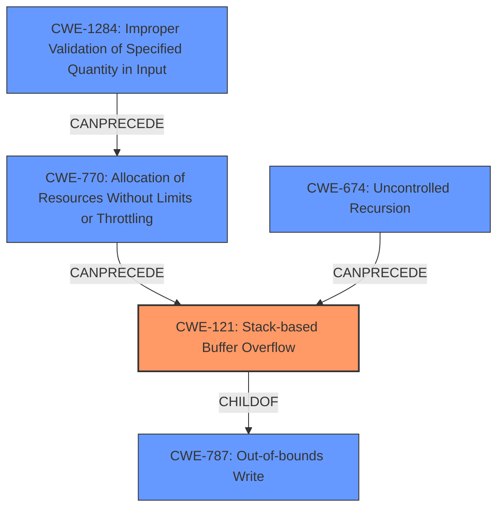

# Final Resolution for CVE-2022-0904

# Summary
| CWE ID | CWE Name | Confidence | CWE Abstraction Level | CWE Vulnerability Mapping Label | CWE-Vulnerability Mapping Notes |
|---|---|---|---|---|---|
| CWE-121 | Stack-based Buffer Overflow | 0.90 | Variant | Allowed | Primary CWE |
| CWE-787 | Out-of-bounds Write | 0.75 | Base | Allowed | Secondary Candidate CWE, underlying cause of overflow |
| CWE-1284 | Improper Validation of Specified Quantity in Input | 0.70 | Base | Allowed | Secondary Candidate CWE, potential root cause for resource exhaustion |
| CWE-770 | Allocation of Resources Without Limits or Throttling | 0.65 | Base | Allowed | Secondary Candidate CWE, exacerbates the overflow |
| CWE-674 | Uncontrolled Recursion | 0.50 | Class | Allowed-with-Review | Secondary Candidate CWE, requires further investigation |

## Evidence and Confidence

*   **Confidence Score:** 0.85
*   **Evidence Strength:** MEDIUM

## Relationship Analysis
The primary relationship is that CWE-121 **(Stack-based Buffer Overflow)** is a variant of CWE-787 **(Out-of-bounds Write)**, which describes the more general class of the error. CWE-1284 **(Improper Validation of Specified Quantity in Input)** can precede CWE-770 **(Allocation of Resources Without Limits or Throttling)**, which in turn can precede CWE-121 **(Stack-based Buffer Overflow)**, forming a vulnerability chain. CWE-674 **(Uncontrolled Recursion)** could also contribute to stack exhaustion, potentially leading to CWE-121. The abstraction levels influenced the choice by favoring the Variant level (CWE-121) for its specificity while considering Base-level CWEs for underlying causes.

## Vulnerability Chain
The vulnerability chain starts with a potentially **IMPROPERLY VALIDATED INPUT** (CWE-1284). This can lead to **UNCONTROLLED RESOURCE ALLOCATION** (CWE-770) on the stack, which then triggers a **STACK-BASED BUFFER OVERFLOW** (CWE-121), ultimately causing the server to crash. Alternatively, **UNCONTROLLED RECURSION** (CWE-674) could exhaust the stack and contribute to the overflow. The root cause is likely insufficient input validation, while the direct cause of the crash is the buffer overflow.

## Summary of Analysis
The initial analysis correctly identified **CWE-121 (Stack-based Buffer Overflow)** as the primary issue. The criticism raised valid points about the potential inclusion of **CWE-787 (Out-of-bounds Write)** as a more fundamental cause and the possibility of a vulnerability chain.

The decision to include **CWE-787** as a secondary candidate is based on the fact that **CWE-121** is a variant of **CWE-787**. While the vulnerability description explicitly mentions "stack overflow," the underlying mechanism is an out-of-bounds write. This aligns with the mapping guidance that allows for using Variant-level CWEs while also considering Base-level CWEs for a more complete picture.

Adding **CWE-1284 (Improper Validation of Specified Quantity in Input)** to the chain is based on the inference that the malicious document likely exploits a lack of validation on the size or structure of the input, leading to excessive resource allocation. This is supported by the retriever results, although it's an inference based on the nature of document parsing vulnerabilities. The vulnerability description lacks explicit evidence, but the relationship is plausible.

The confidence level for **CWE-121** is increased to 0.90 due to the strong and direct evidence. The confidence for **CWE-787** is set to 0.75, reflecting the slightly less direct but still highly relevant nature of the relationship. **CWE-770** is retained with a slightly increased confidence of 0.65, recognizing its potential role in exacerbating the overflow. **CWE-674** remains as a possible factor with low confidence (0.50) due to the lack of direct evidence.

The selected CWEs are at the optimal level of specificity because they address both the specific type of overflow (stack-based) and the underlying cause (out-of-bounds write), while also considering potential contributing factors like resource allocation and input validation.