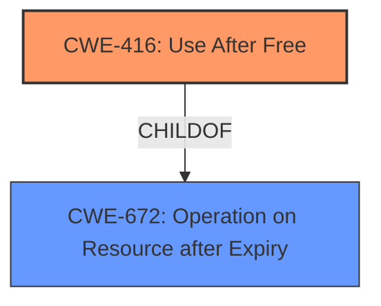

# Final Resolution for CVE-2022-0971

# Summary
| CWE ID | CWE Name | Confidence | CWE Abstraction Level | CWE Vulnerability Mapping Label | CWE-Vulnerability Mapping Notes |
|---|---|---|---|---|---|
| **CWE-416** | **Use After Free** | 1.0 | Variant | Allowed | Primary CWE |

## Evidence and Confidence

*   **Confidence Score:** 1.0
*   **Evidence Strength:** HIGH

## Relationship Analysis
The primary relationship considered was the parent-child relationship between CWE-416 (**Use After Free**) and its parent classes. While CWE-672 (Operation on Resource after Expiry) is a parent, CWE-416 provides a more specific classification that aligns directly with the vulnerability description. There are no chain relationships immediately relevant to this single CWE assignment.

## Vulnerability Chain
The vulnerability chain starts with the **rootcause**, which is the **use after free** condition (CWE-416). This allows a remote attacker to potentially exploit heap corruption. The impact is heap corruption, potentially leading to arbitrary code execution.

## Summary of Analysis
The initial analysis and the provided criticism both align in their assessment that **CWE-416** (**Use After Free**) is the most appropriate classification. The vulnerability description explicitly mentions "**use after free**," providing direct evidence for this classification. The analysis also correctly notes that the vulnerability leads to "**heap corruption**," which is a common consequence of **use after free** vulnerabilities. The mapping guidance for **CWE-416** indicates that its usage is ALLOWED, further solidifying its selection.

The relationship analysis confirms that while broader categories exist, **CWE-416** provides the optimal level of specificity. The criticism suggests elaborating on the connection to heap corruption and potential mitigations. However, it ultimately agrees with the initial assessment's conclusion.

The final determination is to classify this vulnerability as **CWE-416** (**Use After Free**) with a confidence score of 1.0, based on the direct evidence from the vulnerability description. The selection of **CWE-416** is at the optimal level of specificity.