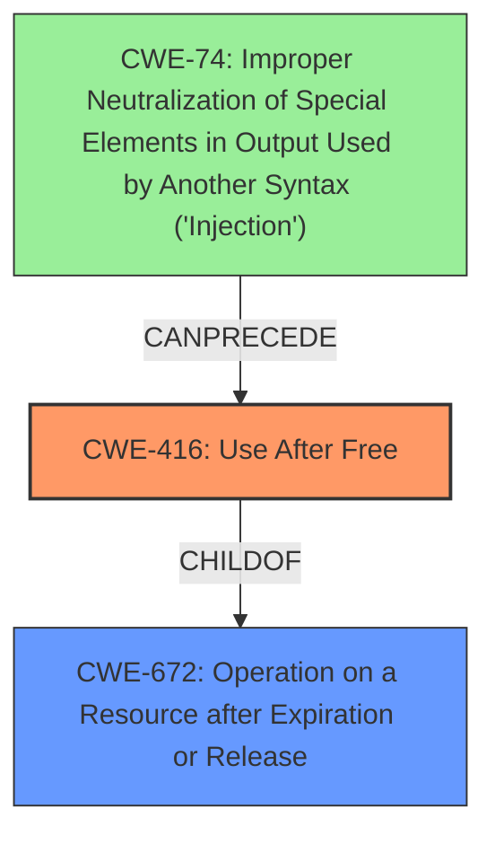

# Analysis Report for CVE-2022-0972

# Vulnerability Analysis Report: CVE-2022-0972

## Description

Use after free in Extensions in Google Chrome prior to 99.0.4844.74 allowed an attacker who convinced a user to install a malicious extension to potentially exploit heap corruption via a crafted HTML page.

## Vulnerability Description Key Phrases

**Rootcause:** use after free
**Weakness:** heap corruption
**Vector:** crafted HTML page
**Attacker:** attacker
**Product:** Google Chrome
**Version:** prior to 99.0.4844.74
**Component:** Extensions

## Analysis (with Relationship Data)

# Summary
| CWE ID | CWE Name | Confidence | CWE Abstraction Level | CWE Vulnerability Mapping Label | CWE-Vulnerability Mapping Notes |
|---|---|---|---|---|---|
| CWE-416 | Use After Free | 1.0 | Variant | Allowed | Primary CWE |

## Evidence and Confidence

*   **Confidence Score:** 1.0
*   **Evidence Strength:** HIGH

- **Analysis and Justification:**  
  - *Explanation:* The vulnerability description explicitly states "**use after free**" as the **root cause**, which directly corresponds to CWE-416 (Use After Free). The description also mentions "**heap corruption**" as a **weakness**, which is a common consequence of use-after-free vulnerabilities. The CVE Reference Links Content Summary reiterates "Use after free" as the "Root cause of vulnerability" and "Use after free in Extensions" as "Weaknesses/vulnerabilities". The "Attack vectors" involve a crafted extension, solidifying the attacker's ability to trigger the vulnerability. The Retriever Results also lists CWE-416 as the top match. CWE-416 is a Variant level CWE, which is a preferred level of abstraction. The MITRE mapping guidance for CWE-416 indicates this is ALLOWED.
  
  - *Relationship Analysis:* CWE-416 is a variant of CWE-672 (Operation on Resource after Expiry). There is no direct parent-child relationship.

- **Confidence Score:**  
  - Confidence: 1.0 (The description explicitly mentions the root cause, use after free, and aligns perfectly with CWE-416)

## Criticism of Analysis

## Critique of the Analysis

The analysis is **very strong** and accurately identifies CWE-416 (Use After Free) as the primary CWE for the described vulnerability. The confidence score of 1.0 is justified based on the explicit mention of "use after free" in the vulnerability description and CVE details. The reasoning and justification are clear, concise, and well-supported by the evidence provided.

Here's a breakdown of the strengths and potential areas for minor improvements:

**Strengths:**

*   **Accurate Identification:** The analysis correctly identifies CWE-416 as the primary weakness. The connection between the vulnerability description and the CWE description is clear and direct.
*   **Strong Justification:** The justification is thorough and references key phrases from the vulnerability description, CVE summary, and retriever results.  It explicitly links "use after free" as the root cause and "heap corruption" as a common consequence.
*   **Abstraction Level:**  The analysis correctly notes that CWE-416 is at the Variant level of abstraction, which is preferred.
*   **Mapping Guidance Adherence:** The analysis explicitly references the "Allowed" mapping guidance for CWE-416 and explains why it's an appropriate fit.
*   **Relationship Analysis:** The mention of CWE-672 and noting that there is no direct parent-child relationship is helpful.
*   **Confidence Level:** The confidence level of 1.0 is appropriate and justified by the direct evidence.
*   **CWE Examples:** Providing examples of similar CVEs is helpful context.
*   **Complete CWE Specifications:** Including the full CWE specifications is excellent and allows for a comprehensive review.

**Areas for Minor Improvements (Mostly Suggestions for Completeness):**

1.  **Consideration of CWE-672 (Operation on a Resource after Expiration or Release):**

    *   While the analysis correctly identifies CWE-416 as the most specific and appropriate CWE, it would be beneficial to explicitly discuss *why* CWE-672 is *not* the primary CWE, even though it is the parent. The analysis mentions it under "Relationship Analysis", but doesn't elaborate why CWE-416 is preferred.
    *   Explain why, although CWE-672 is a parent, it is not the preferred CWE because CWE-416 provides the specific *type* of operation being performed (use), while CWE-672 remains too abstract for this case.
    *  According to mapping guidance, the Usage is Allowed-with-Review, and it suggests examining children of this entry to see if there is a better fit (which there is).
    *   Also, even though it's a parent, the description of CWE-672 talks about "expired, released, or revoked" which might not be immediately apparent from the original vulnerability description. It is only after analyzing the details that you find that the resource was "released" (freed), and then "used". This should be explicitly mentioned.

2.  **Discussion of Heap Corruption:**

    *   The analysis mentions "heap corruption" as a weakness, but it could benefit from a slightly deeper dive. While CWE-416 is the root cause, the *impact* often involves heap corruption.
    *   Consider briefly explaining that heap corruption, while a consequence, is not a sufficiently specific *cause* to warrant a separate CWE. Heap corruption can arise from various memory errors, not just use-after-free. While heap corruption can sometimes lead to a buffer overflow (CWE-122), that's not the *initial* condition here.

3.  **Mitigations:**

    *   While not strictly necessary, it could be beneficial to briefly mention which mitigation strategies from the CWE-416 specification are most relevant to the specific context of the Chrome Extensions vulnerability.  For example, mentioning that choosing a language with automatic memory management (as suggested by CWE-416's Mitigation 1) isn't practical for Chrome Extensions development, but setting freed pointers to NULL (Mitigation 2) could be a useful defensive measure (although it might not fully prevent the UAF in all scenarios, especially with complex data structures).

4. **Consideration of other CWEs in Retriever Results:**

    *   It would strengthen the analysis to address why other high-ranking CWEs from the retriever results (like CWE-366, CWE-843, and CWE-415) are not the best fit. Briefly explaining why these are less relevant (e.g., CWE-366 requires concurrency, which isn't explicitly mentioned; CWE-843 involves type confusion, which isn't indicated in the description; CWE-415 is a double-free, while the description indicates a single free followed by a use) will show a comprehensive understanding of the problem.

5.  **Chain:**

    *   Given that the "Attack Vectors" section mentions "crafted HTML page" and "malicious extension" and the CVE Reference Links Content Summary indicates "crafted extension", a chain may exist that involves some form of injection (e.g. CWE-74, CWE-94, CWE-79) leading to the UAF. Although, without more information, it is difficult to determine what the exact nature of the injected data is, it's worth exploring if something like an injection vulnerability is a required precursor to the UAF. For example, the malicious extension might inject code that then frees the memory and later uses it, or inject code that causes Chrome itself to free the memory and then use it. This precursor weakness may be the vulnerability the user interacts with more directly.

**Revised Summary Table (incorporating suggestions):**

| CWE ID | CWE Name | Confidence | CWE Abstraction Level | CWE Vulnerability Mapping Label | CWE-Vulnerability Mapping Notes |
|---|---|---|---|---|---|
| CWE-416 | Use After Free | 1.0 | Variant | Allowed | Primary CWE.  Explicitly stated in the vulnerability description. A more specific child of CWE-672, making it the preferred mapping.|
| CWE-672 | Operation on a Resource after Expiration or Release | Low | Class | Allowed-with-Review | Parent of CWE-416, but too abstract for this case. While the resource *was* released and then used, CWE-416 provides the specific *type* of operation being performed. |

**In conclusion,** the original analysis is excellent. These suggestions are primarily for adding depth and completeness to further solidify the justification and demonstrate a thorough understanding of the nuances involved in CWE selection.

## Final Resolution

# Summary
| CWE ID | CWE Name | Confidence | CWE Abstraction Level | CWE Vulnerability Mapping Label | CWE-Vulnerability Mapping Notes |
|---|---|---|---|---|---|
| **CWE-416** | **Use After Free** | 1.0 | Variant | Allowed | Primary **CWE**. Explicitly stated in the vulnerability description. A more specific child of CWE-672, making it the preferred mapping. |
| CWE-672 | Operation on a Resource after Expiration or Release | 0.2 | Class | Allowed-with-Review | Parent of **CWE-416**, but too abstract for this case. While the resource *was* released and then used, **CWE-416** provides the specific *type* of operation being performed. |
| CWE-74 | Improper Neutralization of Special Elements in Output Used by Another Syntax ('Injection') | 0.3 | Base | Allowed | Secondary Candidate. A crafted HTML page and a malicious extension *could* be used to inject code that leads to the **use-after-free**. However, without more information, this remains speculative.|

## Evidence and Confidence

*   **Confidence Score:** 0.9
*   **Evidence Strength:** MEDIUM

## Relationship Analysis
The primary relationship impacting the decision is the parent-child relationship between CWE-672 and **CWE-416**. While CWE-672 is the parent, **CWE-416** provides the necessary specificity for the **root cause** of this vulnerability. Furthermore, there is a potential chain relationship where some form of injection (**CWE-74**) could *precede* the **use-after-free** (**CWE-416**), though this is based on the attack vectors described and not explicitly stated in the vulnerability description. **CWE-416** is a variant of the Class CWE-672.

## Vulnerability Chain
The vulnerability chain starts with a user installing a malicious extension. This extension could then inject code via a crafted HTML page (**CWE-74**). This injected code could then lead to memory being freed. Later, the same code, or another part of the extension, attempts to use that freed memory (**CWE-416**), leading to heap corruption and potentially arbitrary code execution. The **root cause** is the **use-after-free**, but the injection *could* be a necessary precursor, although the evidence for the injection is not strong. If the injection does exist, the user interacting with injected code would be the initial flaw, leading to the final impact of arbitrary code execution.

## Summary of Analysis
The initial analysis correctly identified **CWE-416 (Use After Free)** as the primary **CWE**. The vulnerability description explicitly states "**use after free**," making it a direct match.

The criticism provided valuable suggestions for improving the analysis, particularly in considering the parent **CWE (CWE-672)** and exploring potential vulnerability chains.

*Evidence from the Vulnerability Description:* "Use after free in Extensions in Google Chrome prior to 99.0.4844.74 allowed an attacker who convinced a user to install a malicious extension to potentially exploit heap corruption via a crafted HTML page."

The graph relationships influenced the final selection by highlighting the importance of specificity. While **CWE-672** is a parent, **CWE-416** is the more precise description of the **root cause**. The attack vectors ("crafted HTML page" and "malicious extension") suggest a potential injection vulnerability (**CWE-74**) as a precursor, but without stronger evidence, it remains a secondary consideration.

The selected **CWEs** are at the optimal level of specificity. **CWE-416** directly reflects the **root cause** described in the vulnerability. While heap corruption is a consequence, it's not a specific enough cause to warrant a separate **CWE**. The evidence for **CWE-74** is weak.

*Report generated on 2025-03-18 06:28:52*
