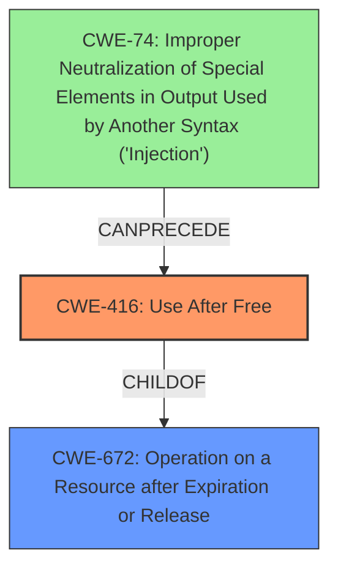

# Final Resolution for CVE-2022-0972

# Summary
| CWE ID | CWE Name | Confidence | CWE Abstraction Level | CWE Vulnerability Mapping Label | CWE-Vulnerability Mapping Notes |
|---|---|---|---|---|---|
| **CWE-416** | **Use After Free** | 1.0 | Variant | Allowed | Primary **CWE**. Explicitly stated in the vulnerability description. A more specific child of CWE-672, making it the preferred mapping. |
| CWE-672 | Operation on a Resource after Expiration or Release | 0.2 | Class | Allowed-with-Review | Parent of **CWE-416**, but too abstract for this case. While the resource *was* released and then used, **CWE-416** provides the specific *type* of operation being performed. |
| CWE-74 | Improper Neutralization of Special Elements in Output Used by Another Syntax ('Injection') | 0.3 | Base | Allowed | Secondary Candidate. A crafted HTML page and a malicious extension *could* be used to inject code that leads to the **use-after-free**. However, without more information, this remains speculative.|

## Evidence and Confidence

*   **Confidence Score:** 0.9
*   **Evidence Strength:** MEDIUM

## Relationship Analysis
The primary relationship impacting the decision is the parent-child relationship between CWE-672 and **CWE-416**. While CWE-672 is the parent, **CWE-416** provides the necessary specificity for the **root cause** of this vulnerability. Furthermore, there is a potential chain relationship where some form of injection (**CWE-74**) could *precede* the **use-after-free** (**CWE-416**), though this is based on the attack vectors described and not explicitly stated in the vulnerability description. **CWE-416** is a variant of the Class CWE-672.

## Vulnerability Chain
The vulnerability chain starts with a user installing a malicious extension. This extension could then inject code via a crafted HTML page (**CWE-74**). This injected code could then lead to memory being freed. Later, the same code, or another part of the extension, attempts to use that freed memory (**CWE-416**), leading to heap corruption and potentially arbitrary code execution. The **root cause** is the **use-after-free**, but the injection *could* be a necessary precursor, although the evidence for the injection is not strong. If the injection does exist, the user interacting with injected code would be the initial flaw, leading to the final impact of arbitrary code execution.

## Summary of Analysis
The initial analysis correctly identified **CWE-416 (Use After Free)** as the primary **CWE**. The vulnerability description explicitly states "**use after free**," making it a direct match.

The criticism provided valuable suggestions for improving the analysis, particularly in considering the parent **CWE (CWE-672)** and exploring potential vulnerability chains.

*Evidence from the Vulnerability Description:* "Use after free in Extensions in Google Chrome prior to 99.0.4844.74 allowed an attacker who convinced a user to install a malicious extension to potentially exploit heap corruption via a crafted HTML page."

The graph relationships influenced the final selection by highlighting the importance of specificity. While **CWE-672** is a parent, **CWE-416** is the more precise description of the **root cause**. The attack vectors ("crafted HTML page" and "malicious extension") suggest a potential injection vulnerability (**CWE-74**) as a precursor, but without stronger evidence, it remains a secondary consideration.

The selected **CWEs** are at the optimal level of specificity. **CWE-416** directly reflects the **root cause** described in the vulnerability. While heap corruption is a consequence, it's not a specific enough cause to warrant a separate **CWE**. The evidence for **CWE-74** is weak.