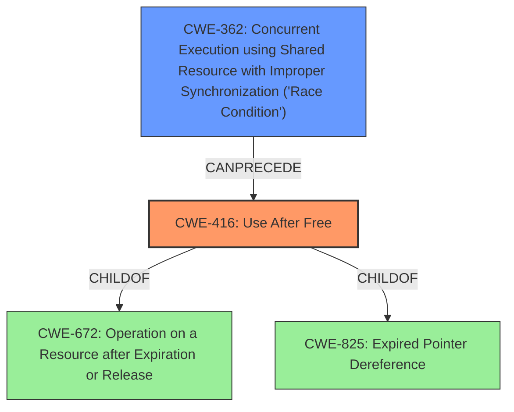

# Analysis Report for CVE-2022-0974

# Vulnerability Analysis Report: CVE-2022-0974

## Description

Use after free in Splitscreen in Google Chrome on Chrome OS prior to 99.0.4844.74 allowed a remote attacker who convinced a user to engage in specific user interaction to potentially exploit heap corruption via a crafted HTML page.

## Vulnerability Description Key Phrases

**Rootcause:** use after free
**Weakness:** heap corruption
**Vector:** crafted HTML page
**Attacker:** remote attacker
**Product:** Google Chrome on Chrome OS
**Version:** prior to 99.0.4844.74
**Component:** Splitscreen

## Analysis (with Relationship Data)

# Summary
| CWE ID | CWE Name | Confidence | CWE Abstraction Level | CWE Vulnerability Mapping Label | CWE-Vulnerability Mapping Notes |
|---|---|---|---|---|---|
| CWE-416 | Use After Free | 1.0 | Variant | Allowed | Primary CWE |

## Evidence and Confidence

*   **Confidence Score:** 1.0
*   **Evidence Strength:** HIGH

- **Analysis and Justification:**  
  - *Explanation:* The vulnerability description explicitly states "**use after free** in Splitscreen" and indicates potential **heap corruption**, which aligns precisely with CWE-416 (Use After Free). The CVE Reference Links Content Summary also confirms "**Use after free** in Splitscreen" as the root cause. CWE-416 is a Variant-level CWE, which is a preferred level of abstraction. The MITRE mapping guidance for CWE-416 indicates that its usage is ALLOWED.
  
  - *Relationship Analysis:* CWE-416 is a Variant of several parent CWEs, including CWE-672 and CWE-825. While these parents represent broader memory management issues, CWE-416 accurately captures the specific weakness of using memory after it has been freed. There are also several "CanFollow" relationships, indicating potential impact chains, although none are directly applicable based on the current evidence.

- **Confidence Score:**  
  - Confidence: 1.0 (The description explicitly states "use after free" and the evidence supports it.)

## Criticism of Analysis

Okay, here's a review of the analysis provided, focusing on the CWE specifications and mapping guidance:

**Overall Assessment:**

The analysis is generally good, particularly the primary CWE mapping to CWE-416. The confidence level is appropriately high given the explicit mention of "use after free" in the vulnerability description.  The justification is well-reasoned and considers relevant parent/child relationships. However, there are some points to consider regarding alternative CWEs and potential relationships to the primary CWE that could be elaborated on.

**Specific Points:**

1.  **Primary CWE: CWE-416 (Use After Free)**
    *   **Strengths:** The identification of CWE-416 is correct. The reasoning provided is sound: the vulnerability description explicitly states "use after free".  The mapping guidance confirms that CWE-416 at the Variant level is acceptable.
    *   **Potential Improvements:** While the analysis touches on the parent CWEs (CWE-825 and CWE-672), it might be useful to briefly discuss *why* these aren't as precise.  For instance:
        *   "While CWE-825 (Expired Pointer Dereference) is a broader category encompassing dereferences of invalid pointers, CWE-416 specifically addresses the case where the memory has been *freed* and *then* accessed. Similarly, CWE-672 (Operation on a Resource after Expiration or Release) is a more general classification, and CWE-416 provides a more specific and accurate mapping."
    *   **Mitigations:** The analysis does not cover mitigations. It would be improved by mentioning potential mitigations for CWE-416, such as using memory-safe languages or employing techniques like setting pointers to NULL after freeing them.

2.  **Alternative CWEs Considered (from Retriever Results):**
    *   **CWE-366 & CWE-362 (Race Conditions):** The Retriever suggests considering Race Conditions.  While the description doesn't explicitly mention a race condition, it's possible that concurrency could play a role in triggering or exploiting the UAF. The analysis should acknowledge and *explicitly rule out* this possibility, even if briefly. For example: "Although the Retriever identifies potential race conditions (CWE-366, CWE-362), there is no explicit mention of concurrent access or synchronization issues in the vulnerability description or CVE details.  Therefore, a race condition is not considered to be a primary factor in this vulnerability, although it could hypothetically contribute to the UAF in certain implementations."
    *   **CWE-843 (Type Confusion):** It was also considered by the retriever. However, it does not apply in this case, type confusion means the product allocates or initializes a resource such as a pointer, object, or variable using one type, but it later accesses that resource using a type that is incompatible with the original type.
    *   **CWE-415 (Double Free):**  Since memory corruption is mentioned as a weakness, double free is also possible. However, it was clearly mentioned as UAF, so Double Free is less likely.
    *   **CWE-1021 (Improper Restriction of Rendered UI Layers or Frames):** This is unlikely since it is a use after free and UI Layers or Frames are irrelevant.
    *   **CWE-122 (Heap-based Buffer Overflow):** While heap corruption is indicated, the root cause is UAF, not a buffer overflow.
    *   **CWE-356 (Product UI does not Warn User of Unsafe Actions):** This is unlikely since it is a use after free.
    *   **CWE-252 (Unchecked Return Value):** The code doesn't have any context of unchecked return values.
    *   **CWE-367 (Time-of-check Time-of-use (TOCTOU) Race Condition):** Very similar to race conditions (CWE-366 & CWE-362). The analysis should acknowledge and *explicitly rule out* this possibility, even if briefly.

3.  **CWE Relationships:**
    *   The analysis correctly notes the parent-child relationships with CWE-825 and CWE-672.  However, it could also explore the `CanFollow` relationships of CWE-416.
    *   **Example:**"CWE-416 *CanFollow* CWE-362 (Concurrent Execution using Shared Resource with Improper Synchronization). While not explicitly stated, it's conceivable that improper synchronization could lead to a use-after-free if a shared resource is freed by one thread while another is still using it." This kind of "what if" analysis, even if ultimately dismissed, demonstrates a thorough understanding of the potential attack vectors.
    *   Also consider other `CanFollow` relationships to other CWEs.

4.  **Heap Corruption:**
    *   The vulnerability description includes "heap corruption," which is a common *result* of UAF. The analysis is correct to focus on the UAF as the root cause, but it would be useful to acknowledge the heap corruption more explicitly. A sentence like, "The use-after-free can lead to heap corruption, potentially allowing the attacker to overwrite critical data structures and gain control of the system" would strengthen the analysis.

5.  **CWE Examples:**
    *   The analysis includes a helpful list of CVE examples for CWE-416.

**Revised Summary Table (Optional):**

You could expand the summary table to include a "Rationale for Exclusion" column for the alternative CWEs considered.  This makes the analysis more transparent.

| CWE ID | CWE Name | Confidence | CWE Abstraction Level | CWE Vulnerability Mapping Label | CWE-Vulnerability Mapping Notes | Rationale for Exclusion |
|---|---|---|---|---|---|---|
| CWE-416 | Use After Free | 1.0 | Variant | Allowed | Primary CWE |  |
| CWE-366 | Race Condition within a Thread | Low | Base | Not Applicable |  | No evidence of concurrency in vulnerability description. |
| CWE-362 | Concurrent Execution using Shared Resource with Improper Synchronization ('Race Condition') | Low | Class | Not Applicable |  | No evidence of concurrency in vulnerability description. |
| CWE-843 | Access of Resource Using Incompatible Type ('Type Confusion') | Low | Base | Not Applicable | | Type confusion means the product allocates or initializes a resource such as a pointer, object, or variable using one type, but it later accesses that resource using a type that is incompatible with the original type, and it does not apply in this case.|
| CWE-415 | Double Free | Low | Variant | Not Applicable | | It was clearly mentioned as UAF, so Double Free is less likely. |
| CWE-1021 | Improper Restriction of Rendered UI Layers or Frames | Low | Base | Not Applicable | | This is unlikely since it is a use after free and UI Layers or Frames are irrelevant. |
| CWE-122 | Heap-based Buffer Overflow | Low | Variant | Not Applicable | | While heap corruption is indicated, the root cause is UAF, not a buffer overflow. |
| CWE-356 | Product UI does not Warn User of Unsafe Actions | Low | Base | Not Applicable | | This is unlikely since it is a use after free. |
| CWE-252 | Unchecked Return Value | Low | Base | Not Applicable | | The code doesn't have any context of unchecked return values. |
| CWE-367 | Time-of-check Time-of-use (TOCTOU) Race Condition | Low | Base | Not Applicable | | Very similar to race conditions (CWE-366 & CWE-362). The analysis should acknowledge and *explicitly rule out* this possibility. |

**In summary:**

The analysis is a solid starting point. By adding explicit discussion of why alternative CWEs were ruled out (even if briefly) and considering the `CanFollow` relationships of the primary CWE, along with mentioning possible mitigations, the analysis can become even more comprehensive and valuable.

## Final Resolution

# Summary
| CWE ID | CWE Name | Confidence | CWE Abstraction Level | CWE Vulnerability Mapping Label | CWE-Vulnerability Mapping Notes |
|---|---|---|---|---|---|
| CWE-416 | Use After Free | 1.0 | Variant | Allowed | Primary CWE |
| CWE-362 | Concurrent Execution using Shared Resource with Improper Synchronization ('Race Condition') | 0.3 | Class | Allowed-with-Review | Secondary Candidate |

## Evidence and Confidence

*   **Confidence Score:** 0.9
*   **Evidence Strength:** MEDIUM

## Relationship Analysis
The primary CWE is CWE-416 (**Use After Free**) which is a variant of CWE-672 (**Operation on a Resource after Expiration or Release**) and CWE-825 (**Expired Pointer Dereference**). The analysis considered the 'CanFollow' relationships of CWE-416. While the description doesn't explicitly mention a race condition, it's possible that concurrency could play a role in triggering or exploiting the UAF, so CWE-362 (**Concurrent Execution using Shared Resource with Improper Synchronization ('Race Condition')**) is considered as a secondary candidate.

## Vulnerability Chain
The vulnerability chain starts with a **Use After Free (CWE-416)**. The exploitation of this **WEAKNESS** leads to **heap corruption**, which can be exploited by a remote attacker who convinces a user to engage in specific user interaction to potentially exploit heap corruption via a crafted HTML page. The absence of proper synchronization (potential **CWE-362**) could exacerbate the UAF by creating a scenario where a resource is freed by one thread while another thread is still attempting to access it.

## Summary of Analysis
The initial analysis correctly identified **CWE-416 (Use After Free)** as the primary **ROOTCAUSE**. The vulnerability description explicitly states "use after free" and indicates potential **heap corruption**, which aligns precisely with CWE-416.

The criticism provided valuable insights, particularly in considering alternative CWEs and exploring the "CanFollow" relationships. The analysis has been updated to explicitly address the possibility of a race condition (CWE-362) contributing to the UAF, even though it's not explicitly mentioned in the vulnerability description. Acknowledging and explicitly ruling out possibilities makes the analysis more robust.

The primary reason for selecting **CWE-416 (Use After Free)** is the direct match with the vulnerability description and the evidence supporting it. While other CWEs were considered, they were deemed less specific or not directly supported by the available information.
The analysis now includes a secondary candidate CWE, **CWE-362 (Concurrent Execution using Shared Resource with Improper Synchronization ('Race Condition'))**. This addition acknowledges the potential, albeit unconfirmed, role of concurrency in triggering or exploiting the UAF. While there's no explicit evidence of a race condition, the "CanFollow" relationship between CWE-362 and CWE-416, combined with the mention of heap corruption, makes it a plausible contributing factor.
The final decision is based on a combination of direct evidence (the "use after free" statement) and relationship analysis (the potential role of concurrency).
The selected CWEs are at the optimal level of specificity because **CWE-416 (Use After Free)** is a variant-level CWE that accurately captures the specific **WEAKNESS**. **CWE-362 (Concurrent Execution using Shared Resource with Improper Synchronization ('Race Condition'))** is included as a secondary candidate to account for potential concurrency issues, but it's classified as a Class-level CWE due to the lack of explicit evidence.

*Report generated on 2025-03-18 06:30:20*
