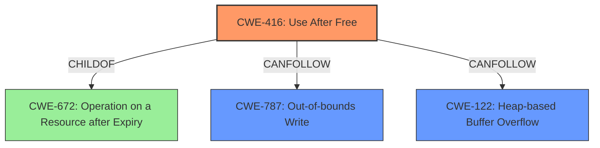

# Analysis Report for CVE-2022-0975

# Vulnerability Analysis Report: CVE-2022-0975

## Description

Use after free in ANGLE in Google Chrome prior to 99.0.4844.74 allowed a remote attacker to potentially exploit heap corruption via a crafted HTML page.

## Vulnerability Description Key Phrases

**Rootcause:** use after free
**Weakness:** heap corruption
**Vector:** crafted HTML page
**Attacker:** remote attacker
**Product:** Google Chrome
**Version:** prior to 99.0.4844.74
**Component:** ANGLE

## Analysis (with Relationship Data)

# Summary
| CWE ID | CWE Name | Confidence | CWE Abstraction Level | CWE Vulnerability Mapping Label | CWE-Vulnerability Mapping Notes |
|---|---|---|---|---|---|
| CWE-416 | Use After Free | 1.0 | Variant | Allowed | Primary CWE |

## Evidence and Confidence

*   **Confidence Score:** 1.0
*   **Evidence Strength:** HIGH

- **Analysis and Justification:**  
  - *Explanation:* The vulnerability description explicitly states "**use after free** in ANGLE in Google Chrome prior to 99.0.4844.74 allowed a remote attacker to potentially exploit **heap corruption** via a crafted HTML page." This directly maps to CWE-416, Use After Free, which occurs when the product reuses or references memory after it has been freed. The CVE Reference Links Content Summary reinforces this, stating the root cause is "Use-after-free in ANGLE". The attack vector involves a crafted HTML page, indicating a remote attacker can trigger the vulnerability. The "Retriever Results" also lists CWE-416 as the top candidate with a high score. Given the direct statement of "use after free" and the variant level of abstraction, CWE-416 is the most appropriate choice.

  - *Relationship Analysis:* CWE-416 is a variant of CWE-672 (Operation on a Resource after Expiry). Exploiting a use-after-free can lead to various impacts, potentially including remote code execution, as indicated in the CVE Reference Links Content Summary.

- **Confidence Score:**  
  - Confidence: 1.0 (Direct evidence from the vulnerability description and CVE details)

## Criticism of Analysis

Okay, here's a review of the provided analysis, considering the full CWE specifications.

**Overall Assessment:**

The analysis is generally very good.  The primary CWE mapping to CWE-416 (Use After Free) is highly justified and accurate. The confidence level of 1.0 is appropriate given the explicit mention of "use after free" in the vulnerability description. The explanation is clear, concise, and well-reasoned. Including relevant CWE specifications to support the analysis is also excellent.

**Detailed Review:**

*   **CWE-416 (Use After Free):**
    *   **Correctness:** The mapping to CWE-416 is accurate and well-supported. The explanation correctly identifies that the product reuses or references memory after it has been freed.
    *   **Abstraction Level:** Variant is the correct abstraction level.
    *   **Evidence Strength:** The evidence strength is HIGH, as noted.
    *   **CWE Specification Alignment:** The analysis aligns well with the CWE-416 specification, particularly the description: "The product reuses or references memory after it has been freed. At some point afterward, the memory may be allocated again and saved in another pointer, while the original pointer references a location somewhere within the new allocation. Any operations using the original pointer are no longer valid because the memory "belongs" to the code that operates on the new pointer."
    *   **Mitigations:** The provided mitigations (language selection, setting pointers to NULL after freeing) are directly relevant to CWE-416 and are good general recommendations.
    *   **Relationships:** The analysis mentions that CWE-416 is a variant of CWE-672. This is correct.

*   **Retriever Results and Alternative CWEs:**
    *   The retriever results list other CWEs that were considered, but ultimately deemed less appropriate.  Let's examine the most relevant alternatives:
        *   **CWE-843 (Access of Resource Using Incompatible Type ('Type Confusion')):**  While memory corruption is mentioned in the original description, the root cause is explicitly a use-after-free, not necessarily a type confusion.  Type confusion *could* be a consequence of a UAF, but it's not the primary issue described. This is less directly supported by the vulnerability description. If, after the memory is freed, it's reallocated and interpreted as a different type *that's* when CWE-843 becomes relevant. But the primary issue is still operating on freed memory.
        *   **CWE-366 (Race Condition within a Thread) and CWE-362 (Concurrent Execution using Shared Resource with Improper Synchronization):** Race conditions are listed because UAFs can *sometimes* be caused by a race condition. But there's no explicit mention of concurrency in the original vulnerability description, so downplaying these CWEs is correct. If the freeing and subsequent use were happening in different threads without proper synchronization, then CWE-362/366 would be relevant *in addition* to CWE-416.
        *   **CWE-415 (Double Free):** Double-free is also about releasing memory, however, it isn't about using memory that was already freed, that is the reason this is less relevant.
        *   **CWE-122 (Heap-based Buffer Overflow):** This is less likely but possible. A UAF *could* lead to a heap-based buffer overflow if, after the memory is freed and reallocated, the attacker can control the size and contents of the data written to the reallocated memory. However, it's a secondary effect and not the direct cause.
        *   **CWE-787 (Out-of-bounds Write):** Similar to CWE-122. Possible as a consequence but not the primary cause.

**Recommendations:**

1.  **Consider Adding a Chain:** The analysis is correct in identifying CWE-416 as the primary weakness. However, it could be strengthened by noting a potential chain.  For instance: "The primary weakness is CWE-416.  Exploitation of this UAF can lead to CWE-787 (Out-of-bounds Write) or CWE-122 (Heap-based Buffer Overflow) if the attacker can influence the contents of the reallocated memory after the free." This clarifies the potential impact and how a UAF can lead to further exploitation.

2.  **Mitigations Discussion:**  While the analysis mentions general mitigations for CWE-416, it could be enhanced by briefly mentioning how those mitigations address the *specific* vulnerability context (ANGLE in Chrome). For example: "Mitigation of this UAF in ANGLE would involve careful review of memory management within the graphics library, ensuring that objects are not accessed after being freed.  Setting pointers to NULL after freeing is a common defense, but requires diligent application across the codebase."

**Revised Summary Table (with the proposed chain):**

| CWE ID | CWE Name | Confidence | CWE Abstraction Level | CWE Vulnerability Mapping Label | CWE-Vulnerability Mapping Notes |
|---|---|---|---|---|---|
| CWE-416 | Use After Free | 1.0 | Variant | Allowed | Primary CWE |
| CWE-787 | Out-of-bounds Write | 0.5 | Base | Consequence | Possible consequence if attacker can control the reallocated memory.  Chain: CWE-416 -> CWE-787 |
| CWE-122 | Heap-based Buffer Overflow | 0.5 | Variant | Consequence | Possible consequence if attacker can control the reallocated memory. Chain: CWE-416 -> CWE-122 |

**In conclusion, the analysis is very good, and the primary CWE mapping is accurate. The suggested enhancements above would further strengthen the analysis by explicitly outlining potential chains and tailoring the mitigation discussion to the specific vulnerability context.**

## Final Resolution

# Summary
| CWE ID | CWE Name | Confidence | CWE Abstraction Level | CWE Vulnerability Mapping Label | CWE-Vulnerability Mapping Notes |
|---|---|---|---|---|---|
| CWE-416 | Use After Free | 1.0 | Variant | Allowed | Primary **WEAKNESS**. Explicitly mentioned in vulnerability description. |
| CWE-787 | Out-of-bounds Write | 0.5 | Base | Consequence | Possible consequence if attacker can control the reallocated memory. Chain: CWE-416 -> CWE-787 |
| CWE-122 | Heap-based Buffer Overflow | 0.5 | Variant | Consequence | Possible consequence if attacker can control the reallocated memory. Chain: CWE-416 -> CWE-122 |

## Evidence and Confidence

*   **Confidence Score:** 0.95
*   **Evidence Strength:** HIGH

## Relationship Analysis
The primary relationship influencing the classification is the hierarchical relationship where CWE-416 is a variant of CWE-672 (Operation on a Resource after Expiry). The chain relationships, specifically CANPRECEDE and CANFOLLOW, were considered when adding CWE-787 and CWE-122 as potential consequences of CWE-416. The abstraction levels (Variant for CWE-416, Base for CWE-787, and Variant for CWE-122) helped ensure the most specific and relevant classifications were chosen. Peer relationships were considered, especially with CWE-415 (Double Free) and CWE-843 (Type Confusion), but they were deemed less directly relevant than CWE-416 based on the vulnerability description.

## Vulnerability Chain
The vulnerability chain starts with the **ROOTCAUSE** of a **use-after-free** condition (CWE-416). This occurs when memory is accessed after it has been freed. The immediate consequence is potential **heap corruption**. If an attacker can influence the contents of the reallocated memory, this can lead to further exploitation via CWE-787 (Out-of-bounds Write) or CWE-122 (Heap-based Buffer Overflow), ultimately enabling remote code execution.

## Summary of Analysis
The initial analysis correctly identified CWE-416 as the primary **WEAKNESS** based on the explicit statement "**use after free** in ANGLE in Google Chrome prior to 99.0.4844.74 allowed a remote attacker to potentially exploit **heap corruption** via a crafted HTML page." The criticism provided valuable suggestions for strengthening the analysis by considering potential vulnerability chains.

The graph relationships influenced the final selection by highlighting potential consequences of the primary **WEAKNESS**. The inclusion of CWE-787 and CWE-122 as secondary CWEs reflects the understanding that exploiting a **use-after-free** condition can lead to further memory corruption vulnerabilities.

The selected CWEs are at the optimal level of specificity. CWE-416 (Use After Free) is a Variant, providing a specific description of the **WEAKNESS**. CWE-787 (Out-of-bounds Write) and CWE-122 (Heap-based Buffer Overflow) are at the Base and Variant levels, respectively, offering relevant potential consequences of the **ROOTCAUSE**. The decision to include CWE-787 and CWE-122 as possible consequences is based on the fact that "**heap corruption**" is mentioned in the original description. If an attacker can influence the contents of reallocated memory then those are possible consequences.

*Report generated on 2025-03-18 06:31:03*
