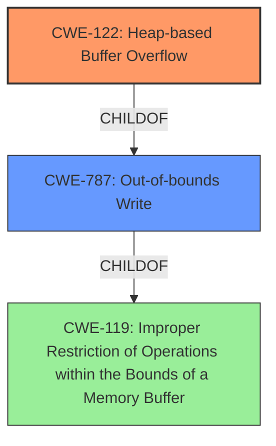

# Analysis Report for CVE-2022-0976

# Vulnerability Analysis Report: CVE-2022-0976

## Description

Heap buffer overflow in GPU in Google Chrome prior to 99.0.4844.74 allowed a remote attacker to potentially exploit heap corruption via a crafted HTML page.

## Vulnerability Description Key Phrases

**Rootcause:** buffer overflow
**Impact:** heap corruption
**Vector:** crafted HTML page
**Attacker:** remote attacker
**Product:** Google Chrome
**Version:** prior to 99.0.4844.74
**Component:** GPU

## Analysis (with Relationship Data)

# Summary
| CWE ID | CWE Name | Confidence | CWE Abstraction Level | CWE Vulnerability Mapping Label | CWE-Vulnerability Mapping Notes |
|---|---|---|---|---|---|
| CWE-122 | Heap-based Buffer Overflow | 0.95 | Variant | Primary | Allowed |
| CWE-787 | Out-of-bounds Write | 0.75 | Base | Secondary | Allowed |

## Evidence and Confidence

*   **Confidence Score:** 0.90
*   **Evidence Strength:** HIGH

- **Analysis and Justification:**  
  - *Explanation:* The vulnerability description explicitly states a "Heap **buffer overflow** in GPU" leading to potential heap corruption. CWE-122 (Heap-based Buffer Overflow) directly addresses this scenario, where a buffer overflow occurs in the heap memory region. The **root cause** is clearly a **buffer overflow**, making CWE-122 a precise fit. CWE-787 (Out-of-bounds Write) is a related CWE, as it describes the general condition of writing data past the end of a buffer. However, since the description specifies "heap," CWE-122 is more specific and thus preferred. The CVE Reference Links Content Summary confirms this, stating "Heap buffer overflow in GPU". The "weaknesses" section also lists "Heap buffer overflow."
  
  - *Relationship Analysis:* CWE-122 is a variant of CWE-119 (Improper Restriction of Operations within the Bounds of a Memory Buffer), providing a more specific classification related to heap memory. CWE-787 is a parent of CWE-122.

- **Confidence Score:**  
  - Confidence: 0.95 (High evidence from the description and CVE reference materials.)

---

## Criticism of Analysis

## Critique of the CWE Analysis

The analysis provided is generally good, accurately identifying CWE-122 (Heap-based Buffer Overflow) as the primary weakness and CWE-787 (Out-of-bounds Write) as a secondary, more general classification. The confidence scores are justified, and the evidence cited is relevant.

Here's a breakdown of the critique:

**Strengths:**

*   **Accurate Primary CWE:** The selection of CWE-122 is spot-on. The description clearly indicates a heap buffer overflow, and CWE-122 is the most specific CWE available for this scenario. The reasoning in the analysis is sound.
*   **Justified Secondary CWE:** The inclusion of CWE-787 as a secondary CWE is reasonable. While CWE-122 is more specific, CWE-787 represents the broader class of out-of-bounds write issues. This acknowledges that a buffer overflow *is* an out-of-bounds write.
*   **High Confidence:** The assigned confidence scores (0.95 for CWE-122, 0.75 for CWE-787) are adequate.  The explicit mention of "Heap buffer overflow" in the vulnerability description and CVE reference strengthens the confidence in CWE-122.
*   **Detailed Justification:** The analysis provides a clear explanation of why each CWE was selected, including the relationship between them (CWE-787 is a parent of CWE-122).
*   **Use of CVE Examples:** The inclusion of CVE examples for CWE-122 helps to demonstrate the applicability of the CWE to real-world vulnerabilities.

**Areas for Potential Improvement:**

*   **Consider CWE-119's Mapping Guidance:** Although you correctly focused on CWE-122 and CWE-787, it's worth acknowledging CWE-119 (Improper Restriction of Operations within the Bounds of a Memory Buffer). The CWE specifications for CWE-119 say that it should be "Discouraged" because "CWE-119 is commonly misused in low-information vulnerability reports when lower-level CWEs could be used instead." You *correctly* selected lower-level CWEs, which is excellent.
*   **Retriever Results Discussion:** While the retriever results are included, the analysis doesn't explicitly discuss *why* the retriever might have suggested other CWEs.  For example, the Retriever Results lists the following as Top Combined Results:

    *   CWE-843: Access of Resource Using Incompatible Type ('Type Confusion')
    *   CWE-190: Integer Overflow or Wraparound
    *   CWE-124: Buffer Underwrite ('Buffer Underflow')
    *   CWE-125: Out-of-bounds Read
    *   CWE-366: Race Condition within a Thread

    Briefly explaining *why* these were considered and ultimately rejected would strengthen the analysis. For example:

    *   "While CWE-843 (Type Confusion) was suggested by the retriever, the vulnerability description focuses on overflowing a buffer, not on misinterpreting the data type of the buffer. Therefore, CWE-843 is not applicable."
    *   "CWE-190 (Integer Overflow) can lead to buffer overflows, but there is no explicit mention of integer overflows or wraparounds in the provided data."
    *   "CWE-124 (Buffer Underwrite) and CWE-125 (Out-of-bounds Read) relate to memory access problems but the description clearly states a buffer *overflow*, a write past the end of the buffer, not a read problem or an underwrite."
    * "CWE-366 Race Condition within a Thread is related to multi-threaded applications and would not be related to this instance."

*   **Attack Vector Detail:** While the attack vector is identified as a "crafted HTML page," elaborating on how this leads to a heap buffer overflow in the GPU component could be beneficial. For instance, the analysis could explain if the HTML page triggers a specific GPU function that processes data without proper bounds checking, leading to the overflow. This is not strictly *necessary*, but it would add more context.
*   **Mitigation Specificity:** Relating the potential mitigations to the specific component (GPU) could improve the analysis. For example, instead of just listing general mitigations for buffer overflows, the analysis could state that the GPU drivers should be updated with the latest security patches, or that the browser should enable GPU process sandboxing, to contain the impact of the overflow.

**Revised Summary Table (incorporating suggestions):**

| CWE ID | CWE Name | Confidence | CWE Abstraction Level | CWE Vulnerability Mapping Label | CWE-Vulnerability Mapping Notes |
|---|---|---|---|---|---|
| CWE-122 | Heap-based Buffer Overflow | 0.95 | Variant | Primary | The vulnerability description explicitly states a "Heap buffer overflow" making this a direct match. |
| CWE-787 | Out-of-bounds Write | 0.75 | Base | Secondary | A buffer overflow is a specific instance of an out-of-bounds write. While less specific than CWE-122, it represents the broader class of the weakness. |

**In conclusion:**

The analysis is well-reasoned and accurate. The suggested improvements would primarily add more context and address potential alternative interpretations, thereby further solidifying the rationale behind the chosen CWEs. The emphasis on heap-based overflows is correct.

## Final Resolution

# Summary
| CWE ID | CWE Name | Confidence | CWE Abstraction Level | CWE Vulnerability Mapping Label | CWE-Vulnerability Mapping Notes |
|---|---|---|---|---|---|
| CWE-122 | Heap-based Buffer Overflow | 0.95 | Variant | Primary | The vulnerability description explicitly states a "Heap buffer overflow" making this a direct match. |
| CWE-787 | Out-of-bounds Write | 0.75 | Base | Secondary | A buffer overflow is a specific instance of an out-of-bounds write. While less specific than CWE-122, it represents the broader class of the **weakness**. |

## Evidence and Confidence

*   **Confidence Score:** 0.93
*   **Evidence Strength:** HIGH

## Relationship Analysis
The primary relationship influencing the decision is the hierarchical relationship between CWE-787 (**Out-of-bounds Write**) and CWE-122 (**Heap-based Buffer Overflow**). CWE-122 is a specific type of CWE-787, focusing on heap-based overflows. The choice of CWE-122 is driven by the explicit mention of "heap buffer overflow" in the vulnerability description, making it a more precise classification than its parent. While CWE-119 (**Improper Restriction of Operations within the Bounds of a Memory Buffer**) is a parent of both, its "Discouraged" usage and the availability of more specific CWEs made it less suitable.

## Vulnerability Chain
The vulnerability chain starts with a crafted HTML page. This leads to a **buffer overflow** in the GPU component's heap, as indicated by the vulnerability description. The **root cause** is the lack of proper bounds checking when processing data from the HTML page within the GPU component. This results in an **out-of-bounds write**, specifically a **heap-based buffer overflow (CWE-122)**. The impact is potential heap corruption, which could lead to arbitrary code execution.

## Summary of Analysis
The initial analysis accurately identified CWE-122 (**Heap-based Buffer Overflow**) as the primary **weakness**, supported by the explicit mention of "Heap buffer overflow in GPU" in the vulnerability description. The criticism suggested considering the mapping guidance for CWE-119 (**Improper Restriction of Operations within the Bounds of a Memory Buffer**), which is "Discouraged" when more specific CWEs are available, reinforcing the choice of CWE-122. The criticism also suggested explaining why other retriever-suggested CWEs were rejected.

*   CWE-843 (**Access of Resource Using Incompatible Type ('Type Confusion')**) was rejected because the description focuses on overflowing a buffer, not on misinterpreting the data type of the buffer.
*   CWE-190 (**Integer Overflow or Wraparound**) was rejected because there is no explicit mention of integer overflows or wraparounds in the provided data.
*   CWE-124 (**Buffer Underwrite ('Buffer Underflow')**) and CWE-125 (**Out-of-bounds Read**) were rejected because the description clearly states a **buffer overflow**, a write past the end of the buffer, not a read problem or an underwrite.
*   CWE-366 (**Race Condition within a Thread**) was rejected because it is related to multi-threaded applications, and there is nothing to suggest this instance is related.

The graph relationships influenced the final selection by highlighting the importance of choosing the most specific CWE available. The hierarchical relationship between CWE-787 (**Out-of-bounds Write**) and CWE-122 (**Heap-based Buffer Overflow**) made it clear that CWE-122 was the optimal choice due to its specificity.
The chosen CWEs are at the optimal level of specificity because CWE-122 accurately describes the heap-based nature of the **buffer overflow**, providing more precision than its parent, CWE-787. This level of detail is crucial for effective mitigation and remediation efforts.

*Report generated on 2025-03-18 06:31:50*
