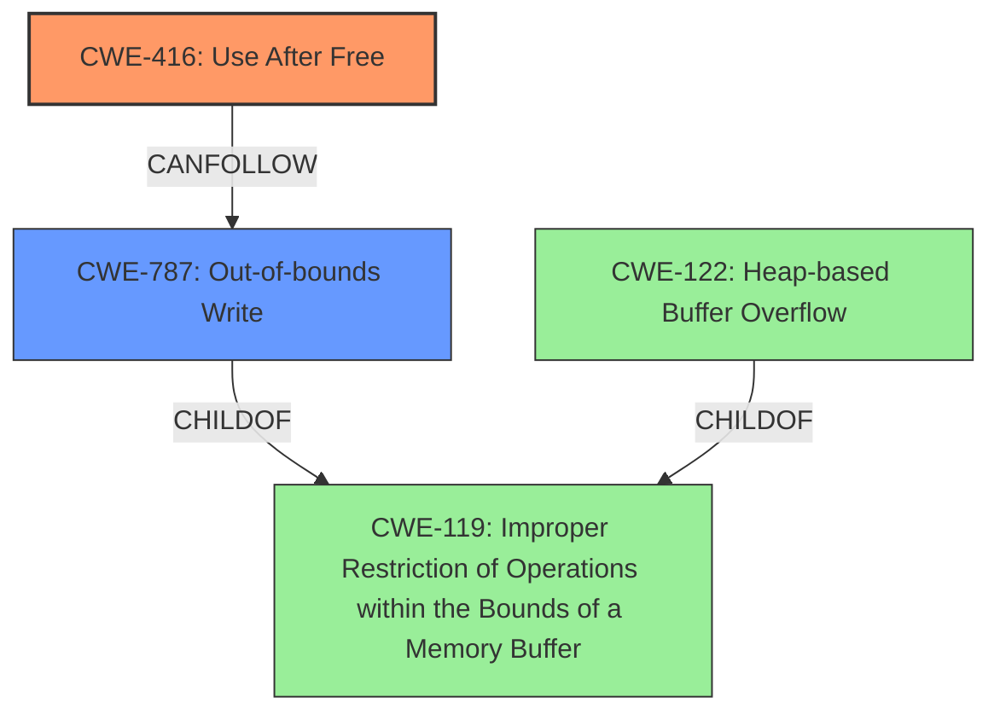

# Final Resolution for CVE-2022-0977

# Summary

| CWE ID  | CWE Name                                                                | Confidence | CWE Abstraction Level | CWE Vulnerability Mapping Label | CWE-Vulnerability Mapping Notes                                                                                                                                                                                          |
| :------ | :---------------------------------------------------------------------- | :--------- | :-------------------- | :------------------------------ | :----------------------------------------------------------------------------------------------------------------------------------------------------------------------------------------------------------------------- |
| CWE-416 | Use After Free                                                            | 1.0        | Variant               | Primary                       | Allowed                                                                                                                                                                                                                    |
| CWE-787 | Out-of-bounds Write                                             | 0.7        | Base               | Secondary                      | Allowed. The UAF can potentially lead to an out-of-bounds write if the freed memory is reallocated, and a subsequent write operation overflows the buffer. This is likely given the attacker can craft the HTML page. |

## Evidence and Confidence

*   **Confidence Score:** 0.9
*   **Evidence Strength:** HIGH

## Relationship Analysis
The primary relationship considered was the chain relationship `CanFollow` from CWE-416 (**Use After Free**) to CWE-787 (**Out-of-bounds Write**). The decision to include CWE-787 as a secondary CWE was heavily influenced by the "heap corruption" mentioned in the vulnerability description. While CWE-122 (Heap-based Buffer Overflow) was also considered, CWE-787 was chosen for its broader applicability, as it doesn't necessarily require a "buffer" in the traditional sense but rather a write beyond the allocated memory region. Both CWE-787 and CWE-122 are children of CWE-119 (Improper Restriction of Operations within the Bounds of a Memory Buffer), showing their close relationship. The abstraction levels also played a role, with the variant-level CWE-416 providing specificity for the initial error, and the base-level CWE-787 describing the consequence.

## Vulnerability Chain
The vulnerability chain starts with the **ROOTCAUSE** of **CWE-416 (Use After Free)**. This leads to the consequence of **CWE-787 (Out-of-bounds Write)**, resulting in heap corruption. The prerequisite condition is that the attacker convinces a user to engage in specific user interaction via a crafted HTML page. The final impact is potential exploitation of heap corruption, which could lead to arbitrary code execution or denial of service. There are no missing links in the chain, as the connection between the UAF and heap corruption is well-established.

## Summary of Analysis
The initial analysis correctly identified CWE-416 (**Use After Free**) as the primary **WEAKNESS**. The criticism highlighted the need to address the "heap corruption" aspect more explicitly. Based on the evidence that the attacker can craft an HTML page, it's highly probable that they can influence the data written to the freed memory after reallocation. This leads to the inclusion of CWE-787 (**Out-of-bounds Write**) as a secondary CWE to represent the consequence of the UAF.

The graph relationships, especially the `CanFollow` relationship, were instrumental in selecting CWE-787. The vulnerability description provides direct evidence for CWE-416 ("Use after free in Browser UI") and indirect evidence for CWE-787 ("potentially exploit heap corruption via a crafted HTML page"). The selected CWEs are at the optimal level of specificity, with the variant-level CWE-416 pinpointing the initial error and the base-level CWE-787 describing the immediate consequence.

The decision to not include CWE-356 or CWE-1021 was made because there is no direct evidence in the vulnerability description to suggest a UI issue or clickjacking. Similarly, while a race condition (CWE-362, CWE-366) could potentially trigger the UAF, there is no explicit mention of multithreading or concurrency issues in the provided description.