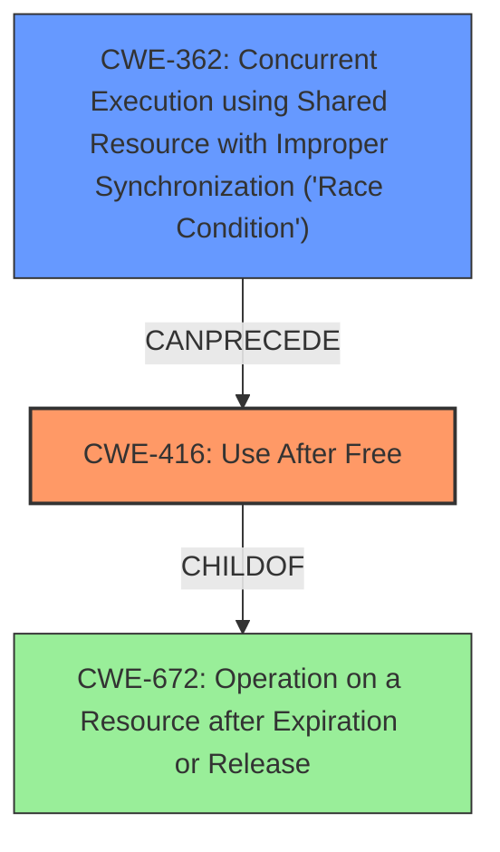

# Final Resolution for CVE-2022-0978

# Summary
| CWE ID | CWE Name | Confidence | CWE Abstraction Level | CWE Vulnerability Mapping Label | CWE-Vulnerability Mapping Notes |
|---|---|---|---|---|---|
| CWE-416 | **Use After Free** | 1.0 | Variant | Allowed | Primary CWE |
| CWE-362 | Concurrent Execution using Shared Resource with Improper Synchronization ('Race Condition') | 0.4 | Class | Allowed-with-Review | Possible preceding **weakness** in a chain: CWE-362 -> CWE-416. Investigate if a race condition may have led to the premature freeing of the memory. |

## Evidence and Confidence

*   **Confidence Score:** 0.8
*   **Evidence Strength:** MEDIUM

## Relationship Analysis
The primary **weakness** is CWE-416 (**Use After Free**), a variant of CWE-672 (Operation on a Resource after Expiration or Release). While CWE-672 is a parent, CWE-416 is more specific and directly reflects the **rootcause** described in the vulnerability. The analysis considers a potential chain relationship with CWE-362 (Race Condition), where a race condition could lead to premature freeing of memory. The retriever results also mentioned CWE-366 (Race Condition within a Thread), which is a child of CWE-362. Exploring this chain provides a more comprehensive understanding of the vulnerability.

## Vulnerability Chain
The vulnerability chain starts with a potential CWE-362 (**Race Condition**), where multiple threads access a shared resource without proper synchronization. This could lead to a premature release of memory, which is then accessed by another thread, resulting in CWE-416 (**Use After Free**). The final impact is heap corruption, potentially leading to remote code execution.

Missing links: The description does not explicitly state that a **race condition** caused the **use-after-free**. This is only a possibility. Further investigation is needed.

## Summary of Analysis
The initial analysis correctly identified CWE-416 (**Use After Free**) as the primary CWE. The criticism correctly pointed out the need to explore potential chain relationships. The vulnerability description explicitly states "Use after free," which strongly supports the selection of CWE-416. The CVE Reference Links Content Summary reinforces this by stating the **root_cause** as "Use after free," leading to "Remote code execution."

The inclusion of CWE-362 as a secondary CWE is based on the possibility that a **race condition** could have led to the **use-after-free**. However, this is only a hypothesis based on retriever results and common patterns. There is no explicit evidence in the vulnerability description to confirm this. Therefore, the confidence score for CWE-362 is lower.

The selection of CWE-416 is at the optimal level of specificity because it directly matches the **rootcause** described in the vulnerability. While CWE-672 is a parent, CWE-416 is more specific and provides a better understanding of the actual **weakness**.

I am lowering the overall confidence score to 0.8 because the possibility of CWE-362 being a part of the chain is only a hypothesis. More evidence is needed to confirm this.

The evidence strength is MEDIUM, based on the explicit statement in the vulnerability description and the potential for a chain relationship. More information would be needed to get to high confidence in CWE-362.