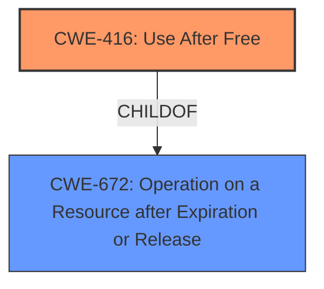

# Analysis Report for CVE-2022-0979

# Vulnerability Analysis Report: CVE-2022-0979

## Description

Use after free in Safe Browsing in Google Chrome on Android prior to 99.0.4844.74 allowed a remote attacker who convinced a user to engage in specific user interaction to potentially exploit heap corruption via a crafted HTML page.

## Vulnerability Description Key Phrases

**Rootcause:** use after free
**Weakness:** heap corruption
**Vector:** crafted HTML page
**Attacker:** remote attacker
**Product:** Google Chrome on Android
**Version:** prior to 99.0.4844.74
**Component:** Safe Browsing

## Analysis (with Relationship Data)

# Summary
| CWE ID | CWE Name | Confidence | CWE Abstraction Level | CWE Vulnerability Mapping Label | CWE-Vulnerability Mapping Notes |
|---|---|---|---|---|---|
| CWE-416 | Use After Free | 1.0 | Variant | Allowed | Primary CWE |

## Evidence and Confidence

*   **Confidence Score:** 1.0
*   **Evidence Strength:** HIGH

- **Analysis and Justification:**  
  - *Explanation:* The vulnerability description explicitly states "**use after free**" as the **rootcause**, which is a direct match for CWE-416 (Use After Free). The vulnerability occurs in "Safe Browsing" in Google Chrome on Android, and the attacker can trigger the vulnerability by convincing a user to engage with a crafted HTML page, potentially leading to **heap corruption**. CWE-416 describes the condition where memory is reused or referenced after it has been freed, aligning perfectly with the vulnerability. The "CWE for similar CVE Descriptions" section lists CWE-416 as the primary match and the most frequent CWE in similar descriptions, strengthening the selection. The Retriever Results also list CWE-416, further supporting this mapping.

  - *Relationship Analysis:* CWE-416 is a variant of CWE-672 (Operation on Resource after Expiry).

- **Confidence Score:**  
  - Confidence: 1.0 (Direct match with explicit root cause in vulnerability description and supporting evidence from similar CVEs and retriever results)

## Criticism of Analysis

Okay, I've reviewed the provided analysis with the full CWE specifications. Here's a breakdown of my critique, focusing on the accuracy and justification of the CWE-416 mapping:

**Overall Assessment:**

The analysis is well-structured and demonstrates a strong understanding of CWE concepts. The selection of CWE-416 (Use After Free) as the primary CWE appears to be accurate and well-justified. The confidence score of 1.0 is appropriate given the explicit mention of "use after free" in the vulnerability description.

**Strengths:**

*   **Clear Justification:** The explanation provided for selecting CWE-416 is detailed and clearly connects the vulnerability description to the CWE definition. It also correctly identifies CWE-416 as a Variant, the preferred level.
*   **Comprehensive Evidence:** The analysis considers multiple sources of evidence:
    *   The original vulnerability description.
    *   The "CWE for similar CVE Descriptions" section.
    *   The Retriever Results.
    *   The CWE specifications themselves.
*   **Relationship Analysis:** The analysis correctly identifies the parent relationship of CWE-416 as a child of CWE-672 (Operation on a Resource after Expiration or Release).
*   **Good Use of CWE Examples:** The inclusion of known examples of CWE-416 with CVE references helps to illustrate the nature of the vulnerability and reinforce the mapping.
*   **Thorough CWE Specification Review:** The provided complete CWE specifications are helpful for understanding the full context of the selected CWE and potential alternative mappings.

**Areas for Improvement (Minor):**

*   **Heap Corruption Context:** The original vulnerability description mentions "heap corruption" as a potential consequence of the use-after-free. While CWE-416 is the root cause, it might be beneficial to briefly acknowledge the connection to heap corruption, perhaps by stating that a successful exploit of a use-after-free in this context can lead to heap corruption, which then could result in arbitrary code execution or other malicious activity. This is implied, but a more explicit statement would strengthen the analysis.  You could add a sentence like: "The vulnerability can lead to heap corruption, potentially allowing an attacker to achieve arbitrary code execution".
*   **Attack Vector Specifics:** While the attack vector is described as a "crafted HTML page," further elaboration could be useful. For example, "The crafted HTML page likely triggers a specific sequence of events within the Safe Browsing component, leading to the premature freeing of memory and subsequent use of that freed memory." This adds more context to the vulnerability.
*   **Retriever Results Examination:** The Retriever Results list several other CWEs with relatively high scores. While CWE-416 is clearly the most appropriate, it could be beneficial to briefly explain *why* the other highly ranked CWEs are *not* the best fit. For example:
    *   **CWE-366 (Race Condition within a Thread):** "While concurrency issues can sometimes contribute to use-after-free vulnerabilities, the primary weakness here is the direct use of freed memory, not a race condition."
    *   **CWE-843 (Access of Resource Using Incompatible Type ('Type Confusion')):** "Type confusion could be a *secondary* factor *if* the use-after-free results in the code accessing the freed memory with an unexpected type. However, the core issue is the use of freed memory, making CWE-416 the more direct fit."
    *   **CWE-356 (Product UI does not Warn User of Unsafe Actions):** "While the user is being tricked into engaging with a crafted HTML page, the core weakness is not a lack of warnings but the underlying memory management error."
    *   **CWE-1021 (Improper Restriction of Rendered UI Layers or Frames):** "Although it involves interaction through a crafted HTML page, the vulnerability's root cause resides within memory management, making this CWE a less precise fit."

    This demonstrates that you considered the alternatives and consciously rejected them based on the evidence.
*   **Mitigation Awareness:** Mention that CWE-416's recommended mitigations involve choosing languages with automatic memory management and ensuring pointers are set to NULL after freeing. This shows awareness of the practical implications of the CWE selection.

**Specific Comments on Retriever Results and Alternatives:**

The Retriever Results are useful but also highlight the challenges in automated CWE assignment. It's crucial to understand why the *top* results might not be the *best* results. My comments above address this.

**Conclusion:**

The analysis is strong and accurately identifies CWE-416 as the primary weakness. The suggestions above are minor refinements to further strengthen the justification and demonstrate a more comprehensive understanding of the vulnerability's context and potential alternatives. The analysis demonstrates a good grasp of CWE principles and the importance of connecting vulnerability descriptions to the correct CWE.

## Final Resolution

# Summary
| CWE ID | CWE Name | Confidence | CWE Abstraction Level | CWE Vulnerability Mapping Label | CWE-Vulnerability Mapping Notes |
|---|---|---|---|---|---|
| CWE-416 | Use After Free | 1.0 | Variant | Allowed | Primary CWE |

## Evidence and Confidence

*   **Confidence Score:** 1.0
*   **Evidence Strength:** HIGH

## Relationship Analysis
The primary relationship influencing the decision is the direct match of the vulnerability description to CWE-416. While other CWEs might be related as potential consequences or contributing factors, CWE-416 is the most specific and directly applicable **rootcause**. CWE-416 is a variant of CWE-672 (Operation on a Resource after Expiration or Release), indicating a hierarchical relationship where CWE-416 provides a more granular description of the issue.

## Vulnerability Chain
The vulnerability chain starts with the crafted HTML page, leading to a **use-after-free** (**CWE-416**) within the Safe Browsing component. This **weakness** can then lead to **heap corruption**, which is the impact described in the CVE. While heap corruption itself isn't explicitly classified here, it's a direct consequence of the **CWE-416** condition.

## Summary of Analysis
The initial analysis and subsequent criticism both strongly support the selection of CWE-416 (Use After Free) as the primary **rootcause** for this vulnerability. The vulnerability description explicitly mentions "use after free," providing direct evidence for this classification. The criticism suggests minor improvements, such as acknowledging the potential for heap corruption as a consequence and briefly explaining why other highly ranked CWEs from the Retriever Results are not the best fit. These suggestions strengthen the justification but do not change the primary CWE selection. The evidence from the vulnerability description is: "Use after free in Safe Browsing in Google Chrome on Android prior to 99.0.4844.74 allowed a remote attacker who convinced a user to engage in specific user interaction to potentially exploit heap corruption via a crafted HTML page.". The selected CWE is at the optimal level of specificity, as it directly addresses the **rootcause** described in the vulnerability.

*Report generated on 2025-03-18 06:34:07*
