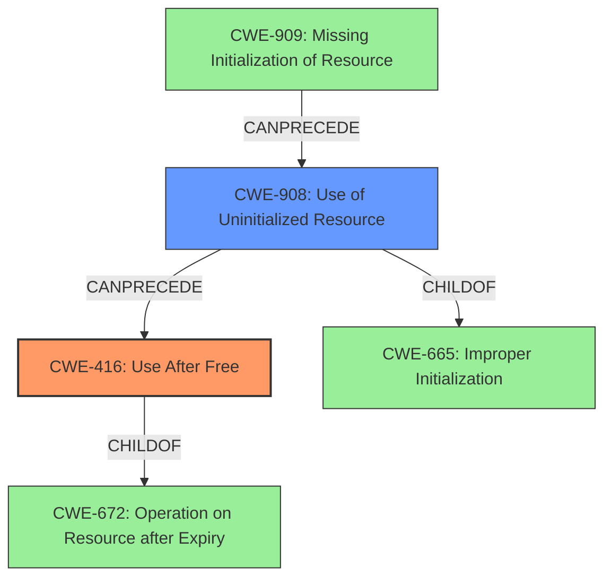

# Final Resolution for CVE-2022-1016

# Summary
| CWE ID | CWE Name | Confidence | CWE Abstraction Level | CWE Vulnerability Mapping Label | CWE-Vulnerability Mapping Notes |
|---|---|---|---|---|---|
| CWE-416 | Use After Free | 0.9 | Variant | Primary | Allowed. Operation on uninitialized stack data |
| CWE-908 | Use of Uninitialized Resource | 0.7 | Base | Secondary | Allowed. Contributing factor; uninitialized `regs` struct. (CWE-909 -> CWE-908 -> CWE-416) |

## Evidence and Confidence

*   **Confidence Score:** 0.9
*   **Evidence Strength:** HIGH

## Relationship Analysis
The primary weakness is CWE-416 (Use After Free), a variant-level CWE. This is appropriate as variant-level CWEs are preferred for root cause analysis. It is related to CWE-672 (Operation on Resource after Expiry) as a child. The secondary weakness, CWE-908 (Use of Uninitialized Resource), is a base-level CWE, making it suitable for mapping root causes. It's a child of CWE-665 (Improper Initialization). These relationships show a clear chain: an uninitialized resource is used after being freed.

## Vulnerability Chain
The vulnerability chain begins with CWE-909 (Missing Initialization of Resource) which leads to CWE-908 (**Use of Uninitialized Resource**). This **weakness** then results in CWE-416 (**Use After Free**). The initial **flaw** is the lack of initialization, and the final impact is a **use-after-free** vulnerability. There are no missing links; the chain is complete based on the evidence. The uninitialized register data is then accessed later, leading to a kernel information leak.

## Summary of Analysis
The initial analysis correctly identified CWE-416 as the primary **weakness** due to the explicit mention of "**use-after-free**" in the vulnerability description. The addition of CWE-908 as a secondary contributing factor is also well-justified, as the CVE summary states that the `regs` struct is "not initialized before being used."

The graph relationships support this analysis, with CWE-416 being a variant of CWE-672 and CWE-908 being a base-level **weakness** related to CWE-665. This hierarchical structure ensures that the selected CWEs are at the optimal level of specificity.

The vulnerability chain clearly shows how the lack of initialization (CWE-909) leads to the **use of an uninitialized resource** (CWE-908), which then results in a **use-after-free** condition (CWE-416). This chain provides a comprehensive understanding of the vulnerability.

The final determination is based on direct evidence from the vulnerability description and CVE summary, as well as supporting evidence from the CWE relationships. The selected CWEs are at the optimal level of specificity, with CWE-416 being a variant and CWE-908 being a base-level **weakness**. The confidence levels are appropriately assigned based on the strength of the evidence.