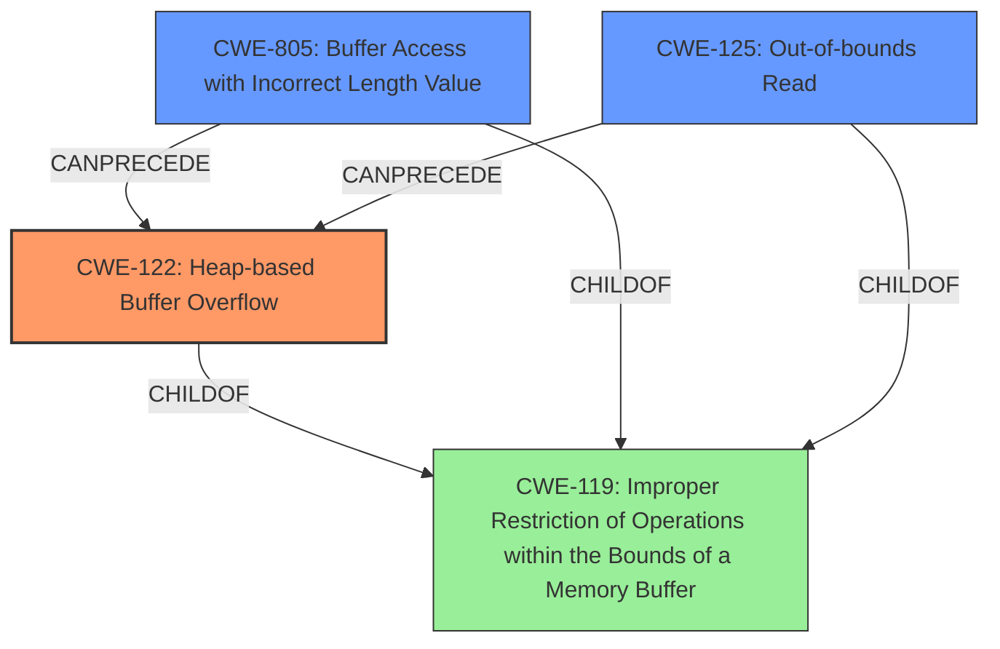

# Final Resolution for CVE-2022-1052

# Summary
| CWE ID | CWE Name | Confidence | CWE Abstraction Level | CWE Vulnerability Mapping Label | CWE-Vulnerability Mapping Notes |
|---|---|---|---|---|---|
| CWE-122 | Heap-based Buffer Overflow | 0.95 | Variant | Allowed | Primary CWE |
| CWE-805 | Buffer Access with Incorrect Length Value | 0.80 | Base | Allowed | Secondary Candidate |
| CWE-125 | Out-of-bounds Read | 0.70 | Base | Allowed | Secondary Candidate |

## Evidence and Confidence

*   **Confidence Score:** 0.90
*   **Evidence Strength:** HIGH

## Relationship Analysis
The primary weakness is classified as CWE-122 (**Heap-based Buffer Overflow**) which is a variant of CWE-119 (**Improper Restriction of Operations within the Bounds of a Memory Buffer**). The secondary weakness, CWE-805 (**Buffer Access with Incorrect Length Value**), highlights the use of an incorrect length during buffer access, leading to the overflow. CWE-125 (**Out-of-bounds Read**) represents the act of reading beyond the intended buffer boundaries, directly contributing to the vulnerability.

## Vulnerability Chain
The vulnerability chain begins with the processing of a malformed Mach-O file. The file contains an incorrect `segs_count` value, leading to CWE-805 (**Buffer Access with Incorrect Length Value**). This, in turn, causes an out-of-bounds read (CWE-125). The **incorrect loop condition** leads to a heap-based buffer overflow (CWE-122) in the `iterate_chained_fixups` function. The **ROOTCAUSE** is the mishandling of the segment count, leading to out-of-bounds access and a heap overflow.

## Summary of Analysis
The initial analysis correctly identified CWE-122 as the primary **WEAKNESS**, given the "Heap Buffer Overflow" description. The criticism highlighted the need for more specific secondary CWEs and a stronger emphasis on mitigations. Specifically, the criticism noted the potential relevance of CWE-805 (**Buffer Access with Incorrect Length Value**), which more directly relates to the **incorrect length value** used during buffer access.

The provided evidence states: "The CVE Reference Links Content Summary further confirms this by detailing an out-of-bounds read in the `mach0.iterate_chained_fixups` function due to an incorrect handling of `segs_count`, leading to an out-of-bounds access `mo->chained_starts[i]`."

I agree with the criticism that CWE-805 is a more direct and specific secondary CWE than CWE-193. The vulnerability stems from the usage of the incorrect `segs_count` value, leading to out-of-bounds access. While an off-by-one error *could* be present, it is less directly supported by the evidence. Therefore, I am replacing CWE-193 with CWE-805 as a secondary candidate.

The selected CWEs are at the optimal level of specificity because they accurately represent the **ROOTCAUSE** and the consequences of the vulnerability, with CWE-122 capturing the overflow, CWE-805 detailing the **incorrect length value**, and CWE-125 describing the out-of-bounds read.