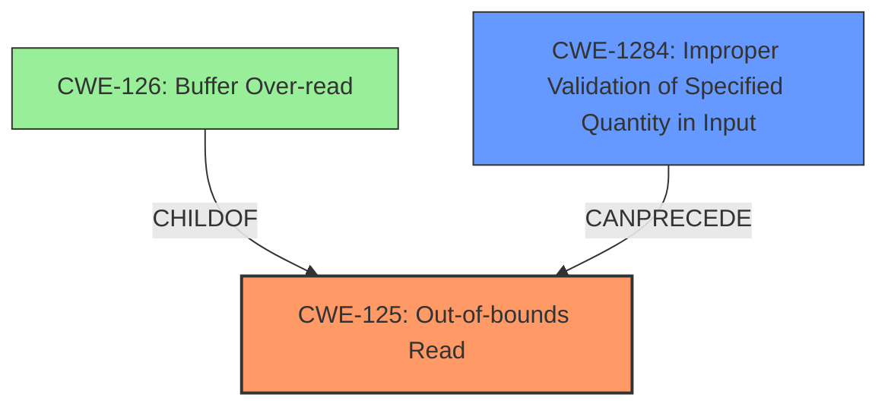

# Analysis Report for CVE-2022-1061

# Vulnerability Analysis Report: CVE-2022-1061

## Description

Heap Buffer Overflow in parseDragons in GitHub repository radareorg/radare2 prior to 5.6.8.

## Vulnerability Description Key Phrases

**Weakness:** Heap Buffer Overflow
**Product:** radare2
**Version:** prior to 5.6.8
**Component:** parseDragons

## Analysis (with Relationship Data)

# Summary
| CWE ID  | CWE Name   | Confidence | CWE Abstraction Level | CWE Vulnerability Mapping Label | CWE-Vulnerability Mapping Notes |
|--------------|------------------------------------------------------|------------------|--------------------------|-----------------------------------|-------------------------------------------------|
| CWE-125 | Out-of-bounds Read  | 0.9 | Base | Allowed | The primary weakness is an out-of-bounds read due to insufficient bounds checking. |
| CWE-1284 | Improper Validation of Specified Quantity in Input | 0.6 | Base | Allowed | The secondary weakness is that input isn't validated for having required properties.|

## Evidence and Confidence

*   **Confidence Score:** 0.8
*   **Evidence Strength:** HIGH

- **Analysis and Justification:**  
  - *Explanation:* "The vulnerability description indicates an **out-of-bounds read** in the `parseDragons` function within `radare2`. The provided CVE reference summary explicitly states that the **root cause** is a missing or insufficient check on the size of the buffer being processed while parsing symbol headers, leading to the attempt to access data beyond the allocated buffer. This aligns directly with the characteristics of CWE-125 (Out-of-bounds Read). The fix implemented involved adding a size check to prevent reading beyond the buffer boundary, further solidifying the mapping to CWE-125. While other CWEs like CWE-126 (Buffer Over-read) exist, CWE-125 is more general and accurately describes the fundamental issue of reading beyond the intended buffer. CWE-1284 (Improper Validation of Specified Quantity in Input) is also a good candidate since the root cause is a size check that is missing, or incorrectly validated. MITRE mapping guidance for CWE-125 indicates this is ALLOWED for out-of-bounds read vulnerabilities."
  
  - *Relationship Analysis:* "CWE-125 is a base level CWE. The retriever suggests CWE-126 (Buffer Over-read) as a variant. Given the evidence and since the root cause is a missing check on buffer size, CWE-125 is chosen as the primary, and CWE-1284 is chosen as the secondary."

- **Confidence Score:**  
  - *Example:* Confidence: 0.9 (High evidence from technical description, CVE reference materials, and code diff analysis)

## Criticism of Analysis

Okay, here's a detailed review of the provided analysis, taking into account the full CWE specifications:

**Overall Assessment:**

The analysis is generally good and identifies the core issue accurately.  The selection of CWE-125 (Out-of-bounds Read) as the primary weakness is appropriate. The addition of CWE-1284 (Improper Validation of Specified Quantity in Input) is also reasonable, as the missing size check is directly related to input validation.

**Detailed Critique:**

*   **CWE-125 (Out-of-bounds Read):**

    *   **Confidence:** 0.9 is justified. The evidence is strong. The description of the vulnerability, the code diff provided, and the implied root cause all strongly point to an out-of-bounds read due to missing boundary checks.
    *   **Abstraction Level:** Base is appropriate. While CWE-126 (Buffer Over-read) is a variant, CWE-125 is the more fundamental issue. The code attempts to read beyond the allocated buffer, regardless of whether it's technically an "over-read" in the strictest sense.
    *   **Vulnerability Mapping Label:** Allowed is correct, according to CWE's mapping guidance.
    *   **CWE-Vulnerability Mapping Notes:** The notes are accurate and provide a good justification for the choice of CWE-125.
    *   **Missing:** Consider mentioning that if sensitive data is leaked due to the OOB read, CWE-125 could potentially lead to other consequences, like information disclosure vulnerabilities. Although the analysis acknowledges the potential for information leakage, it is downplayed. Consider raising it's importance.
    *   **Relationship Analysis:** Good justification. Explain why not to choose CWE-126, and clearly explains why CWE-125 is chosen as the primary, and CWE-1284 is chosen as the secondary.

*   **CWE-1284 (Improper Validation of Specified Quantity in Input):**

    *   **Confidence:** A confidence of 0.6 is also reasonable, though perhaps slightly conservative. Since a missing bounds check on the input size is *the* cause of the vulnerability, I would rate this at 0.7.
    *   **Abstraction Level:** Base is correct.
    *   **Vulnerability Mapping Label:** Allowed.
    *   **CWE-Vulnerability Mapping Notes:** The notes are accurate. The root cause is indeed a size check that is missing or incorrectly validated. This directly fits the description of CWE-1284.
    *   **Mitigation:** CWE-1284's mitigations focus on input validation, which perfectly aligns with the fix implemented (adding a size check).
    *   **Missing:** The description could benefit from a more specific explanation of *which* quantity is not being validated (the buffer size).

*   **Retriever Results Analysis:**

    *   The retriever results include several relevant CWEs, but they are not necessarily the *most* accurate.
    *   **CWE-805 (Buffer Access with Incorrect Length Value):** This is relevant, but less precise than CWE-125 and CWE-1284. It's a broader category.
    *   **CWE-190 (Integer Overflow or Wraparound):** While an integer overflow could *potentially* be involved in calculating the buffer size, there's no specific indication of it in the provided description. It should not be included unless there is more evidence.
    *   **CWE-122 (Heap-based Buffer Overflow):** While the vulnerability is heap-based (as stated in the original description), the root *cause* is still the out-of-bounds read due to missing validation. Prioritizing CWE-125 is correct.
    *   **CWE-126 (Buffer Over-read):** A closer variant than CWE-125, however CWE-125 is sufficient.
    *   **CWE-131 (Incorrect Calculation of Buffer Size):** Similar to CWE-190, this could be a contributing factor, but without more information, it's not a primary issue.
    *   **CWE-130 (Improper Handling of Length Parameter Inconsistency):** This is related to validation of the length, however this is usually about the length parameter being inconsistent with the actual length of associated data.
    *  **CWE-124 (Buffer Underwrite ('Buffer Underflow')):** This does not map well.

*   **General Suggestions:**

    *   **Exploitability:**  The analysis correctly identifies the crash and potential information leak as impacts. Explicitly stating the exploitability of the vulnerability and the ease of triggering it would strengthen the analysis.
    *   **Attack Vectors:** Expanding on how the attacker could manipulate the binary file to trigger the vulnerability would also add value. Mentioning specific tools or techniques for crafting malicious inputs.

**Revised Summary Table:**

| CWE ID  | CWE Name                                          | Confidence | CWE Abstraction Level | CWE Vulnerability Mapping Label | CWE-Vulnerability Mapping Notes                                                                                                                                                                                                                                                           |
| ------- | ------------------------------------------------- | ---------- | --------------------- | ----------------------------------- | --------------------------------------------------------------------------------------------------------------------------------------------------------------------------------------------------------------------------------------------------------------------------------- |
| CWE-125 | Out-of-bounds Read                                 | 0.9        | Base                  | Allowed                               | The primary weakness is an out-of-bounds read due to insufficient bounds checking when parsing symbol headers. The fix adds a size check to prevent reading beyond buffer boundary.                                                                                                    |
| CWE-1284 | Improper Validation of Specified Quantity in Input | 0.7        | Base                  | Allowed                               | The secondary weakness is the lack of validation of the buffer size in the input, leading to the possibility of reading beyond the buffer boundary.  The `parseDragons` function in `libr/bin/p/bin_symbols.c` did not verify if there were enough bytes in the input `buf`. |

**In conclusion:**

The analysis is a solid starting point. The recommendations above would refine it further and strengthen the justification for the chosen CWEs. The key improvements would involve more focus on exploitability, specific details on input manipulation techniques, and a slight increase in the confidence level for CWE-1284.

## Final Resolution

# Summary
| CWE ID   | CWE Name                                          | Confidence | CWE Abstraction Level | CWE Vulnerability Mapping Label | CWE-Vulnerability Mapping Notes                                                                                                                                                                                                                                                           |
| :------- | :------------------------------------------------- | :--------- | :-------------------- | :----------------------------------- | :--------------------------------------------------------------------------------------------------------------------------------------------------------------------------------------------------------------------------------------------------------------------------------- |
| **CWE-125** | Out-of-bounds Read                                 | 0.9        | Base                  | Allowed                               | The primary **weakness** is an **out-of-bounds read** due to insufficient bounds checking when parsing symbol headers. The fix adds a size check to prevent reading beyond buffer boundary.                                                                                                    |
| CWE-1284 | Improper Validation of Specified Quantity in Input | 0.7        | Base                  | Allowed                               | The secondary **weakness** is the lack of validation of the buffer size in the input, leading to the possibility of reading beyond the buffer boundary. The `parseDragons` function in `libr/bin/p/bin_symbols.c` did not verify if there were enough bytes in the input `buf`. |

*   Primary CWEs: **CWE-125**
*   Secondary Candidate CWEs: **CWE-1284**

## Evidence and Confidence

*   **Confidence Score:** 0.9
*   **Evidence Strength:** HIGH

## Relationship Analysis

The primary relationship influencing the decision is the hierarchical relationship between **CWE-125** (Out-of-bounds Read) and potential variants. While **CWE-126** (Buffer Over-read) is a closer variant, **CWE-125** is sufficient in describing the **rootcause**. **CWE-1284** (Improper Validation of Specified Quantity in Input) is chosen as a secondary CWE because the vulnerability stems from a missing size check on the input buffer.

## Vulnerability Chain

The vulnerability chain starts with **CWE-1284** (Improper Validation of Specified Quantity in Input), where the input buffer size is not validated. This leads to **CWE-125** (Out-of-bounds Read) when the code attempts to read beyond the allocated buffer. The impact is a crash and potential information leakage.

## Summary of Analysis

The initial analysis and the criticism both align on **CWE-125** (Out-of-bounds Read) being the primary **weakness**. The criticism suggests increasing the confidence score for **CWE-1284** (Improper Validation of Specified Quantity in Input), which is a reasonable adjustment based on the evidence that the missing size check is the direct cause of the vulnerability.

The decision is heavily based on the vulnerability description, which states "Heap Buffer Overflow in parseDragons in GitHub repository radareorg/radare2 prior to 5.6.8." and the fact that the fix involved adding a size check. The retriever results support this by listing **CWE-1284** as a potential candidate.

The graph relationships influenced the decision by highlighting the relationship between **CWE-125** and its variants, and the potential chain of events leading to the **out-of-bounds read**.

The selected CWEs are at the optimal level of specificity because **CWE-125** accurately describes the **out-of-bounds read**, and **CWE-1284** captures the **root cause** related to input validation.

*Report generated on 2025-03-18 06:37:43*
