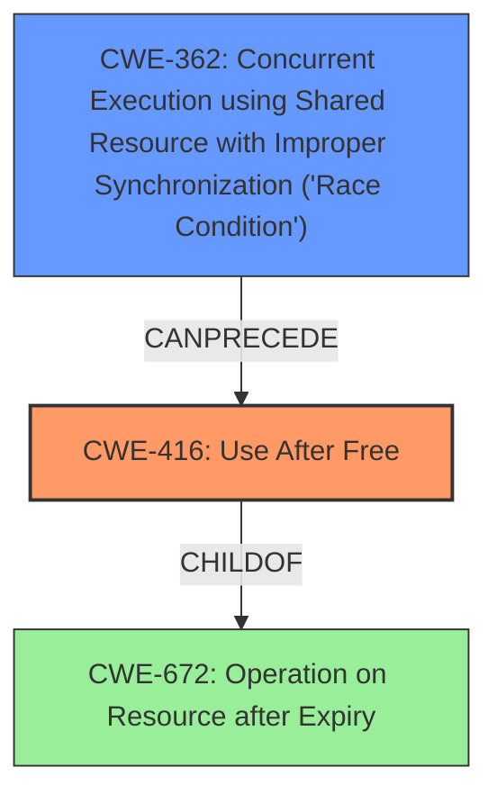

# Final Resolution for CVE-2022-1127

# Summary
| CWE ID | CWE Name | Confidence | CWE Abstraction Level | CWE Vulnerability Mapping Label | CWE-Vulnerability Mapping Notes |
|---|---|---|---|---|---|
| CWE-416 | Use After Free | 1.0 | Variant | Allowed | Primary CWE |
| CWE-362 | Concurrent Execution using Shared Resource with Improper Synchronization ('Race Condition') | 0.4 | Class | Allowed-with-Review | Secondary Candidate |

## Evidence and Confidence

*   **Confidence Score:** 0.9
*   **Evidence Strength:** MEDIUM

## Relationship Analysis
The primary relationship is that CWE-416 (Use After Free) is a variant of CWE-672 (Operation on Resource after Expiry). The criticism suggests that CWE-362 (Concurrent Execution using Shared Resource with Improper Synchronization) or CWE-366 (Race Condition Within a Thread) could potentially precede CWE-416 if a race condition leads to the use-after-free. CWE-362 is a class, and CWE-366 is a base. Since there is a CANPRECEDE relationship between CWE-362 and CWE-416, this is a valid potential secondary CWE. I have included CWE-362 but with a lower confidence since the presence of a race condition has not been confirmed.

## Vulnerability Chain
The vulnerability chain starts with a potential **CWE-362** (Race Condition), which leads to **CWE-416** (Use After Free). The consequence of **CWE-416** is heap corruption, as noted in the vulnerability description. The chain highlights how improper synchronization can lead to memory corruption. If a race condition exists, multiple threads could attempt to free and then access the same memory, resulting in the use-after-free.

## Summary of Analysis
The initial analysis correctly identified **CWE-416 (Use After Free)** as the primary **weakness**, based on the explicit mention in the vulnerability description: "Use after free in QR Code Generator".

The criticism raised a valid point about the potential involvement of a race condition. The retriever results included **CWE-362 (Concurrent Execution using Shared Resource with Improper Synchronization)** with a relatively high score, and the criticism correctly cited the CANPRECEDE relationship between **CWE-362** and **CWE-416**.

Given the information available, there is no definitive evidence to confirm a race condition. Therefore, I have added **CWE-362** as a secondary candidate with a lower confidence score of 0.4. Further code analysis would be needed to confirm the presence of a race condition.

The selection of **CWE-416** as the primary **weakness** remains the most accurate classification based on the available evidence. It is at the optimal level of specificity (Variant) and directly addresses the stated cause of the vulnerability.