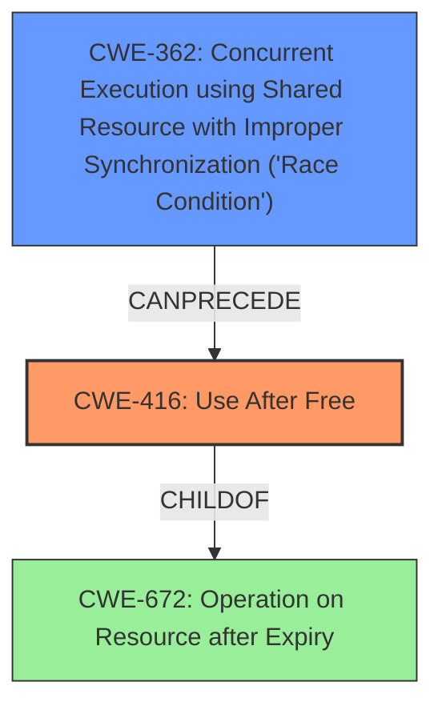

# Analysis Report for CVE-2022-1133

# Vulnerability Analysis Report: CVE-2022-1133

## Description

Use after free in WebRTC Perf in Google Chrome prior to 100.0.4896.60 allowed a remote attacker to potentially exploit heap corruption via a crafted HTML page.

## Vulnerability Description Key Phrases

**Weakness:** use after free
**Impact:** heap corruption
**Vector:** crafted HTML page
**Attacker:** remote attacker
**Product:** Google Chrome
**Version:** prior to 100.0.4896.60
**Component:** WebRTC Perf

## Analysis (with Relationship Data)

# Summary
| CWE ID | CWE Name | Confidence | CWE Abstraction Level | CWE Vulnerability Mapping Label | CWE-Vulnerability Mapping Notes |
|---|---|---|---|---|---|
| CWE-416 | Use After Free | 1.0 | Variant | Primary | Allowed |

## Evidence and Confidence

*   **Confidence Score:** 1.0
*   **Evidence Strength:** HIGH

- **Analysis and Justification:**  
  - *Explanation:* The vulnerability description explicitly states "**use after free**" in WebRTC Perf in Google Chrome. The "CVE Reference Links Content Summary" confirms "**Root Cause:** Use-after-free vulnerability in WebRTC." and "**Weaknesses/Vulnerabilities:** Use-after-free. This occurs when a program attempts to access memory after it has been freed". CWE-416 (Use After Free) is a Variant level CWE, which is a preferred level of abstraction. The MITRE mapping guidance for CWE-416 indicates this is ALLOWED for use-after-free vulnerabilities.

  - *Relationship Analysis:* CWE-416 is a variant of CWE-672 (Operation on Resource after Expiry). It can CanFollow CWE-754 (Improper Check for Unusual or Exceptional Conditions).

- **Confidence Score:**  
  - Confidence: 1.0 (Explicit evidence from the vulnerability description and CVE reference materials)

## Criticism of Analysis

Okay, here's a review of the provided analysis, incorporating the full CWE specifications:

**Overall Assessment:**

The analysis is generally good, with a strong justification for the primary CWE mapping. The confidence level is appropriately high. The inclusion of CWE examples and relevant specification excerpts is excellent, demonstrating a thorough understanding. However, there's room for improvement in considering potential *chains* of weaknesses and discussing mitigations in the context of the specific vulnerability.

**Specific Feedback:**

**1. Primary CWE Mapping (CWE-416):**

*   **Correct and Justified:** The mapping to CWE-416 (Use After Free) is accurate and well-supported by the provided information. The vulnerability description explicitly mentions "use after free," and the additional CVE details reinforce this.  The analysis correctly identifies CWE-416 as a Variant level CWE and acknowledges that this is an ALLOWED mapping according to MITRE guidelines.
*   **Confidence:** The confidence score of 1.0 is appropriate.
*   **Potential Mitigations:** Consider listing specific mitigations that could address the UAF in the context of WebRTC. For example:
    *   **Language Selection:** While choosing a language with automatic memory management might not be feasible for the entire Chrome codebase, specific WebRTC components *could* potentially leverage safer languages or libraries.
    *   **Smart Pointers:** In C++, consider using smart pointers (e.g., `std::unique_ptr`, `std::shared_ptr`) to manage the lifetime of WebRTC objects and prevent dangling pointers.
    *   **Defensive Programming:** Implement robust error handling and checks to ensure that pointers are valid before being dereferenced.  This can be complex in a multi-threaded environment like WebRTC.
    *   **Address Sanitizer:** Employ tools like AddressSanitizer (ASan) during development and testing to detect use-after-free errors.

**2. Retriever Results Analysis:**

The Retriever Results provide a ranked list of potential CWEs. It's important to understand why these were suggested and whether they could be related, even if not the *primary* cause.

*   **CWE-366 (Race Condition within a Thread) & CWE-362 (Concurrent Execution using Shared Resource with Improper Synchronization):** These are strong candidates for *related* weaknesses, especially given WebRTC's heavily multi-threaded nature. UAF vulnerabilities often arise due to race conditions where one thread frees memory while another thread is still using it. The analysis should explicitly address this possibility. For example: "While the primary vulnerability is a UAF, a race condition might be the *cause* of the UAF. Multiple threads within WebRTC could be accessing the same memory, and improper synchronization could lead to a thread freeing the memory while another is still using it. In this case, the vulnerability could be described as a chain: CWE-362 -> CWE-416."
*   **CWE-843 (Access of Resource Using Incompatible Type ('Type Confusion')):** Type confusion could potentially lead to a UAF. If an object is cast to an incorrect type, it's possible that the incorrect type doesn't manage memory properly, leading to a premature free. This would be a more complex chain.
*   **CWE-415 (Double Free):**  While less likely than a race condition being a contributing factor, it's *possible* that the code contains a double-free, which then *leads* to a use-after-free scenario. However, the primary description doesn't suggest this.
*   **CWE-787 (Out-of-bounds Write):** An out-of-bounds write could corrupt memory management structures, *indirectly* leading to a UAF.  This is a more distant, but still possible, relationship.
*   **CWE-1021 (Improper Restriction of Rendered UI Layers or Frames):** This is less relevant unless the UAF could be triggered by manipulating UI elements in a specific way (e.g., by quickly creating and destroying WebRTC-related UI components).  The analysis should explain why this is *not* a likely contributor.
*   **CWE-122 (Heap-based Buffer Overflow):** Similar to CWE-787, a buffer overflow could corrupt memory and lead to a UAF indirectly. The analysis should discuss why this is less direct.
*   **CWE-367 (Time-of-check Time-of-use (TOCTOU) Race Condition):** Could be relevant in some very specific scenarios, but less likely in general.  The analysis should consider TOCTOU in the context of WebRTC resources.
*   **CWE-401 (Missing Release of Memory after Effective Lifetime):** This is a memory leak, which is different from a UAF. It is unlikely to be a primary cause here, but a memory leak in a related component could exacerbate the impact of the UAF over time.
*   **CWE-451 (User Interface (UI) Misrepresentation of Critical Information):** This is highly unlikely to be directly related to a UAF.

**3. Relationship Analysis:**

The analysis correctly mentions the ChildOf/CanFollow relationships of CWE-416.  Expanding on this, especially regarding potential *chains* of weaknesses, would improve the analysis. For example:

*   "CWE-416 can *follow* CWE-362 (Concurrent Execution using Shared Resource) or CWE-754 (Improper Check for Unusual or Exceptional Conditions).  In this case, a race condition (CWE-362) could lead to a thread freeing memory while another thread is still accessing it (CWE-416). Alternatively, an improper check for an error condition or race condition (CWE-754) could lead to a premature free, resulting in CWE-416."

**4. CWE Examples:**

The provided CWE examples are helpful. Consider adding examples that are more specific to WebRTC or browser-based UAFs if available.

**5. Mapping Guidance Usage:**

The analysis correctly states that the "Usage" for CWE-416 is "Allowed."  It also correctly notes the rationale.

**6. In Summary:**

*   The primary CWE mapping is correct and well-justified.
*   The analysis should be expanded to consider potential *chains* of weaknesses, particularly involving race conditions (CWE-362, CWE-366).
*   Discussing potential mitigations in the context of WebRTC would enhance the analysis.
*   Briefly explain why other high-ranking Retriever Results are less likely to be direct contributors.

By addressing these points, the analysis can become more comprehensive and insightful.

## Final Resolution

# Summary

| CWE ID | CWE Name | Confidence | CWE Abstraction Level | CWE Vulnerability Mapping Label | CWE-Vulnerability Mapping Notes |
|---|---|---|---|---|---|
| CWE-416 | Use After Free | 0.95 | Variant | Primary | Allowed |
| CWE-362 | Concurrent Execution using Shared Resource with Improper Synchronization ('Race Condition') | 0.7 | Class | Secondary | Allowed-with-Review |

## Evidence and Confidence

*   **Confidence Score:** 0.85
*   **Evidence Strength:** MEDIUM

## Relationship Analysis
The primary weakness is **CWE-416 (Use After Free)**, a variant level weakness, which is a child of **CWE-672 (Operation on Resource after Expiry)**. The criticism suggests that a race condition (**CWE-362 (Concurrent Execution using Shared Resource with Improper Synchronization ('Race Condition'))**) could be the cause of the **use after free** vulnerability, given the multi-threaded nature of WebRTC. **CWE-362** is a class, and the analysis considers that it can precede **CWE-416**. Therefore, I added **CWE-362** as a secondary weakness with a slightly lower confidence level, as there is no explicit mention of a race condition in the vulnerability description, but it is a plausible contributing factor based on the context.

## Vulnerability Chain
The vulnerability chain starts with a potential **race condition** (**CWE-362**), where multiple threads in WebRTC access the same memory resource. Due to improper synchronization, one thread might free the memory while another thread is still using it. This leads to the **use-after-free** condition (**CWE-416**), where the thread accesses memory that has already been freed, leading to heap corruption and potentially allowing a remote attacker to execute arbitrary code.

## Summary of Analysis
The initial analysis correctly identified **CWE-416 (Use After Free)** as the primary weakness based on the explicit description of the vulnerability. The criticism raised a valid point about the potential involvement of a race condition, given the context of WebRTC. Based on the criticism and the relationships between the CWEs, I have added **CWE-362 (Concurrent Execution using Shared Resource with Improper Synchronization ('Race Condition'))** as a secondary weakness.

The evidence for **CWE-416** is strong, as the vulnerability description clearly states "use after free." The evidence for **CWE-362** is less direct, but the criticism provides a logical argument based on the multi-threaded nature of WebRTC and the common occurrence of race conditions leading to UAF vulnerabilities. As the criticism stated: "While the primary vulnerability is a UAF, a race condition might be the *cause* of the UAF. Multiple threads within WebRTC could be accessing the same memory, and improper synchronization could lead to a thread freeing the memory while another is still using it. In this case, the vulnerability could be described as a chain: CWE-362 -> CWE-416."

The selected CWEs are at the optimal level of specificity. **CWE-416** is a Variant, and **CWE-362** is a Class, which are appropriate levels of abstraction for mapping to the root causes of vulnerabilities. While further base CWEs might exist as children of **CWE-362**, without explicit evidence of the specific synchronization issues or type of race condition it is best to stay at the class level.

*Report generated on 2025-03-18 06:44:05*
