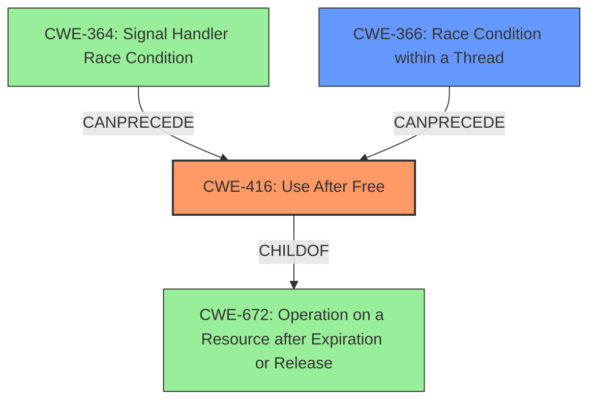

# Final Resolution for CVE-2022-1135

# Summary
| CWE ID | CWE Name | Confidence | CWE Abstraction Level | CWE Vulnerability Mapping Label | CWE-Vulnerability Mapping Notes |
|---|---|---|---|---|---|
| **CWE-416** | **Use After Free** | 0.95 | Variant | Allowed | Primary CWE |
| **CWE-366** | **Race Condition within a Thread** | 0.4 | Base | Allowed | Secondary Candidate |

## Evidence and Confidence

*   **Confidence Score:** 0.93
*   **Evidence Strength:** HIGH

## Relationship Analysis
The primary relationship influencing the decision is the direct match of the vulnerability description to **CWE-416 (Use After Free)**. While **CWE-366 (Race Condition within a Thread)** is considered a secondary factor, its relevance is based on the understanding of concurrent applications and potential exploitation scenarios rather than explicit evidence from the vulnerability description. **CWE-416** is a variant, making it more specific than its parent **CWE-672 (Operation on a Resource after Expiration or Release)**. The `CanFollow` relationships of **CWE-416**, such as with **CWE-364 (Signal Handler Race Condition)**, highlight potential preceding conditions.

## Vulnerability Chain
The vulnerability chain starts with a potential race condition (**CWE-366**) or other preceding conditions such as **CWE-364**. This leads to a **use-after-free** condition (**CWE-416**), where memory is accessed after it has been freed. The consequence is heap corruption, potentially allowing a remote attacker to exploit the system. The missing link is a concrete example of how the race condition specifically triggers the **use-after-free**, which lowers the confidence in **CWE-366**.

## Summary of Analysis
The initial analysis correctly identified **CWE-416 (Use After Free)** as the primary **weakness**. The vulnerability description explicitly mentions "**use after free**," and the CVE reference summary confirms this. The analysis also considered **CWE-366 (Race Condition within a Thread)** as a potential secondary **weakness**, which is reasonable given the concurrent nature of web browsers.

The criticism suggested elaborating on how a race condition might exacerbate or trigger the **use-after-free**. While there's no direct evidence in the provided description, the possibility exists that multiple threads could race to access a shared resource, leading to the freeing of the resource while another thread is still attempting to use it.

The graph relationships influence the selection by showing potential preceding conditions (e.g., **CWE-364**) that could lead to the **use-after-free** (**CWE-416**). **CWE-416** is at the optimal level of specificity, as it directly describes the **weakness** mentioned in the vulnerability description. The confidence score for **CWE-366** is increased to 0.4 to reflect the possibility that a race condition contributes to the **use-after-free**, even though there's no explicit evidence.