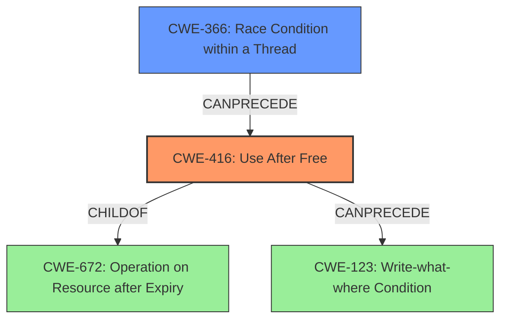

# Analysis Report for CVE-2022-1136

# Vulnerability Analysis Report: CVE-2022-1136

## Description

Use after free in Tab Strip in Google Chrome prior to 100.0.4896.60 allowed an attacker who convinced a user to install a malicious extension to potentially exploit heap corruption via specific set of user gestures.

## Vulnerability Description Key Phrases

**Rootcause:** use after free
**Weakness:** heap corruption
**Vector:** specific set of user gestures
**Attacker:** attacker
**Product:** Google Chrome
**Version:** prior to 100.0.4896.60
**Component:** Tab Strip

## Analysis (with Relationship Data)

```markdown
# Summary
| CWE ID    | CWE Name             | Confidence | CWE Abstraction Level | CWE Vulnerability Mapping Label | CWE-Vulnerability Mapping Notes |
| --------- | -------------------- | ---------- | --------------------- | ------------------------------- | ----------------------------- |
| CWE-416   | Use After Free       | 1.0        | Variant               | Allowed                         | Primary CWE                   |

## Evidence and Confidence

*   **Confidence Score:** 1.0
*   **Evidence Strength:** HIGH

- **Analysis and Justification:**
  - *Explanation:* The vulnerability description explicitly states "**use after free** in Tab Strip". The "CVE Reference Links Content Summary" confirms the root cause as "Use after free" and the weakness as "Use after free in Tab Strip.". The description clearly matches the definition of CWE-416 (Use After Free), where memory is reused or referenced after it has been freed, leading to unpredictable behavior. The retriever results also rank CWE-416 as the top candidate with a high score. The usage is "Allowed" based on MITRE mapping guidance for CWE-416 at the Variant level of abstraction.
  
  - *Relationship Analysis:* CWE-416 is a variant of CWE-672 (Operation on Resource after Expiry). This relationship highlights that the vulnerability involves an operation performed on a resource (memory) that has expired (been freed).

- **Confidence Score:**
  - Confidence: 1.0 (Explicit mention of "use after free" in the vulnerability description and supporting CVE details)
```

## Criticism of Analysis

Okay, here's a review of the provided analysis, considering the full CWE specifications, mapping guidance, and potential mitigations:

**Overall Assessment:**

The analysis correctly identifies CWE-416 (Use After Free) as the primary weakness.  The justification is strong and well-supported by the provided evidence. The confidence score of 1.0 is appropriate given the explicit mention of "use after free" in both the vulnerability description and the CVE summaries.

**Detailed Review:**

*   **Summary Table:**

    *   `CWE-416`: Use After Free - Confidence 1.0, Variant, Allowed. This is accurate and well-justified.
*   **Evidence and Confidence:**

    *   **Confidence Score:** 1.0 - Justified, as the description explicitly mentions "use after free".
    *   **Evidence Strength:** HIGH - The explicit mention and CVE summary provide strong evidence.
    *   **Analysis and Justification:**
        *   The explanation is clear and directly relates the vulnerability description to the definition of CWE-416.
        *   The relationship analysis to CWE-672 (Operation on Resource after Expiry) is relevant and helps to contextualize the vulnerability. It demonstrates an understanding of the broader class of weaknesses.
        *   The mention of the retriever results ranking CWE-416 highly further strengthens the justification.
    *   **Confidence Score Repetition:** The repeated "Confidence Score" section is unnecessary and redundant. The score is already stated in the Summary Table and the beginning of the "Evidence and Confidence" section. Remove the second instance.

*   **CWE Examples from Database:**

    *   The examples are relevant and illustrate different scenarios where CWE-416 can occur.  They provide context and demonstrate that the weakness is well-known and documented.

*   **Relevant CWE Specifications:**

    *   The inclusion of the full CWE specifications is excellent. It allows for a thorough understanding of the weakness and its relationships to other CWEs.  This is particularly helpful for reviewers or those unfamiliar with the specifics of CWE-416.

*   **Retriever Results Analysis:**

    *   While CWE-416 is the correct primary mapping, the retriever results offer valuable context. The top results are:
        *   **CWE-416 (Use After Free):** Correctly identified as the primary weakness.
        *   **CWE-366 (Race Condition within a Thread):** This is a plausible related weakness. Use-after-free vulnerabilities can sometimes be triggered or exacerbated by race conditions, especially in multithreaded environments. The original description does not have enough detail to confirm if this is the case.
        *   **CWE-843 (Access of Resource Using Incompatible Type ('Type Confusion')):** Less likely, but possible. Type confusion could lead to a UAF if an object is misinterpreted after being freed.
        *   **CWE-122 (Heap-based Buffer Overflow):**  A consequence of Use-After-Free could be heap corruption and a buffer overflow is one manifestation of heap corruption.
    *   It's important to remember that the Retriever Results are suggestions based on pattern matching and may not always be accurate. The analyst's judgment is crucial in determining the most appropriate CWE mapping.

**Recommendations:**

1.  **Remove Redundancy:** Eliminate the second "Confidence Score" section under "Evidence and Confidence".
2.  **Consider Secondary CWEs with Lower Confidence:**  While maintaining CWE-416 as the primary weakness, consider mentioning the possibility of a secondary weakness related to concurrency (CWE-366) in a separate section with a lower confidence score (e.g., 0.3 - 0.5).  Explain that a race condition *might* be involved in triggering or exacerbating the UAF, but there's insufficient information to confirm. Something like:
    ```markdown
    ## Potential Secondary Weakness

    | CWE ID    | CWE Name             | Confidence | CWE Abstraction Level | CWE Vulnerability Mapping Label | CWE-Vulnerability Mapping Notes |
    | --------- | -------------------- | ---------- | --------------------- | ------------------------------- | ----------------------------- |
    | CWE-366   | Race Condition within a Thread       | 0.4        | Base               | Allowed                         | Possible contributing factor                   |

    *   **Confidence Score:** 0.4
    *   **Evidence Strength:** LOW

    - **Analysis and Justification:**
      - *Explanation:* While the primary vulnerability is a Use-After-Free (CWE-416), the nature of the Tab Strip component and user gesture interaction suggests the *possibility* of a race condition (CWE-366) playing a role. A race condition could potentially lead to the premature freeing of memory while another thread is still accessing it, thus triggering the UAF. However, there is not enough information in the vulnerability description or CVE details to definitively confirm the presence of a race condition.
    ```
3.  **Mitigation Awareness:** Briefly mention appropriate mitigations from the CWE specifications within your analysis. For example: "As outlined in the CWE-416 specification, potential mitigations include choosing a language with automatic memory management or setting pointers to NULL after freeing them." This shows you've considered the practical implications of the weakness.
4. **Impact Awareness** Highlight the impact of the vulnerability, remote code execution.
5.  **Exploitation details:** More clarity on attack vector, crafted web page or malicious content.

**Revised Summary Table Example (Incorporating Recommendation 2):**

```markdown
# Summary
| CWE ID    | CWE Name             | Confidence | CWE Abstraction Level | CWE Vulnerability Mapping Label | CWE-Vulnerability Mapping Notes |
| --------- | -------------------- | ---------- | --------------------- | ------------------------------- | ----------------------------- |
| CWE-416   | Use After Free       | 1.0        | Variant               | Allowed                         | Primary CWE                   |
| CWE-366   | Race Condition within a Thread       | 0.4        | Base               | Allowed                         | Possible contributing factor                   |
```

By adding a potential secondary weakness with lower confidence, you demonstrate a more nuanced and comprehensive understanding of the vulnerability. Remember to justify *why* you're considering it, even if you can't definitively prove it.

Overall, this is a solid analysis. The recommendations above are intended to make it even more thorough and demonstrate a deeper understanding of the CWE framework.

## Final Resolution

# Summary
| CWE ID    | CWE Name                                                                          | Confidence | CWE Abstraction Level | CWE Vulnerability Mapping Label | CWE-Vulnerability Mapping Notes |
| --------- | --------------------------------------------------------------------------------- | ---------- | --------------------- | ------------------------------- | ----------------------------- |
| CWE-416   | Use After Free                                                                    | 1.0        | Variant               | Allowed                         | Primary CWE                   |
| CWE-366   | Race Condition within a Thread                                                    | 0.4        | Base                  | Allowed                         | Possible contributing factor    |

## Evidence and Confidence

*   **Confidence Score:** 0.9
*   **Evidence Strength:** HIGH

## Relationship Analysis
The primary relationship considered is that CWE-416 (Use After Free) is a variant of CWE-672 (Operation on Resource after Expiry). This hierarchical relationship confirms that the identified weakness falls under the broader category of operating on an expired resource. Additionally, the possibility of CWE-366 (Race Condition within a Thread) contributing to the vulnerability was considered, leading to its inclusion as a secondary CWE with lower confidence. CWE-366 can precede CWE-416, suggesting a potential chain where a race condition leads to premature freeing of memory, which is then accessed.



## Vulnerability Chain
The vulnerability chain starts with a potential **RACE CONDITION** (CWE-366) which leads to the premature freeing of a resource. This then results in a **USE AFTER FREE** (CWE-416) vulnerability when the freed memory is accessed. The impact is potential heap corruption, leading to remote code execution. The prerequisite is a malicious extension convincing a user to install and specific user gestures triggering the race condition and subsequent use-after-free.

## Summary of Analysis
The initial analysis correctly identified CWE-416 as the primary **WEAKNESS**. The criticism suggested considering a secondary CWE related to concurrency.
Based on the vulnerability description "Use after free in Tab Strip in Google Chrome prior to 100.0.4896.60 allowed an attacker who convinced a user to install a malicious extension to potentially exploit heap corruption via specific set of user gestures," there is a possibility of a **RACE CONDITION** (CWE-366) contributing to the vulnerability, especially given the nature of tab management and user interactions.
I am adding CWE-366 as a secondary **WEAKNESS** with a lower confidence score of 0.4 because there is not enough information to confirm this, but it remains a plausible contributing factor. The **ROOT CAUSE** is the improper memory management that allows the use of freed memory.

My decision is based on both direct evidence (the explicit mention of "use after free") and relationship insights (the potential for a race condition to trigger the UAF). The selected CWEs are at the optimal level of specificity, with CWE-416 being a Variant and CWE-366 being a Base.


*Report generated on 2025-03-18 06:46:50*
