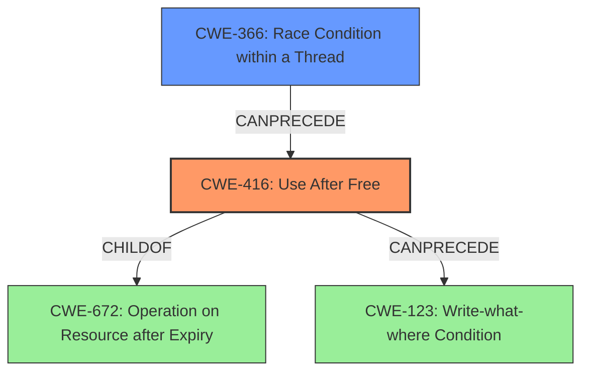

# Final Resolution for CVE-2022-1136

# Summary
| CWE ID    | CWE Name                                                                          | Confidence | CWE Abstraction Level | CWE Vulnerability Mapping Label | CWE-Vulnerability Mapping Notes |
| --------- | --------------------------------------------------------------------------------- | ---------- | --------------------- | ------------------------------- | ----------------------------- |
| CWE-416   | Use After Free                                                                    | 1.0        | Variant               | Allowed                         | Primary CWE                   |
| CWE-366   | Race Condition within a Thread                                                    | 0.4        | Base                  | Allowed                         | Possible contributing factor    |

## Evidence and Confidence

*   **Confidence Score:** 0.9
*   **Evidence Strength:** HIGH

## Relationship Analysis
The primary relationship considered is that CWE-416 (Use After Free) is a variant of CWE-672 (Operation on Resource after Expiry). This hierarchical relationship confirms that the identified weakness falls under the broader category of operating on an expired resource. Additionally, the possibility of CWE-366 (Race Condition within a Thread) contributing to the vulnerability was considered, leading to its inclusion as a secondary CWE with lower confidence. CWE-366 can precede CWE-416, suggesting a potential chain where a race condition leads to premature freeing of memory, which is then accessed.

## Vulnerability Chain
The vulnerability chain starts with a potential **RACE CONDITION** (CWE-366) which leads to the premature freeing of a resource. This then results in a **USE AFTER FREE** (CWE-416) vulnerability when the freed memory is accessed. The impact is potential heap corruption, leading to remote code execution. The prerequisite is a malicious extension convincing a user to install and specific user gestures triggering the race condition and subsequent use-after-free.

## Summary of Analysis
The initial analysis correctly identified CWE-416 as the primary **WEAKNESS**. The criticism suggested considering a secondary CWE related to concurrency.
Based on the vulnerability description "Use after free in Tab Strip in Google Chrome prior to 100.0.4896.60 allowed an attacker who convinced a user to install a malicious extension to potentially exploit heap corruption via specific set of user gestures," there is a possibility of a **RACE CONDITION** (CWE-366) contributing to the vulnerability, especially given the nature of tab management and user interactions.
I am adding CWE-366 as a secondary **WEAKNESS** with a lower confidence score of 0.4 because there is not enough information to confirm this, but it remains a plausible contributing factor. The **ROOT CAUSE** is the improper memory management that allows the use of freed memory.

My decision is based on both direct evidence (the explicit mention of "use after free") and relationship insights (the potential for a race condition to trigger the UAF). The selected CWEs are at the optimal level of specificity, with CWE-416 being a Variant and CWE-366 being a Base.