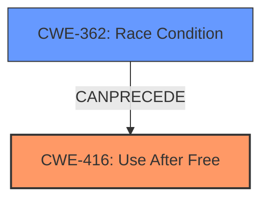

# Final Resolution for CVE-2022-1141

# Summary
| CWE ID | CWE Name | Confidence | CWE Abstraction Level | CWE Vulnerability Mapping Label | CWE-Vulnerability Mapping Notes |
|---|---|---|---|---|---|
| CWE-416 | Use After Free | 0.95 | Variant | Allowed | This CWE entry is at the Variant level of abstraction, which is a preferred level of abstraction for mapping to the root causes of vulnerabilities. |
| CWE-362 | Race Condition Enabling Use After Free | 0.3 | Class | Allowed-with-Review | Secondary contributing factor; concurrency may lead to Use-After-Free. Examine children for a better fit. |

## Evidence and Confidence

*   **Confidence Score:** 0.9
*   **Evidence Strength:** HIGH

## Relationship Analysis
The primary relationship considered was the potential for a race condition (CWE-362) to **precede** the **use-after-free** (CWE-416). While the description explicitly states "use-after-free," the criticism highlights the possibility of concurrency. Considering this possibility is useful in a complete vulnerability chain. The abstraction levels influenced the selection by prioritizing the most specific weakness first, then considering related weaknesses at higher abstraction levels.

## Vulnerability Chain
The vulnerability chain starts with a potential **race condition** (CWE-362), where multiple threads might be interacting with a shared resource. One thread frees the resource, while another attempts to access it, leading to the **use-after-free** condition (CWE-416). This results in heap corruption and potential remote code execution.

## Summary of Analysis
The initial analysis correctly identified CWE-416 (**Use After Free**) as the primary weakness. The vulnerability description explicitly states "**Use after free**", making it a direct match. However, the criticism raised a valid point about the potential involvement of concurrency. The vulnerability description mentions "specific user interaction" and "remote attacker", which does not explicitly rule out a race condition.

Therefore, I'm adding CWE-362 (**Race Condition**) as a secondary contributing factor with a lower confidence score. The "Allowed-with-Review" mapping guidance for CWE-362 is appropriate since it is at the Class level.

The final decision prioritizes CWE-416 as the primary weakness due to the explicit mention in the vulnerability description. CWE-362 is added as a secondary factor to account for the possibility of concurrency, which could potentially lead to the **use-after-free** condition. This provides a more comprehensive view of the vulnerability.