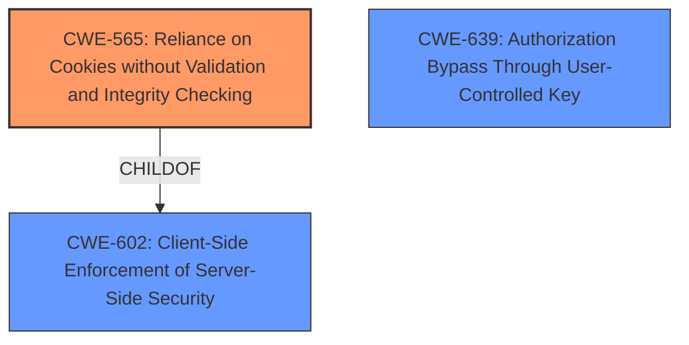

# Final Resolution for CVE-2022-1148

# Summary
| CWE ID  | CWE Name                                                        | Confidence | CWE Abstraction Level | CWE Vulnerability Mapping Label | CWE-Vulnerability Mapping Notes |
| :-------- | :-------------------------------------------------------------- | :--------- | :-------------------- | :------------------------------ | :------------------------------ |
| **CWE-565** | **Reliance on Cookies without Validation and Integrity Checking** | 0.90       | Base                  | Allowed                       | Primary CWE                     |
| CWE-639 | Authorization Bypass Through User-Controlled Key              | 0.70       | Base                  | Allowed                       | Secondary Candidate             |
| CWE-602 | Client-Side Enforcement of Server-Side Security               | 0.60       | Class                   | Allowed-with-Review              | Secondary Candidate             |

## Evidence and Confidence

*   **Confidence Score:** 0.85
*   **Evidence Strength:** HIGH

## Relationship Analysis
The primary weakness is the **improper validation** of session cookies, which directly aligns with CWE-565. While CWE-639 (Authorization Bypass Through User-Controlled Key) is applicable as the attacker bypasses authorization by manipulating the session token, it is a consequence of the cookie validation issue. CWE-602 (Client-Side Enforcement of Server-Side Security) is a reasonable consideration since the server is not properly validating client-provided cookies, but it's a higher-level abstraction than CWE-565. The relationships between these CWEs are important. CWE-565 is a child of CWE-602, indicating that the lack of cookie validation is a specific instance of client-side enforcement problems.

## Vulnerability Chain
The vulnerability chain starts with the **root cause**: the lack of proper cookie validation (CWE-565). This allows an attacker to manipulate the session token, leading to an authorization bypass (CWE-639). The consequence is that the attacker can steal a user's access token and reuse it on other private websites.

## Summary of Analysis
The initial analysis is strong, particularly in identifying CWE-565 as the primary **weakness**. The criticism correctly points out the nuances and relationships between the candidate CWEs. My assessment builds upon this by emphasizing the directness of CWE-565 in representing the **root cause**. The "CVE Reference Links Content Summary" mentioning "**Improper validation of session cookies**" provides strong evidence for this classification. The relationship analysis further supports this decision, as CWE-565 is a specific instance of the broader client-side enforcement issue represented by CWE-602. Therefore, I am increasing the confidence score for CWE-565 to 0.90. I am reducing the confidence score for CWE-639 to 0.70, and I am including CWE-602 with a confidence of 0.60.

The selected CWEs are at the optimal level of specificity. CWE-565 is a base-level CWE that directly addresses the **root cause**. CWE-639 and CWE-602 provide additional context but are less directly representative of the core issue.