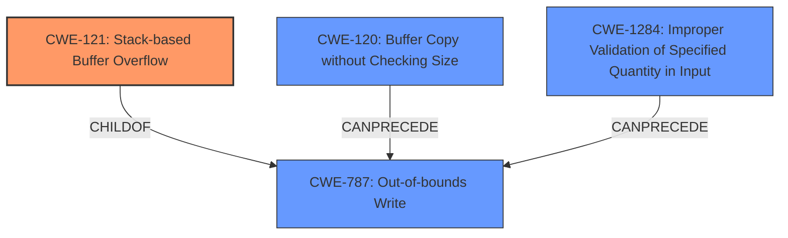

# Analysis Report for CVE-2022-1211

# Vulnerability Analysis Report: CVE-2022-1211

## Description

A vulnerability classified as critical has been found in tildearrow Furnace dev73. This affects the FUR to VGM converter in console mode which causes stack-based overflows and crashes. It is possible to initiate the attack remotely but it requires user-interaction. A POC has been disclosed to the public and may be used.

## Vulnerability Description Key Phrases

**Weakness:** stack-based overflows
**Impact:** crashes
**Product:** tildearrow Furnace
**Version:** dev73
**Component:** FUR to VGM converter in console mode

## Analysis (with Relationship Data)

# Summary
| CWE ID | CWE Name | Confidence | CWE Abstraction Level | CWE Vulnerability Mapping Label | CWE-Vulnerability Mapping Notes |
|---|---|---|---|---|---|
| CWE-121 | Stack-based Buffer Overflow | 1.0 | Variant | Primary | Allowed |
| CWE-787 | Out-of-bounds Write | 0.7 | Base | Secondary Candidate | Allowed |
| CWE-119 | Improper Restriction of Operations within the Bounds of a Memory Buffer | 0.6 | Class | Secondary Candidate | Allowed |

## Evidence and Confidence

*   **Confidence Score:** 0.9
*   **Evidence Strength:** HIGH

- **Analysis and Justification:**  
  - *Explanation:* The vulnerability description explicitly states "**stack-based overflows**" and crashes in the FUR to VGM converter within tildearrow Furnace dev73. The CVE Reference Links Content Summary confirms this, stating a "**stack-based buffer overflow** vulnerability (CWE-121, CWE-787, CWE-119)". This directly aligns with CWE-121 (Stack-based Buffer Overflow), which is a Variant of a buffer overflow occurring specifically on the stack. The description details the component (FUR to VGM converter in console mode), the trigger (user interaction), and the impact (crashes), all supporting a stack-based buffer overflow scenario. The evidence is further strengthened by the mention of fuzz testing as the discovery method and the provided commits `3a7a132` and `258a905` which fixed the vulnerability by hardening the file loader to prevent out-of-bounds access. CWE-787 is considered as secondary because it is a general out-of-bounds write, and CWE-121 is a specific case of that, and the description mentions stack. CWE-119, while relevant as a parent class, is less specific than CWE-121 and CWE-787.
  
  - *Relationship Analysis:* CWE-121 is a Variant of CWE-119 (Improper Restriction of Operations within the Bounds of a Memory Buffer). CWE-121 is also a specific type of CWE-787 (Out-of-bounds Write), focusing on stack-based overflows. The exploit can lead to arbitrary code execution.

- **Confidence Score:**  
  - Confidence: 1.0 (High confidence due to explicit mention of stack-based overflow and corroborating CVE details)

---

## Criticism of Analysis

Okay, I've reviewed the provided analysis against the full CWE specifications. Here's my critique:

**Overall Assessment:**

The analysis is generally good, with a clear and logical justification for the primary CWE mapping. The confidence score and evidence strength are appropriate. The inclusion of secondary candidate CWEs and relationship analysis strengthens the assessment. However, there are some areas where the analysis could be improved, especially concerning the secondary candidates and some missed related CWEs based on the root cause.

**Detailed Critique:**

1.  **CWE-121: Stack-based Buffer Overflow (Primary)**

    *   **Strengths:** The mapping to CWE-121 is accurate and well-justified. The analysis correctly identifies the specific nature of the buffer overflow occurring on the stack. The provided evidence (vulnerability description, CVE details, fuzzing discovery, and fix commits) strongly supports this mapping.
    *   **Areas for Improvement:** None significant.
    *   **CWE Specification Alignment:** The analysis aligns well with the CWE-121 specification, including the description, extended description, and alternative terms.

2.  **CWE-787: Out-of-bounds Write (Secondary Candidate)**

    *   **Strengths:** The rationale for including CWE-787 is valid since a stack-based buffer overflow is a specific form of out-of-bounds write.
    *   **Areas for Improvement:** While correct to include, consider explicitly stating that CWE-787 is the more *general* case, and CWE-121 is a *specific* instance of it.
    *   **CWE Specification Alignment:**  It correctly identifies that CWE-787 is a parent of CWE-121.

3.  **CWE-119: Improper Restriction of Operations within the Bounds of a Memory Buffer (Secondary Candidate)**

    *   **Strengths:** Acknowledging the relationship between CWE-119 and CWE-121/CWE-787 is important because it's the overarching issue of improper memory boundary handling.
    *   **Areas for Improvement:**
        *   Follow the CWE-119's "Mapping Guidance": "Look at CWE-119's children and consider mapping to CWEs such as CWE-787: Out-of-bounds Write, CWE-125: Out-of-bounds Read, or others."  The analysis *does* do this, but then keeps CWE-119 as a *secondary* candidate.  Based on the mapping guidance, CWE-119 should be *excluded* in favor of the more specific CWE-121 and CWE-787.  The analysis essentially acknowledges this in its justification.
        *   The confidence score for CWE-119 should be lower than the scores for CWE-121 and CWE-787, reflecting its higher level of abstraction.  Consider removing it altogether.
    *   **CWE Specification Alignment:** Accurately represents CWE-119 as a class-level weakness and a parent of CWE-121 and CWE-787.

4.  **Missing Related CWEs (Potential Improvement):**

    *   **CWE-120: Buffer Copy without Checking Size of Input ('Classic Buffer Overflow').** If the code directly uses a buffer copy operation (like `strcpy` in C) *without* any size checks, then CWE-120 might be a relevant contributing factor. This depends on the specifics of the vulnerable code, which aren't available, but it's worth considering.  The description notes that "The simplest type of error, and the most common cause of buffer overflows, is the "classic" case in which the product copies the buffer without restricting how much is copied."
    *   **CWE-20: Improper Input Validation:**  Buffer overflows often stem from a lack of proper input validation.  If the size of the input data is not validated before being copied into the stack buffer, CWE-20 would be appropriate.  However, CWE-20's mapping guidance says that it is commonly misused and that lower-level CWEs should be preferred instead.  Thus, if there are more specific validation errors, those would be preferred.  For example:
        *   **CWE-1284: Specified Quantity:** This should be considered if the input contains a size parameter that is not properly validated.
    *   **CWE-131: Incorrect Calculation of Buffer Size:**  If the buffer size calculation was performed incorrectly, leading to a smaller buffer than needed, this would be relevant.
    *   **CWE-788: Access of Memory Location After End of Buffer:** If the vulnerability manifests by writing past the end of the buffer due to an improper index or pointer manipulation, this would be relevant to include

5.  **Mitigation Strategies:**

    *   The analysis doesn't explicitly mention mitigation strategies. While not strictly required, briefly mentioning some relevant mitigations (especially those suggested in the CWE specifications) can enhance the analysis.
    *   For CWE-121, some mitigations could include:
        *   Using compiler-based buffer overflow detection mechanisms (e.g., /GS flag in Visual Studio, FORTIFY_SOURCE in GCC).
        *   Implementing bounds checking on input.
        *   Using safer string handling functions (if applicable).
    *   For CWE-787, focus on language selection, libraries and frameworks and environment hardening.

**Revised Summary Table (Incorporating Suggestions):**

| CWE ID | CWE Name | Confidence | CWE Abstraction Level | CWE Vulnerability Mapping Label | CWE-Vulnerability Mapping Notes |
|---|---|---|---|---|---|
| CWE-121 | Stack-based Buffer Overflow | 1.0 | Variant | Primary | Allowed |
| CWE-787 | Out-of-bounds Write | 0.7 | Base | Secondary Candidate | Allowed | Stack-based buffer overflow is a specific type of out-of-bounds write.
| CWE-119 | Improper Restriction of Operations within the Bounds of a Memory Buffer | 0.3 | Class | Excluded | Discouraged by CWE Mapping Guidance. Use more specific CWEs instead. |
| CWE-120 | Buffer Copy without Checking Size of Input ('Classic Buffer Overflow') | 0.4 | Base | Secondary Candidate | Allowed | Only include if source code uses `strcpy` or equivalent without any size checks.|
| CWE-20 | Improper Input Validation | 0.3 | Class | Secondary Candidate | Only include if there is improper or missing Input Validation.  |

**Key Improvements Suggested:**

*   **Remove CWE-119:** Based on the Mapping Guidance, it's better to use the more specific CWEs and exclude CWE-119.
*   **Consider CWE-120:** Analyze the code to determine if classic buffer copy is used.
*   **Mitigation Suggestions:** Briefly touch on mitigation strategies.

By incorporating these suggestions, the analysis can become even more comprehensive and aligned with best practices for CWE mapping.

## Final Resolution

# Summary
| CWE ID | CWE Name | Confidence | CWE Abstraction Level | CWE Vulnerability Mapping Label | CWE-Vulnerability Mapping Notes |
|---|---|---|---|---|---|
| CWE-121 | Stack-based Buffer Overflow | 1.0 | Variant | Primary | Allowed |
| CWE-787 | Out-of-bounds Write | 0.7 | Base | Secondary Candidate | Allowed | Stack-based buffer overflow is a specific type of out-of-bounds write. |
| CWE-120 | Buffer Copy without Checking Size of Input ('Classic Buffer Overflow') | 0.4 | Base | Secondary Candidate | Allowed | Only include if source code uses `strcpy` or equivalent without any size checks. |
| CWE-1284 | Improper Validation of Specified Quantity in Input | 0.4 | Base | Secondary Candidate | Allowed | Consider if the input contains a size parameter that is not properly validated. |

  - The Primary CWE should be first and noted as the Primary CWEs
  - The secondary candidate CWEs should be next and noted as secondary candidates.
  - The confidence is a confidence score 0 to 1 to rate your confidence in your assessment for that CWE.
  - The CWE Abstraction Level as one of these values: Base, Variant, Pillar, Class, Compound
  - The Mapping Notes Usage as one of these values: Allowed, Allowed-with-Review, Prohibited, Discouraged

## Evidence and Confidence

*   **Confidence Score:** 0.9
*   **Evidence Strength:** HIGH

## Relationship Analysis
The primary weakness is **CWE-121 (Stack-based Buffer Overflow)**, a variant of **CWE-787 (Out-of-bounds Write)**. **CWE-120 (Buffer Copy without Checking Size of Input)** can precede **CWE-787** if a buffer copy operation without size checking is used. **CWE-1284 (Improper Validation of Specified Quantity in Input)** could also precede **CWE-787** if the size of the input is not validated.
CWE-119 was removed because of the CWE Mapping Guidance.

## Vulnerability Chain
The vulnerability chain starts with either **CWE-120 (Buffer Copy without Checking Size)** or **CWE-1284 (Improper Validation of Specified Quantity in Input)**, leading to **CWE-787 (Out-of-bounds Write)**, and finally manifesting as **CWE-121 (Stack-based Buffer Overflow)**. The root cause could be the lack of input validation or the use of unsafe buffer copy functions. The impact is a crash due to the stack-based buffer overflow, potentially leading to arbitrary code execution.

## Summary of Analysis
The initial analysis correctly identified **CWE-121 (Stack-based Buffer Overflow)** as the primary weakness. The criticism provided valuable insights by suggesting the exclusion of **CWE-119 (Improper Restriction of Operations within the Bounds of a Memory Buffer)** based on CWE mapping guidance and proposing the consideration of **CWE-120 (Buffer Copy without Checking Size)** and **CWE-1284 (Improper Validation of Specified Quantity in Input)**.

The vulnerability description explicitly mentions "stack-based overflows," which directly supports the selection of **CWE-121**. The evidence is strengthened by the CVE details and the provided commits, which address out-of-bounds access.

The graph relationships influenced the final selection by highlighting the hierarchical relationship between **CWE-121** and **CWE-787**, as well as the potential chain relationships involving **CWE-120** and **CWE-1284**. The selected CWEs are at the optimal level of specificity, with **CWE-121** being the most specific and accurately reflecting the nature of the vulnerability.

*Report generated on 2025-03-18 06:50:50*
