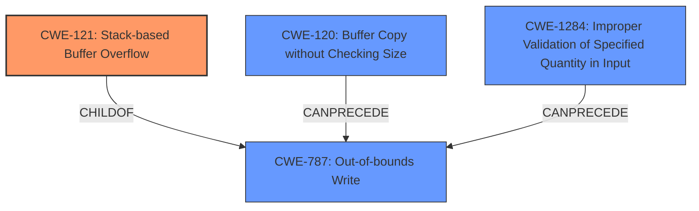

# Final Resolution for CVE-2022-1211

# Summary
| CWE ID | CWE Name | Confidence | CWE Abstraction Level | CWE Vulnerability Mapping Label | CWE-Vulnerability Mapping Notes |
|---|---|---|---|---|---|
| CWE-121 | Stack-based Buffer Overflow | 1.0 | Variant | Primary | Allowed |
| CWE-787 | Out-of-bounds Write | 0.7 | Base | Secondary Candidate | Allowed | Stack-based buffer overflow is a specific type of out-of-bounds write. |
| CWE-120 | Buffer Copy without Checking Size of Input ('Classic Buffer Overflow') | 0.4 | Base | Secondary Candidate | Allowed | Only include if source code uses `strcpy` or equivalent without any size checks. |
| CWE-1284 | Improper Validation of Specified Quantity in Input | 0.4 | Base | Secondary Candidate | Allowed | Consider if the input contains a size parameter that is not properly validated. |

  - The Primary CWE should be first and noted as the Primary CWEs
  - The secondary candidate CWEs should be next and noted as secondary candidates.
  - The confidence is a confidence score 0 to 1 to rate your confidence in your assessment for that CWE.
  - The CWE Abstraction Level as one of these values: Base, Variant, Pillar, Class, Compound
  - The Mapping Notes Usage as one of these values: Allowed, Allowed-with-Review, Prohibited, Discouraged

## Evidence and Confidence

*   **Confidence Score:** 0.9
*   **Evidence Strength:** HIGH

## Relationship Analysis
The primary weakness is **CWE-121 (Stack-based Buffer Overflow)**, a variant of **CWE-787 (Out-of-bounds Write)**. **CWE-120 (Buffer Copy without Checking Size of Input)** can precede **CWE-787** if a buffer copy operation without size checking is used. **CWE-1284 (Improper Validation of Specified Quantity in Input)** could also precede **CWE-787** if the size of the input is not validated.
CWE-119 was removed because of the CWE Mapping Guidance.

## Vulnerability Chain
The vulnerability chain starts with either **CWE-120 (Buffer Copy without Checking Size)** or **CWE-1284 (Improper Validation of Specified Quantity in Input)**, leading to **CWE-787 (Out-of-bounds Write)**, and finally manifesting as **CWE-121 (Stack-based Buffer Overflow)**. The root cause could be the lack of input validation or the use of unsafe buffer copy functions. The impact is a crash due to the stack-based buffer overflow, potentially leading to arbitrary code execution.

## Summary of Analysis
The initial analysis correctly identified **CWE-121 (Stack-based Buffer Overflow)** as the primary weakness. The criticism provided valuable insights by suggesting the exclusion of **CWE-119 (Improper Restriction of Operations within the Bounds of a Memory Buffer)** based on CWE mapping guidance and proposing the consideration of **CWE-120 (Buffer Copy without Checking Size)** and **CWE-1284 (Improper Validation of Specified Quantity in Input)**.

The vulnerability description explicitly mentions "stack-based overflows," which directly supports the selection of **CWE-121**. The evidence is strengthened by the CVE details and the provided commits, which address out-of-bounds access.

The graph relationships influenced the final selection by highlighting the hierarchical relationship between **CWE-121** and **CWE-787**, as well as the potential chain relationships involving **CWE-120** and **CWE-1284**. The selected CWEs are at the optimal level of specificity, with **CWE-121** being the most specific and accurately reflecting the nature of the vulnerability.