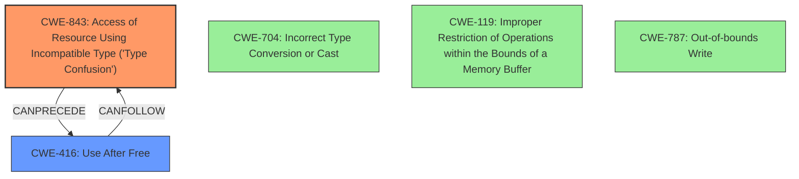

# Final Resolution for CVE-2022-1232

# Summary
| CWE ID | CWE Name | Confidence | CWE Abstraction Level | CWE Vulnerability Mapping Label | CWE-Vulnerability Mapping Notes |
|---|---|---|---|---|---|
| CWE-843 | Access of Resource Using Incompatible Type ('Type Confusion') | 1.0 | Base | Allowed | Primary CWE |
| CWE-416 | Use After Free | 0.5 | Variant | Allowed | Secondary Candidate |

## Evidence and Confidence

*   **Confidence Score:** 0.75
*   **Evidence Strength:** HIGH

## Relationship Analysis
The primary relationship influencing the decision is the CAN_FOLLOW relationship, where **CWE-843** (**Type Confusion**) can lead to **CWE-416** (**Use After Free**). **CWE-843** is chosen as the primary **ROOTCAUSE** due to explicit mention of "type confusion" in the vulnerability description. The analysis considered and rejected **CWE-704** (**Incorrect Type Conversion or Cast**) as a possible alternative, but it was deemed less specific than **CWE-843**, because the vulnerability is about *accessing* a resource with an incompatible type, not necessarily the type conversion itself. **CWE-119** (**Improper Restriction of Operations within the Bounds of a Memory Buffer**) and **CWE-787** (**Out-of-bounds Write**) were also considered as potential impacts of type confusion, but the **ROOTCAUSE** is the type confusion.

## Vulnerability Chain
The vulnerability chain starts with a "crafted HTML page" leading to **CWE-843** (**Type Confusion**) in the V8 JavaScript engine. The **WEAKNESS** then causes heap corruption, potentially leading to **CWE-416** (**Use After Free**). The final impact is remote code execution.

## Summary of Analysis
The final assessment strongly supports the initial analysis. The classification relies heavily on the vulnerability description's explicit mention of "type confusion," which directly corresponds to **CWE-843** (**Access of Resource Using Incompatible Type ('Type Confusion')**). The relationship analysis, particularly the CAN_FOLLOW relationship where **CWE-843** can precede **CWE-416**, reinforces the selection of **CWE-843** as the primary **ROOTCAUSE** and **CWE-416** as a secondary candidate representing a potential consequence. The selected CWEs are at the optimal level of specificity, with **CWE-843** being a Base-level CWE and **CWE-416** being a Variant.