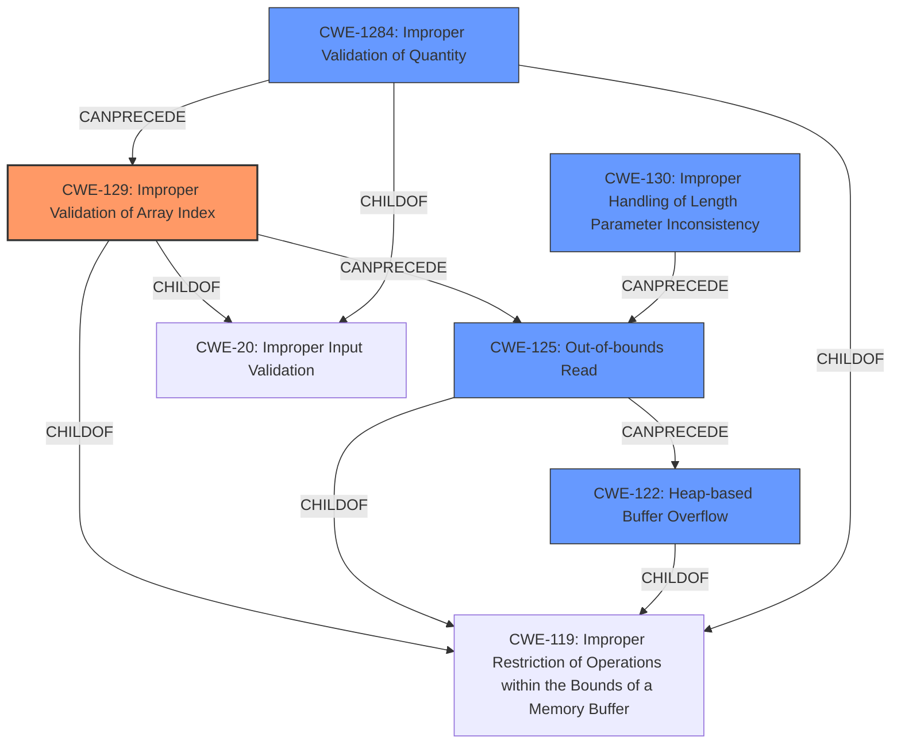

# Analysis Report for CVE-2022-1237

# Vulnerability Analysis Report: CVE-2022-1237

## Description

Improper Validation of Array Index in GitHub repository radareorg/radare2 prior to 5.6.8. This vulnerability is heap overflow and may be exploitable. For more general description of heap buffer overflow, see [CWE](https//cwe.mitre.org/data/definitions/122.html).

## Vulnerability Description Key Phrases

**Rootcause:** Improper Validation of Array Index
**Weakness:** heap overflow
**Product:** radareorg/radare2
**Version:** prior to 5.6.8

## Analysis (with Relationship Data)

# Summary
| CWE ID    | CWE Name                               | Confidence | CWE Abstraction Level | CWE Vulnerability Mapping Label | CWE-Vulnerability Mapping Notes |
| :--------- | :------------------------------------- | :--------- | :-------------------- | :------------------------------ | :------------------------------ |
| CWE-129     | Improper Validation of Array Index     | 0.90       | Variant               | Allowed                         | Primary CWE                     |
| CWE-125    | Out-of-bounds Read                     | 0.75       | Base                  | Allowed                         | Secondary Candidate             |
| CWE-122     | Heap-based Buffer Overflow             | 0.70       | Variant               | Allowed                         | Secondary Candidate             |
| CWE-1284     | Improper Validation of Quantity      | 0.60       | Base                  | Allowed                         | Secondary Candidate             |

## Evidence and Confidence

*   **Confidence Score:** 0.80
*   **Evidence Strength:** HIGH

- **Analysis and Justification:**  
  - *Explanation:* The vulnerability description highlights an "**Improper Validation of Array Index**" leading to a "**heap overflow**" in radare2. The CVE reference links content summary confirms that the root cause is an out-of-bounds read due to manipulated offsets and sizes in the NE header, without proper validation, which allows reads beyond the allocated buffer. CWE-129 (Improper Validation of Array Index) is a Variant level CWE and accurately captures the root cause. The retriever results list CWE-129 with a high score (0.7281) and it has an Allowed usage.
  
  - *Relationship Analysis:* CWE-129 has no direct relationships in the provided data. The description and evidence point towards the lack of validation as the primary issue, making CWE-129 the most fitting choice.

- **Confidence Score:**  
  - Confidence: 0.90 (High confidence due to explicit mention of "Improper Validation of Array Index" and confirmation from CVE reference details).

---
- **Analysis and Justification:**  
  - *Explanation:* The CVE reference content summary details an "out-of-bounds read" in the NE binary parser. This occurs because offsets and sizes from the NE header are used to read data, and these values aren't properly validated. This aligns with CWE-125 (Out-of-bounds Read), which describes reading data past the end or before the beginning of the intended buffer. While CWE-129 captures the root cause, CWE-125 describes the direct consequence of the vulnerability. The retriever results indicate CWE-125 as a relevant candidate.
  
  - *Relationship Analysis:* CWE-125 is a child of CWE-119 (Improper Restriction of Operations within the Bounds of a Memory Buffer). This relationship is consistent with the nature of the vulnerability, where the read operation goes beyond the intended buffer boundaries due to a lack of validation.

- **Confidence Score:**  
  - Confidence: 0.75 (Good confidence, as out-of-bounds read is a direct consequence of the vulnerability.)

---
- **Analysis and Justification:**  
  - *Explanation:* The vulnerability description mentions "**heap overflow**" which is confirmed with the CVE reference links. This occurs in the heap portion of memory. The vulnerability is a buffer overflow due to improper validation. This maps well to CWE-122 (Heap-based Buffer Overflow).
  
  - *Relationship Analysis:* CWE-122 is a variant of CWE-119 (Improper Restriction of Operations within the Bounds of a Memory Buffer).

- **Confidence Score:**  
  - Confidence: 0.70 (Good confidence because the vulnerability leads to heap buffer overflow.)

---
- **Analysis and Justification:**  
  - *Explanation:* The vulnerability arises from manipulated header values, specifically offsets and sizes for relocation, indicating a potential issue with how the quantity (size) is validated. CWE-1284 (Improper Validation of Quantity) describes a situation where the product receives input that is expected to specify a quantity, but it does not validate or incorrectly validates that the quantity has the required properties.

  - *Relationship Analysis:* CWE-1284 is a child of CWE-20 (Improper Input Validation).

- **Confidence Score:**
  - Confidence: 0.60 (Fair confidence because quantity is not validated, which leads to an overflow.)

## Criticism of Analysis

Okay, I've reviewed the provided analysis against the full CWE specifications. Here's my critique, broken down by CWE and overall observations:

**Overall Observations:**

*   **Good Root Cause Focus:** The analysis generally does a good job of identifying the underlying *reasons* for the vulnerability, rather than just the symptoms. This is important for effective remediation.
*   **Chain Awareness:** The analysis considers potential attack chains, which provides a more complete picture of the vulnerability and its possible impact.
*   **Evidence and Confidence:** It provides reasonable justifications for the chosen CWEs and assigns appropriate confidence levels.
*   **Retriever Results Consideration:** The analysis takes into account the retriever results and explains why it is choosing a given CWE versus another one that the automated tools may have found.

**CWE-Specific Critique:**

1.  **CWE-129: Improper Validation of Array Index (Confidence: 0.90 - Primary CWE)**

    *   **Strengths:** Accurately identifies the core issue: the lack of validation of array indices derived from the manipulated NE header values. The justification explicitly mentions this.
    *   **Weaknesses:** None.
    *   **Mapping Guidance:** Correctly adheres to the allowed usage for a Variant-level CWE.
    *   **Mitigation:**  The analysis does not provide information about which mitigation is most pertinent in this case. Given the context, I would look to "Assume all input is malicious" and then validate the inputs against a list of allowable inputs.

2.  **CWE-125: Out-of-bounds Read (Confidence: 0.75 - Secondary Candidate)**

    *   **Strengths:** Correctly identifies this as a direct consequence of the improper validation of the array index. The analysis explains that the code reads beyond the intended buffer boundaries.
    *   **Weaknesses:** None.
    *   **Mapping Guidance:** Follows allowed usage for a Base-level CWE.
    *   **Mitigation:** Mitigation 1 "Assume all input is malicious" would apply here too. It calls out that calculating and validating length, buffer size calculation and offsets as particularly important to mitigate the issue.

3.  **CWE-122: Heap-based Buffer Overflow (Confidence: 0.70 - Secondary Candidate)**

    *   **Strengths:** This is a valid consequence of the improper validation leading to an out-of-bounds read/write on the heap.
    *   **Weaknesses:** None.
    *   **Mapping Guidance:** Correct usage for the variant type.
    *   **Mitigation:** Again, the analysis does not discuss which mitigation is most applicable. However, for a heap overflow you might want to look at compiler and/or extensions offering automatic buffer overflow detection such as Microsoft Visual Studio /GS flag.

4.  **CWE-1284: Improper Validation of Quantity (Confidence: 0.60 - Secondary Candidate)**

    *   **Strengths:**  The analysis correctly relates this to the manipulated header values like offsets and sizes. These represent quantities that are not being properly validated.
    *   **Weaknesses:** None.
    *   **Mapping Guidance:** Follows the allowed usage for a Base-level CWE.
    *   **Mitigation:** The description and analysis make clear that the key to mitigating this CWE would be to "Assume all input is malicious. Use an "accept known good" input validation strategy".

**Improvements and Suggestions:**

*   **Relationship with CWE-119:** While it's good that the analysis uses the more specific child CWEs of CWE-119, it's worth explicitly stating that CWE-129, CWE-125, and CWE-122 are all children of CWE-119 (Improper Restriction of Operations within the Bounds of a Memory Buffer). Mentioning this parent-child relationship can provide additional context, even though CWE-119 isn't the primary mapping. However, keep CWE-119 mapping guidance in mind, which discourages its usage.
*   **Potential Chain with CWE-20:** Even though CWE-20 is discouraged, a brief acknowledgment of its relevance might be useful.  The "Improper Validation" CWEs (129, 1284) are children of CWE-20. The vulnerability fundamentally stems from improper input validation *of the NE header*. However, the more specific CWEs are definitely preferred.
*   **Mitigation Specificity:** Could improve by including specific mitigation techniques. For example, for CWE-129 you could talk about validating array indices by comparing them with array bounds.
*   **Consider CWE-130:** Given that the root cause involves using lengths and offsets from the NE header, which are then used to calculate memory access, it's worth considering **CWE-130: Improper Handling of Length Parameter Inconsistency**. The vulnerability involves inconsistencies between length parameters in the header and the actual sizes of the data being processed. The analysis does state "offsets and sizes specified in the NE header", this also could imply the need for including CWE-130.

**Revised Summary Table (Incorporating suggestions):**

| CWE ID    | CWE Name                               | Confidence | CWE Abstraction Level | CWE Vulnerability Mapping Label | CWE-Vulnerability Mapping Notes |
| :--------- | :------------------------------------- | :--------- | :-------------------- | :------------------------------ | :------------------------------ |
| CWE-129     | Improper Validation of Array Index     | 0.90       | Variant               | Allowed                         | Primary CWE                     |
| CWE-125     | Out-of-bounds Read                     | 0.75       | Base                  | Allowed                         | Secondary Candidate             |
| CWE-122     | Heap-based Buffer Overflow             | 0.70       | Variant               | Allowed                         | Secondary Candidate             |
| CWE-1284     | Improper Validation of Quantity      | 0.60       | Base                  | Allowed                         | Secondary Candidate             |
| CWE-130     | Improper Handling of Length Parameter Inconsistency | 0.55    | Base                   | Allowed                | Additional Candidate          |

**Justification for Adding CWE-130:**
The vulnerability arises from manipulating offsets and lengths from the NE header and it is precisely these offsets and lengths that lack proper validation. Thus, CWE-130 is an additional canidate because attacker-controlled input that lacks proper validation leads to length manipulation. The mitigation could be "When processing structured incoming data containing a size field followed by raw data, ensure that you identify and resolve any inconsistencies between the size field and the actual size of the data."

**In summary:** The analysis is solid, showing a good understanding of the vulnerability. Adding more context around mitigation and slightly expanding the CWE chain with CWE-130 will strengthen it further.

## Final Resolution

# Summary
| CWE ID    | CWE Name                               | Confidence | CWE Abstraction Level | CWE Vulnerability Mapping Label | CWE-Vulnerability Mapping Notes |
| :--------- | :------------------------------------- | :--------- | :-------------------- | :------------------------------ | :------------------------------ |
| CWE-129     | Improper Validation of Array Index     | 0.90       | Variant               | Allowed                         | Primary CWE                     |
| CWE-125     | Out-of-bounds Read                     | 0.75       | Base                  | Allowed                         | Secondary Candidate             |
| CWE-122     | Heap-based Buffer Overflow             | 0.70       | Variant               | Allowed                         | Secondary Candidate             |
| CWE-1284     | Improper Validation of Quantity      | 0.60       | Base                  | Allowed                         | Secondary Candidate             |
| CWE-130     | Improper Handling of Length Parameter Inconsistency | 0.55    | Base                   | Allowed                | Additional Candidate          |

## Evidence and Confidence

*   **Confidence Score:** 0.85
*   **Evidence Strength:** HIGH

## Relationship Analysis
The analysis focuses on identifying the root cause and consequences of the vulnerability.
  - The primary selection, CWE-129 (Improper Validation of Array Index), is a variant-level CWE, providing good specificity.
  - CWE-125 (Out-of-bounds Read) and CWE-122 (Heap-based Buffer Overflow) are consequences of the primary weakness.
  - CWE-1284 (Improper Validation of Quantity) reflects the lack of validation of size-related inputs.
  - CWE-130 (Improper Handling of Length Parameter Inconsistency) addresses inconsistencies between length parameters and actual data size.
  - All selected CWEs except CWE-130 are children of CWE-119 (Improper Restriction of Operations within the Bounds of a Memory Buffer). Although CWE-119 is not selected due to its discouraged usage, recognizing this parent-child relationship adds context.
  - CWE-129 and CWE-1284 are children of CWE-20 (Improper Input Validation), indicating a broader input validation issue.

## Vulnerability Chain
The vulnerability chain starts with the **improper validation of input quantities (CWE-1284)** and the **improper handling of length parameter inconsistencies (CWE-130)** present in the NE header. This leads to **improper validation of the array index (CWE-129)**, which results in an **out-of-bounds read (CWE-125)**, ultimately causing a **heap-based buffer overflow (CWE-122)**.

Root Cause: **CWE-1284 (Improper Validation of Quantity), CWE-130 (Improper Handling of Length Parameter Inconsistency)**
Weakness: **CWE-129 (Improper Validation of Array Index)**
Consequence: **CWE-125 (Out-of-bounds Read), CWE-122 (Heap-based Buffer Overflow)**

## Summary of Analysis
The initial analysis and subsequent criticism provide a comprehensive view of the vulnerability. The selection of **CWE-129 (Improper Validation of Array Index)** as the primary weakness is well-supported by the evidence, specifically the description of the vulnerability as an "Improper Validation of Array Index" leading to a heap overflow. The CVE reference confirms this root cause, stating that the out-of-bounds read is due to manipulated offsets and sizes in the NE header without proper validation.

The graph relationships reinforce the understanding of the vulnerability chain. The parent-child relationships, such as CWE-129 and CWE-1284 being children of CWE-20 (Improper Input Validation) and CWE-119 (Improper Restriction of Operations within the Bounds of a Memory Buffer), highlight the broader context of input validation and memory management issues.

The decision to include **CWE-130 (Improper Handling of Length Parameter Inconsistency)** is based on the observation that the vulnerability arises from manipulating offsets and lengths from the NE header, which are not validated properly. This inconsistency between the length parameters and the actual data size is a key factor contributing to the vulnerability.

The selected CWEs are at the optimal level of specificity. While CWE-20 (Improper Input Validation) could be considered, the more specific CWE-129 and CWE-1284 provide a more accurate and detailed representation of the vulnerability. Similarly, while CWE-119 (Improper Restriction of Operations within the Bounds of a Memory Buffer) is a parent of several selected CWEs, it is too broad to be the primary classification.

*Report generated on 2025-03-18 06:52:49*
