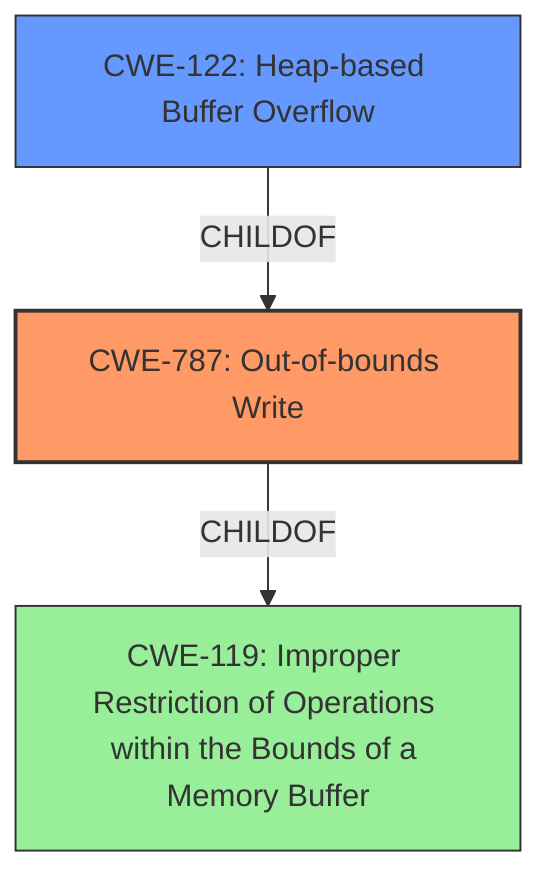

# Final Resolution for CVE-2022-1238

# Summary

| CWE ID | CWE Name | Confidence | CWE Abstraction Level | CWE Vulnerability Mapping Label | CWE-Vulnerability Mapping Notes |
|---|---|---|---|---|---|
| CWE-787 | Out-of-bounds Write | 0.95 | Base | Allowed | Primary CWE |
| CWE-122 | Heap-based Buffer Overflow | 0.75 | Variant | Allowed | Secondary Candidate |

## Evidence and Confidence

*   **Confidence Score:** 0.92
*   **Evidence Strength:** HIGH

## Relationship Analysis
The primary relationship impacting the decision is the parent-child relationship between CWE-119 (Improper Restriction of Operations within the Bounds of a Memory Buffer), CWE-787 (Out-of-bounds Write) and CWE-122 (Heap-based Buffer Overflow). CWE-787 is a child of CWE-119, making it more specific, and CWE-122 is a variant of CWE-787 specifying that the out-of-bounds write occurs on the heap. This hierarchical relationship guides us to select CWE-787 as the primary cause because it directly addresses the out-of-bounds write, while CWE-122 provides additional context.

## Vulnerability Chain
The vulnerability chain starts with the **ROOTCAUSE** which is an **Out-of-bounds Write (CWE-787)** in the `libr/bin/format/ne/ne.c` component. Because it is a heap overflow, **CWE-122** occurs. The consequence is a potential for exploitation.

## Summary of Analysis
The initial analysis and criticism were both accurate. The vulnerability description clearly states an "**Out-of-bounds Write**" occurs and that it is a "**heap overflow**". The provided evidence supports the classification of CWE-787 as the primary CWE because the description specifies writing beyond the intended buffer. CWE-122 is included as a secondary CWE because it specifies the location of the buffer on the heap.

The graph relationships reinforced the decision to use CWE-787 as the primary CWE due to its direct representation of the **WEAKNESS**. The relationships also confirmed the relevance of CWE-122 as a more specific variant that provides additional context without overshadowing the core issue.

The selected CWEs are at the optimal level of specificity. CWE-787 is a Base CWE, which is preferred for primary mappings. CWE-122 is a Variant CWE, which is useful for providing additional context.