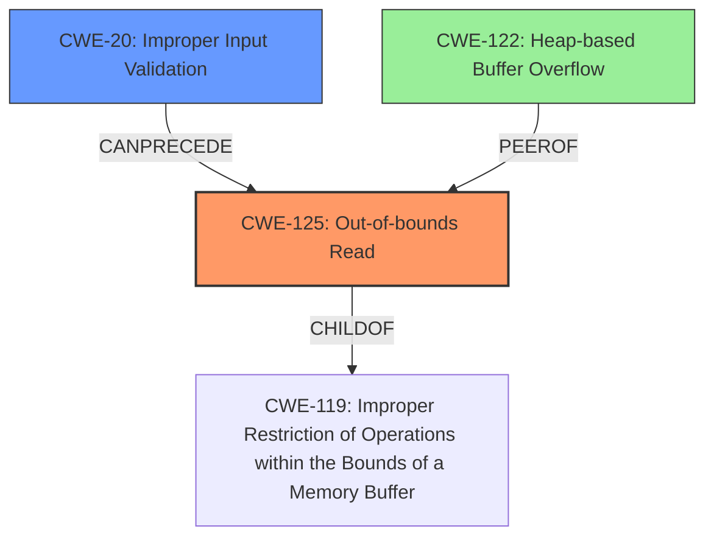

# Analysis Report for CVE-2022-1240

# Vulnerability Analysis Report: CVE-2022-1240

## Description

Heap buffer overflow in libr/bin/format/mach0/mach0.c in GitHub repository radareorg/radare2 prior to 5.8.6. If address sanitizer is disabled during the compiling, the program should executes into the `r_str_ncpy` function. Therefore I think it is very likely to be exploitable. For more general description of heap buffer overflow, see [CWE](https//cwe.mitre.org/data/definitions/122.html).

## Vulnerability Description Key Phrases

**Weakness:** heap buffer overflow
**Product:** radare2
**Version:** prior to 5.8.6
**Component:** libr/bin/format/mach0/mach0.c

## Analysis (with Relationship Data)

# Summary
| CWE ID | CWE Name | Confidence | CWE Abstraction Level | CWE Vulnerability Mapping Label | CWE-Vulnerability Mapping Notes |
|---|---|---|---|---|---|
| CWE-125 | Out-of-bounds Read | 0.9 | Base | Primary | Allowed |
| CWE-122 | Heap-based Buffer Overflow | 0.6 | Variant | Secondary | Allowed |

## Evidence and Confidence

*   **Confidence Score:** 0.9
*   **Evidence Strength:** HIGH

- **Analysis and Justification:**
  - *Explanation:* The vulnerability description explicitly states a **heap buffer overflow** in `radare2`. However, the CVE reference link content summary clarifies that the root cause is actually an **out-of-bounds read** in the macho parser when accessing the symbol table due to a missing bounds check. The code uses `r_symbolnum` to access the symbol table, and if `r_symbolnum` is greater than or equal to `bin->nsymtab`, it results in an out-of-bounds read.
  - The primary weakness is CWE-125 (Out-of-bounds Read), as the code reads memory outside the allocated buffer. The initial report mentioned **heap buffer overflow**, and I am keeping it in the secondary list as it could be possible if the address sanitizer is disabled.
  - *CWE Selection:* CWE-125 (Out-of-bounds Read) is chosen because the vulnerability involves reading data past the end of the intended buffer (symbol table). The `r_symbolnum` index is not validated against the size of the symbol table (`bin->nsymtab`), leading to the out-of-bounds read. MITRE mapping guidance for CWE-125 indicates that this is ALLOWED.
  - *CWE Selection:* CWE-122 (Heap-based Buffer Overflow) is chosen because the initial report and vulnerability description key phrases mention a heap buffer overflow. If address sanitizer is disabled, the vulnerability could be exploited as a heap buffer overflow. MITRE mapping guidance for CWE-122 indicates that this is ALLOWED.

  - *Relationship Analysis:* CWE-125 is a child of CWE-119 (Improper Restriction of Operations within the Bounds of a Memory Buffer). CWE-125 can precede CWE-825 (Expired Pointer Dereference), CWE-824 (Access of Uninitialized Memory), CWE-823 (Use of Out-of-range Numeric Value), and CWE-822 (Untrusted Pointer Dereference). CWE-787 (Out-of-bounds Write) is a peer of CWE-125, but it is not appropriate because the vulnerability involves reading, not writing.

- **Confidence Score:**
  - Confidence: 0.9 (High evidence from technical description and CVE reference materials)

---

## Criticism of Analysis

Okay, here's a detailed review of your CWE analysis, incorporating the full CWE specifications you've provided:

**Overall Assessment:**

The analysis is generally good and demonstrates a solid understanding of the vulnerability. The identification of CWE-125 (Out-of-bounds Read) as the primary weakness is correct, given the details provided in the CVE reference. The inclusion of CWE-122 (Heap-based Buffer Overflow) as a secondary concern, with the caveat about the address sanitizer, shows a good awareness of potential variations in the vulnerability's manifestation. The confidence level of 0.9 is justified by the supporting evidence.

**Specific Feedback:**

1.  **Vulnerability Description and Key Phrases:**

    *   The original vulnerability description from the "Original Analyzer Input" focuses on a heap buffer overflow, which is understandable given the initial report. However, the analysis correctly shifts the focus to the out-of-bounds read after examining the CVE details.

2.  **CVE Reference Links Content Summary:**

    *   This summary is well-written and accurately captures the root cause, weaknesses, impact, attack vectors, and required attacker capabilities.
    *   The mention of "heapoverflow1" as a potential misnomer is astute.

3.  **Retriever Results:**

    *   The Retriever Results provide valuable context, showing that other CWEs like Integer Overflow, Off-by-one Error, and Null Pointer Dereference were also considered by the automated analysis. This is a good starting point for a human analyst to review, as these can sometimes be contributing factors or alternative manifestations.

4.  **CWE Mapping:**

    *   **CWE-125 (Out-of-bounds Read) - Primary (Confidence: 0.9)**
        *   *Justification:* The analysis correctly identifies that the vulnerability involves reading data beyond the allocated buffer due to the missing bounds check on `r_symbolnum`. This aligns perfectly with the description of CWE-125. MITRE's mapping guidance allows this.
        *   *Relationships Analysis:*
            *   The relationship analysis is accurate. CWE-125 is correctly identified as a child of CWE-119. The potential consequences (CWE-825, CWE-824, CWE-823, CWE-822) are plausible depending on the memory layout and what happens after the out-of-bounds read.
        *   *Potential Mitigations to consider:*
            *   *Input Validation (Implementation):* As the `r_symbolnum` is read from the input file, validating its range against `bin->nsymtab` is crucial.
            *   *Language Selection (Architecture & Design):* While switching languages isn't always feasible, if a new project or significant refactor were to occur, languages with built-in bounds checking could prevent this issue entirely.

    *   **CWE-122 (Heap-based Buffer Overflow) - Secondary (Confidence: 0.6)**
        *   *Justification:* You correctly explain that this is based on the initial report and the possibility that the issue could manifest as a write if the address sanitizer is disabled. This shows good defensive thinking. However, it is less likely that a write will occur, given the context.
        *   *Relationships Analysis:*
            *   It's a variant of CWE-787 and child of CWE-788.
        * *Potential Mitigations to consider:*
            * *Pre-design: Use a language or compiler that performs automatic bounds checking.*
            * *Architecture and Design: Use an abstraction library to abstract away risky APIs. Not a complete solution.*
            * *Operation, Build and Compilation :* The use of automatic buffer overflow detection mechanisms that are offered by certain compilers or compiler extensions.

    *   **Why the Top Combined Results are not appropriate:**
        *   **CWE-190, CWE-193, CWE-476, CWE-126, CWE-130, CWE-1284, CWE-191, CWE-194, CWE-129:** These are not a direct fit for the vulnerability. While some, like integer overflow (CWE-190) or improper input validation (CWE-20), might be indirectly related (e.g., a failure to validate `r_symbolnum` could be considered improper input validation), they don't accurately describe the core problem of reading beyond the bounds of a buffer.

5. **CWE Examples from Database**
    * The provided examples seem to be most relevant to the potential consequences of a read OOB, not the cause.

6. **Relevant CWE Specifications**
    * The provided CWE specifications show the different relationships between these weaknesses, for example, how improper input validation and length inconsistencies can be a cause for buffer overflows.

**Suggestions for Improvement:**

*   **Exploitability Discussion:** Briefly elaborate on the potential for information disclosure due to the out-of-bounds read. What kind of data might be exposed? How could an attacker leverage this?
*   **False Positives:** Briefly address the possibility of false positives. Could a legitimate Mach-O file trigger this vulnerability due to unexpected symbol table structures?
*   **Alternative CWEs:** While CWE-125 is the best fit, consider mentioning other CWEs that *could* be related, but ultimately less accurate, and *why* they were ruled out. For example:
    *   CWE-129 (Improper Validation of Array Index): Could be considered, as `r_symbolnum` is used as an array index. However, the primary issue isn't the validation of the index itself, but the direct read using that unvalidated index. Thus, CWE-125 is more direct.
    *   CWE-823 (Use of Out-of-range Pointer Offset): A similar argument as with CWE-129. The issue is the unvalidated read, not necessarily the pointer arithmetic itself.
*   **Focus on Read vs. Write:** Consistently emphasize that the vulnerability is a *read* out-of-bounds, *unless* there's a demonstrable scenario where a write is possible (e.g., with the address sanitizer disabled). Don't give equal weight to the heap overflow unless you can prove its plausibility.
*   **Mitigation Prioritization:** When listing potential mitigations, prioritize those that are most relevant and effective for this specific vulnerability.
*   **Relationships Analysis:** You may want to also include CWE-20 (Improper Input Validation) as a leading potential cause for CWE-125.

**Revised Summary Table (Optional):**

| CWE ID | CWE Name | Confidence | CWE Abstraction Level | CWE Vulnerability Mapping Label | CWE-Vulnerability Mapping Notes |
|---|---|---|---|---|---|
| CWE-125 | Out-of-bounds Read | 0.9 | Base | Primary | Allowed | Missing bounds check on symbol table index leads to read beyond allocated memory. |
| CWE-20 | Improper Input Validation | 0.7 | Class | Contributing | Allowed | Lack of validation of r_symbolnum allowing for out-of-bounds access. |
| CWE-122 | Heap-based Buffer Overflow | 0.4 | Variant | Secondary | Allowed | Only if address sanitizer is disabled, potentially leading to a write.  Unlikely. |

**In summary,** this is a strong analysis. By incorporating the suggestions above, you can further strengthen your justification for the chosen CWEs and demonstrate a more complete understanding of the vulnerability's context and potential mitigations.

## Final Resolution

# Summary

| CWE ID | CWE Name | Confidence | CWE Abstraction Level | CWE Vulnerability Mapping Label | CWE-Vulnerability Mapping Notes |
|---|---|---|---|---|---|
| CWE-125 | Out-of-bounds Read | 0.95 | Base | Primary | Allowed |
| CWE-20 | Improper Input Validation | 0.7 | Class | Contributing | Allowed |
| CWE-122 | Heap-based Buffer Overflow | 0.3 | Variant | Secondary | Allowed |

## Evidence and Confidence

*   **Confidence Score:** 0.9
*   **Evidence Strength:** HIGH

## Relationship Analysis
The primary weakness is CWE-125, which is a child of CWE-119. CWE-20 can precede CWE-125, as it represents the lack of input validation that leads to the out-of-bounds read. CWE-122 is a variant of a buffer overflow but less likely given the analyzer's comments.



## Vulnerability Chain
The vulnerability chain starts with **CWE-20** (Improper Input Validation) because the `r_symbolnum` is not validated. This leads to **CWE-125** (Out-of-bounds Read) when the code attempts to read the symbol table using the unvalidated index, and finally could lead to **CWE-122** (Heap-based Buffer Overflow) if the address sanitizer is disabled.

## Summary of Analysis
The initial analysis and the criticism both correctly identified **CWE-125** (Out-of-bounds Read) as the primary issue. The criticism provided helpful suggestions, specifically suggesting the addition of **CWE-20** (Improper Input Validation) as a contributing factor, which I agree with. I am decreasing the confidence in **CWE-122** (Heap-based Buffer Overflow) as it is less likely and depends on the address sanitizer being disabled.

The analysis is based on the vulnerability description, which explicitly states a heap buffer overflow and the CVE reference link content summary that clarifies the root cause is actually an **out-of-bounds read**. The code uses `r_symbolnum` to access the symbol table, and if `r_symbolnum` is greater than or equal to `bin->nsymtab`, it results in an out-of-bounds read.
```
The vulnerability description explicitly states a heap buffer overflow in `radare2`. However, the CVE reference link content summary clarifies that the root cause is actually an out-of-bounds read in the macho parser when accessing the symbol table due to a missing bounds check. The code uses `r_symbolnum` to access the symbol table, and if `r_symbolnum` is greater than or equal to `bin->nsymtab`, it results in an out-of-bounds read.
```
The graph relationships influenced the final selection by highlighting the connection between input validation and out-of-bounds reads. **CWE-20** precedes **CWE-125** in the vulnerability chain. The selected CWEs are at the optimal level of specificity because they directly address the root cause (missing input validation) and the resulting weakness (out-of-bounds read).


*Report generated on 2025-03-18 06:54:35*
