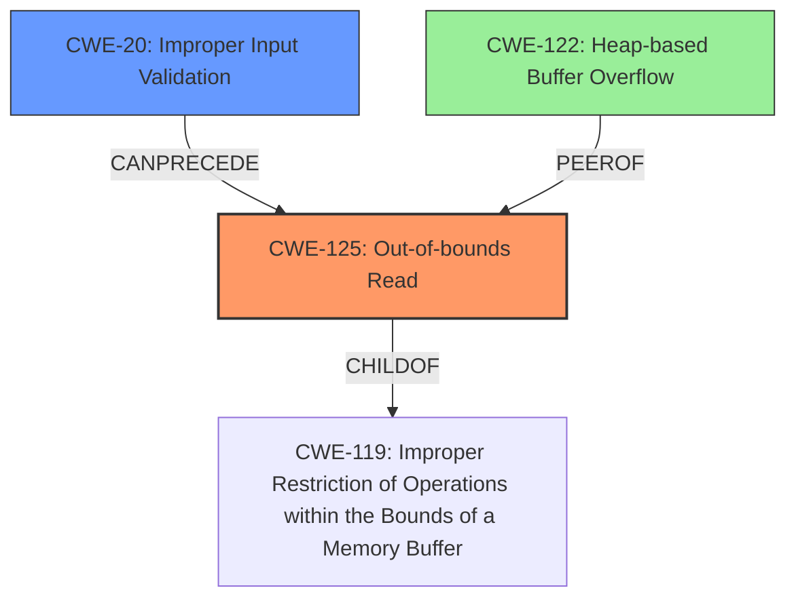

# Final Resolution for CVE-2022-1240

# Summary

| CWE ID | CWE Name | Confidence | CWE Abstraction Level | CWE Vulnerability Mapping Label | CWE-Vulnerability Mapping Notes |
|---|---|---|---|---|---|
| CWE-125 | Out-of-bounds Read | 0.95 | Base | Primary | Allowed |
| CWE-20 | Improper Input Validation | 0.7 | Class | Contributing | Allowed |
| CWE-122 | Heap-based Buffer Overflow | 0.3 | Variant | Secondary | Allowed |

## Evidence and Confidence

*   **Confidence Score:** 0.9
*   **Evidence Strength:** HIGH

## Relationship Analysis
The primary weakness is CWE-125, which is a child of CWE-119. CWE-20 can precede CWE-125, as it represents the lack of input validation that leads to the out-of-bounds read. CWE-122 is a variant of a buffer overflow but less likely given the analyzer's comments.



## Vulnerability Chain
The vulnerability chain starts with **CWE-20** (Improper Input Validation) because the `r_symbolnum` is not validated. This leads to **CWE-125** (Out-of-bounds Read) when the code attempts to read the symbol table using the unvalidated index, and finally could lead to **CWE-122** (Heap-based Buffer Overflow) if the address sanitizer is disabled.

## Summary of Analysis
The initial analysis and the criticism both correctly identified **CWE-125** (Out-of-bounds Read) as the primary issue. The criticism provided helpful suggestions, specifically suggesting the addition of **CWE-20** (Improper Input Validation) as a contributing factor, which I agree with. I am decreasing the confidence in **CWE-122** (Heap-based Buffer Overflow) as it is less likely and depends on the address sanitizer being disabled.

The analysis is based on the vulnerability description, which explicitly states a heap buffer overflow and the CVE reference link content summary that clarifies the root cause is actually an **out-of-bounds read**. The code uses `r_symbolnum` to access the symbol table, and if `r_symbolnum` is greater than or equal to `bin->nsymtab`, it results in an out-of-bounds read.
```
The vulnerability description explicitly states a heap buffer overflow in `radare2`. However, the CVE reference link content summary clarifies that the root cause is actually an out-of-bounds read in the macho parser when accessing the symbol table due to a missing bounds check. The code uses `r_symbolnum` to access the symbol table, and if `r_symbolnum` is greater than or equal to `bin->nsymtab`, it results in an out-of-bounds read.
```
The graph relationships influenced the final selection by highlighting the connection between input validation and out-of-bounds reads. **CWE-20** precedes **CWE-125** in the vulnerability chain. The selected CWEs are at the optimal level of specificity because they directly address the root cause (missing input validation) and the resulting weakness (out-of-bounds read).