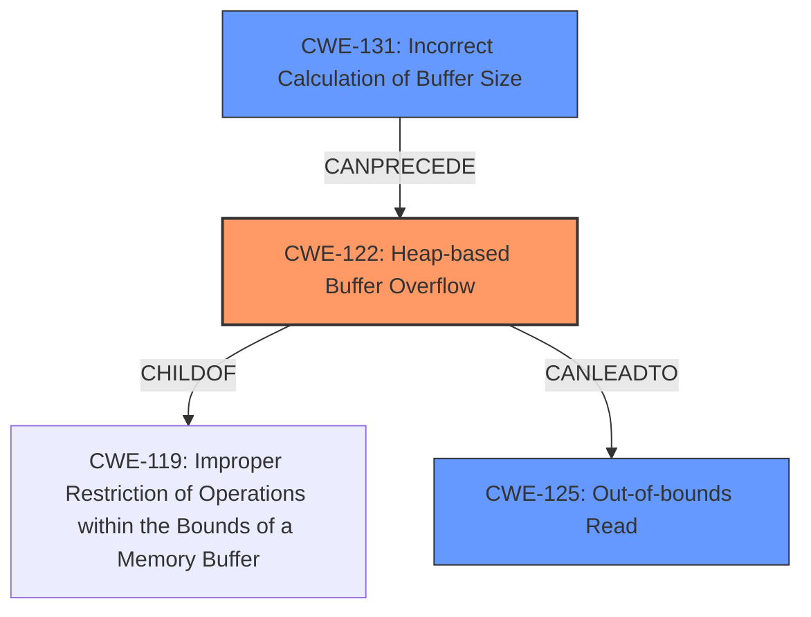

# Analysis Report for CVE-2022-1270

# Vulnerability Analysis Report: CVE-2022-1270

## Description

In GraphicsMagick, a heap buffer overflow was found when parsing MIFF.

## Vulnerability Description Key Phrases

**Weakness:** heap buffer overflow
**Product:** GraphicsMagick
**Component:** when parsing MIFF

## Analysis (with Relationship Data)

# Summary
| CWE ID | CWE Name | Confidence | CWE Abstraction Level | CWE Vulnerability Mapping Label | CWE-Vulnerability Mapping Notes |
|---|---|---|---|---|---|
| CWE-122 | Heap-based Buffer Overflow | 0.95 | Variant | Allowed | Primary CWE |
| CWE-125 | Out-of-bounds Read | 0.65 | Base | Allowed | Secondary Candidate |
| CWE-131 | Incorrect Calculation of Buffer Size | 0.60 | Base | Allowed | Secondary Candidate |

## Evidence and Confidence

*   **Confidence Score:** 0.90
*   **Evidence Strength:** HIGH

- **Analysis and Justification:**  
  - *Explanation:* The vulnerability description clearly states a "**heap buffer overflow**" occurs in GraphicsMagick when parsing MIFF files. The root cause is insufficient checks on the size of the input data during the `fread` operation within the `ReadBlob` function, leading to writing beyond the allocated memory buffer on the heap. This aligns precisely with CWE-122 (Heap-based Buffer Overflow), which is a variant of buffer overflow occurring on the heap. The "CVE Reference Links Content Summary" section confirms this by stating that the `ReadBlob` function attempts to read more data into a buffer than allocated.
  - *Relationship Analysis:* CWE-122 is a variant of buffer overflow and is related to other buffer overflow CWEs like CWE-119 (Improper Restriction of Operations within the Bounds of a Memory Buffer). It can lead to arbitrary code execution, as the overflow allows overwriting memory and hijacking control flow.

- **Confidence Score:**  
  - *Example:* Confidence: 0.95 (High evidence from technical description, vulnerability key phrases, and CVE reference materials)

---

- **Analysis and Justification:**  
  - *Explanation:* The "CVE Reference Links Content Summary" indicates that a malformed MIFF image file causes the `ReadBlob` function to read past the allocated buffer due to insufficient size validation. This suggests that the product reads data past the end of the intended buffer. While the primary issue is a heap buffer overflow (CWE-122), the **out-of-bounds read** is a contributing factor during the exploitation phase, potentially leaking sensitive information or causing a crash.
  - *Relationship Analysis:* CWE-125 is a base level CWE and is related to CWE-122 because the overflow condition may lead to reading data beyond the allocated buffer.

- **Confidence Score:**  
  - *Example:* Confidence: 0.65 (Supporting evidence from the root cause description, indicating that an out-of-bounds read is a factor.)

---

- **Analysis and Justification:**  
  - *Explanation:* The vulnerability summary mentions that the heap buffer overflow occurs because there are insufficient checks on the size of the input data, leading to a size that reads past the allocated buffer during the `fread` operation. This suggests that the buffer size might be incorrectly calculated during memory allocation. Therefore, CWE-131 (Incorrect Calculation of Buffer Size) could also be a contributing factor.
  - *Relationship Analysis:* CWE-131 is a base level CWE. It is related to CWE-122 because the incorrect buffer calculation leads to the heap buffer overflow.

- **Confidence Score:**  
  - *Example:* Confidence: 0.60 (Supporting evidence from the root cause description, indicating that an incorrect buffer size calculation contributes to the overflow.)

## Criticism of Analysis

Okay, let's review the CWE analysis provided, focusing on the accuracy, completeness, and justification of the CWE assignments, while using the full CWE specifications as a guide.

**Overall Assessment:**

The analysis is generally well-reasoned and provides good justification for the chosen CWEs. The primary CWE, CWE-122, is definitely the most accurate and well-supported. The secondary candidates, CWE-125 and CWE-131, are also relevant and justified, but the confidence levels appropriately reflect that they are contributing factors rather than the primary root cause. The use of confidence scores is a great practice.

**Detailed Review:**

*   **CWE-122: Heap-based Buffer Overflow (Confidence: 0.95)**

    *   **Abstraction Level:** Correctly identified as Variant.
    *   **Vulnerability Mapping Label:** Allowed - Correct
    *   **Justification:** The vulnerability description and CVE summary explicitly describe a heap buffer overflow. The root cause, involving insufficient size checks during `fread` within `ReadBlob`, directly leads to memory corruption on the heap.  The analysis correctly links this to overwriting memory and potential arbitrary code execution. The evidence strength is indeed high.
    *   **CWE Specification Alignment:** The analysis correctly utilizes the description of CWE-122, which specifies buffer overflows where the buffer is allocated in the heap (using `malloc` or similar functions). The provided observed examples show similar chains that end in CWE-122.
    *   **Mitigation Review:** Pre-design mitigations are good, but more immediate mitigation is to validate input size before the `fread` operation to ensure the data being read doesn't exceed the allocated buffer size.

*   **CWE-125: Out-of-bounds Read (Confidence: 0.65)**

    *   **Abstraction Level:** Correctly identified as Base.
    *   **Vulnerability Mapping Label:** Allowed - Correct
    *   **Justification:** The analysis correctly suggests that if the overflow happens and attempts to read past the end of the buffer, it might result in leakage of sensitive information and a crash.
    *   **CWE Specification Alignment:**  The analysis is sound. The description of CWE-125 aligns with the possibility of reading data beyond the intended buffer due to the overflow. Also, the examples provided include code that handles non-NULL terminated strings and thus lead to buffer over-read, which is similar to the issue at hand. Also, one of the observed examples shows CWE-125 being part of a chain that includes CWE-122.
    *   **Mitigation Review:** Mitigation 1 of CWE-125 involves assuming all input is malicious, which is a standard security principle. Also, using "accept known good" can be used for validating the data read from the MIFF file.

*   **CWE-131: Incorrect Calculation of Buffer Size (Confidence: 0.60)**

    *   **Abstraction Level:** Correctly identified as Base.
    *   **Vulnerability Mapping Label:** Allowed - Correct
    *   **Justification:** This is a plausible contributing factor. The analysis correctly links the insufficient size checks to potentially an incorrect buffer size calculation.
    *   **CWE Specification Alignment:** The analysis is valid. The description of CWE-131 is that "The product does not correctly calculate the size to be used when allocating a buffer, which could lead to a buffer overflow". The vulnerability description mentions that the software allocates memory for a buffer using data from the header and that the data may not be properly validated.
    *   **Mitigation Review:** Mitigation 3 suggests performing input validation on any numeric input by ensuring that it is within the expected range, which would be relevant here.

**Suggestions for Improvement:**

*   **CWE-193: Off-by-one Error:** If the incorrect buffer size calculation is often off by one, consider including CWE-193. It may be too specific but worth considering.
*    **CWE-120: Buffer Copy without Checking Size of Input ('Classic Buffer Overflow'):** This is a valid option if the `fread` operation can be considered a buffer copy. While the primary issue involves allocating an insufficient buffer size, if the `fread` function directly copies data without any size validation, it could be classified as a "classic" buffer overflow.

*   **Relationship Clarity:** While the relationships between the CWEs are mentioned, explicitly stating *how* they are related (e.g., "CWE-131 leads to CWE-122 because...") improves clarity. Using phrases like "contributing factor" is good, but elaborating further helps.

*   **Mitigation Specificity:** While the general mitigations are relevant, providing *specific* mitigations tailored to the MIFF parsing context would strengthen the analysis. For example, for CWE-131, suggest specifically validating the image width and height parameters from the MIFF header to prevent excessively large buffer allocations.

**Revised Analysis Snippets (Example):**

*   **CWE-125 Analysis Addition:** "Specifically, the `ReadBlob` function, after allocating what it believes is sufficient memory, reads from the MIFF file.  If the length specified in the file header is larger than the allocated buffer, `fread` will attempt to read past the buffer boundary, resulting in an out-of-bounds read. This read is a *consequence* of the overflow condition, potentially leading to information leakage before the program crashes."
*   **CWE-131 Mitigation Addition:** "To address CWE-131, the GraphicsMagick code *must* rigorously validate the image width, height, and other size-related parameters extracted from the MIFF header *before* allocating the buffer.  These values should be checked against reasonable limits to prevent excessively large allocations."

**In summary, the provided CWE analysis is well-done and demonstrates a solid understanding of the vulnerability and relevant CWEs. The suggestions above are mainly for enhancing the analysis with more detail and context-specific recommendations.**

## Final Resolution

# Summary
| CWE ID | CWE Name | Confidence | CWE Abstraction Level | CWE Vulnerability Mapping Label | CWE-Vulnerability Mapping Notes |
|---|---|---|---|---|---|
| CWE-122 | Heap-based Buffer Overflow | 0.95 | Variant | Allowed | Primary CWE |
| CWE-125 | Out-of-bounds Read | 0.65 | Base | Allowed | Secondary Candidate |
| CWE-131 | Incorrect Calculation of Buffer Size | 0.60 | Base | Allowed | Secondary Candidate |

## Evidence and Confidence

*   **Confidence Score:** 0.92
*   **Evidence Strength:** HIGH

## Relationship Analysis
The primary CWE, CWE-122 (**CWE-122: Heap-based Buffer Overflow**), is a variant of a buffer overflow, specifically occurring on the heap. It is related to the base class CWE-119 (**CWE-119: Improper Restriction of Operations within the Bounds of a Memory Buffer**). CWE-125 (**CWE-125: Out-of-bounds Read**) can result from the overflow described by CWE-122. CWE-131 (**CWE-131: Incorrect Calculation of Buffer Size**) can precede CWE-122 by causing an undersized buffer to be allocated on the heap, which is then overflowed. All CWEs are at acceptable levels of abstraction.

## Vulnerability Chain
The vulnerability chain starts with **CWE-131 (Incorrect Calculation of Buffer Size)**, where the buffer size for an image is incorrectly calculated based on header data from a malformed MIFF file. This leads to **CWE-122 (Heap-based Buffer Overflow)**, where the program attempts to write more data to the heap buffer than allocated. The overflow may then result in **CWE-125 (Out-of-bounds Read)** if the code attempts to access memory beyond the allocated buffer.

## Summary of Analysis
The initial analysis and criticism both align well, accurately identifying **CWE-122 (Heap-based Buffer Overflow)** as the primary weakness. The supporting CWEs, **CWE-125 (Out-of-bounds Read)** and **CWE-131 (Incorrect Calculation of Buffer Size)**, are also valid contributing factors. The evidence provided in the vulnerability description clearly points to a heap buffer overflow when parsing MIFF files: "In GraphicsMagick, a heap buffer overflow was found when parsing MIFF."

The relationship analysis confirms the hierarchical and chain relationships between the selected CWEs. **CWE-131 (Incorrect Calculation of Buffer Size)** can lead to **CWE-122 (Heap-based Buffer Overflow)**, which in turn can result in **CWE-125 (Out-of-bounds Read)**. These relationships support the classification decisions.

The chosen CWEs are at an appropriate level of specificity. **CWE-122 (Heap-based Buffer Overflow)** is a variant that accurately describes the type of buffer overflow. **CWE-125 (Out-of-bounds Read)** and **CWE-131 (Incorrect Calculation of Buffer Size)** are base-level CWEs that describe contributing factors to the vulnerability.

*Report generated on 2025-03-18 06:55:28*
