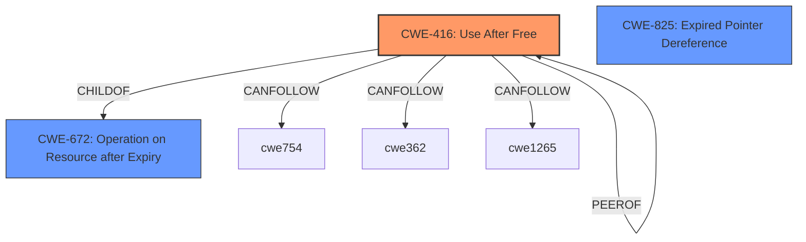

# Analysis Report for CVE-2022-1308

# Vulnerability Analysis Report: CVE-2022-1308

## Description

Use after free in BFCache in Google Chrome prior to 100.0.4896.88 allowed a remote attacker to potentially exploit heap corruption via a crafted HTML page.

## Vulnerability Description Key Phrases

**Rootcause:** use after free
**Impact:** heap corruption
**Vector:** crafted HTML page
**Attacker:** remote attacker
**Product:** Google Chrome
**Version:** prior to 100.0.4896.88
**Component:** BFCache

## Analysis (with Relationship Data)

# Summary
| CWE ID | CWE Name | Confidence | CWE Abstraction Level | CWE Vulnerability Mapping Label | CWE-Vulnerability Mapping Notes |
|---|---|---|---|---|---|
| CWE-416 | Use After Free | 1.0 | Variant | Primary | Allowed |

## Evidence and Confidence

*   **Confidence Score:** 1.0
*   **Evidence Strength:** HIGH

- **Analysis and Justification:**  
  - *Explanation:* The vulnerability description explicitly states "**use after free** in BFCache," which perfectly matches the definition of CWE-416, "Use After Free." The CVE Reference Links Content Summary confirms the "**root_cause**" as "Use after free in BFCache" and lists "**Use after free**" as a weakness. CWE-416 is a Variant-level CWE, offering the desired specificity. The MITRE mapping guidance designates its usage as "ALLOWED," solidifying its appropriateness. This vulnerability can lead to **heap corruption**, as stated in the vulnerability description.

  - *Relationship Analysis:* While CWE-416 doesn't have direct relationships listed in the provided information, it is a child of CWE-672 (Operation on Resource after Expiry) and related to CWE-825 (Expired Pointer Dereference). The "CanFollow" relationships of CWE-416 include CWE-754 (Improper Check for Unusual or Exceptional Conditions) and CWE-362 (Concurrent Execution using Shared Resource with Improper Synchronization ('Race Condition')), indicating potential scenarios that could lead to a use-after-free condition.

- **Confidence Score:**  
  - *Example:* Confidence: 1.0 (Direct match with vulnerability description and supporting evidence)

## Criticism of Analysis

## Review of CWE Mapping Analysis

Here's a review of the provided CWE mapping analysis, incorporating the full CWE specifications:

**Overall Assessment:**

The analysis correctly identifies CWE-416 (Use After Free) as the primary vulnerability. The evidence provided is strong and directly aligns with the vulnerability description. The confidence score of 1.0 is justified. The explanations are clear and well-supported.

**Detailed Review:**

| CWE ID | CWE Name | Confidence | CWE Abstraction Level | CWE Vulnerability Mapping Label | CWE-Vulnerability Mapping Notes | Assessment |
|---|---|---|---|---|---|---|
| CWE-416 | Use After Free | 1.0 | Variant | Primary | Allowed | **Correct**.  The vulnerability description explicitly mentions "use after free". The content summary also confirms this. Mapping guidance for CWE-416 specifies that it is at the preferred Variant level and is "Allowed" for usage. The explanation is strong and provides sufficient justification. |

**Justification for CWE-416 Mapping (Excellent):**

*   **Direct Match:** The "rootcause" and "weaknesses" sections of the CVE reference link content summary directly confirm "Use after free". The vulnerability description itself states "Use after free in BFCache."
*   **Variant Level:** Choosing the Variant level (CWE-416) provides the desired specificity compared to higher-level Class or Pillar CWEs.
*   **Allowed Usage:** The CWE specification's "Mapping Guidance" section explicitly allows CWE-416.
*   **Impact:**  The analysis correctly links the vulnerability to heap corruption, which is a potential consequence of a use-after-free.

**Other Considerations and Potential Improvements:**

1.  **CWE Relationships and Contextual Analysis:** While the primary CWE is accurate, the analysis could be slightly enhanced by discussing the *context* in which the UAF occurs within the BFCache.
    *   For example, BFCache is about caching web pages for faster back/forward navigation. A potential scenario for the UAF could involve the BFCache releasing memory associated with a page being cached, but a JavaScript timer or other asynchronous operation still holding a reference to that memory.
    *   Consider the "CanFollow" relationships of CWE-416, particularly `CWE-362: Concurrent Execution using Shared Resource with Improper Synchronization ('Race Condition')` and `CWE-754: Improper Check for Unusual or Exceptional Conditions`.  While not explicitly stated, the UAF might be triggered due to a race condition or a failure to properly handle an error condition when interacting with the cache.  However, it's critical to *avoid forcing* a mapping if there isn't solid evidence.  The current analysis is strong because it sticks to what *is* directly evident.

2.  **Mitigation Strategies:** The analysis could benefit from briefly mentioning potential mitigation strategies that are specific to the BFCache context.  Here are some examples based on the CWE-416 mitigations:
    *   **Language Selection (from CWE-416 mitigations):** While rewriting Chrome in a memory-safe language isn't feasible, this emphasizes the importance of using safer alternatives when *developing new features* within Chrome.
    *   **Setting Pointers to NULL (from CWE-416 mitigations):** This is a standard practice. The BFCache code should ensure that pointers are set to NULL immediately after the memory they point to is freed, *where feasible*. As the CWE specification mentions, "the utilization of multiple or complex data structures may lower the usefulness of this strategy." The more complex the data structure, the harder it is to ensure that all pointers are nulled out and that the pointer won't be reused after the resource is deallocated.
    *   **Smart Pointers/RAII:** Using smart pointers (e.g., `std::unique_ptr`, `std::shared_ptr` in C++) can help manage memory and prevent UAF vulnerabilities by automatically releasing memory when it's no longer needed. This requires using RAII and preventing raw pointer usage. This might be considered a form of architecture design.

3. **Retriever Results:**
    * While the primary focus remains on CWE-416 due to its explicit mention in the vulnerability description, let's examine the retriever results:
        * **CWE-843 (Access of Resource Using Incompatible Type ('Type Confusion'))** Base / Allowed: While Use-After-Free is the primary cause, it's worth considering if there is a type confusion aspect. For instance, if the freed memory is reallocated as a different type, accessing it with the original type could exacerbate the UAF. This is *possible*, but not explicitly stated in the vulnerability description, so it should *not* be included as the primary CWE.

**Summary Table Updates:**

The analysis and summary table do not need changes. The mapping to CWE-416 is correct and well-justified. Adding speculative or less evident CWEs would weaken the analysis.

**Conclusion:**

The provided analysis is excellent. The mapping to CWE-416 is accurate, well-supported by evidence, and appropriately specific. The suggestions for improvement are minor and aimed at providing a more complete contextual understanding of the vulnerability.

## Final Resolution

# Summary
| CWE ID | CWE Name | Confidence | CWE Abstraction Level | CWE Vulnerability Mapping Label | CWE-Vulnerability Mapping Notes |
|---|---|---|---|---|---|
| CWE-416 | Use After Free | 1.0 | Variant | Primary | Allowed |

## Evidence and Confidence

*   **Confidence Score:** 1.0
*   **Evidence Strength:** HIGH

## Relationship Analysis
The primary relationship considered was the explicit naming of the vulnerability as a Use-After-Free. While other CWEs might contribute to the circumstances leading to the **weakness**, **CWE-416** directly addresses the core issue. The variant level of abstraction is appropriate here, given the direct identification of the **weakness**.

## Vulnerability Chain
The vulnerability chain starts with the **root cause**, which is the **improper management of memory** within the BFCache. Specifically, memory is freed while still being referenced. This leads to **CWE-416 (Use After Free)**, where the dangling pointer is subsequently dereferenced, potentially causing **heap corruption** and leading to arbitrary code execution.

## Summary of Analysis
The initial analysis and the criticism both align in identifying **CWE-416 (Use After Free)** as the primary **weakness**. The vulnerability description explicitly mentions "use after free in BFCache," which provides strong evidence for this classification. The content summary of the CVE reference links further confirms the **root cause** as "Use after free in BFCache".

The graph relationships support this decision, as **CWE-416** is a Variant-level CWE, offering the desired specificity. The MITRE mapping guidance designates its usage as "ALLOWED," solidifying its appropriateness.

The other CWEs identified by the retriever (e.g., **CWE-843 (Access of Resource Using Incompatible Type ('Type Confusion'))**) are not explicitly mentioned in the vulnerability description. While they could potentially contribute to the vulnerability in certain scenarios, there is insufficient evidence to include them as primary or secondary CWEs.

Therefore, the final determination is to classify this vulnerability as **CWE-416 (Use After Free)**. This decision is based on the strong evidence provided in the vulnerability description and the CVE reference links, as well as the mapping guidance for **CWE-416**.

*Report generated on 2025-03-18 06:56:45*
