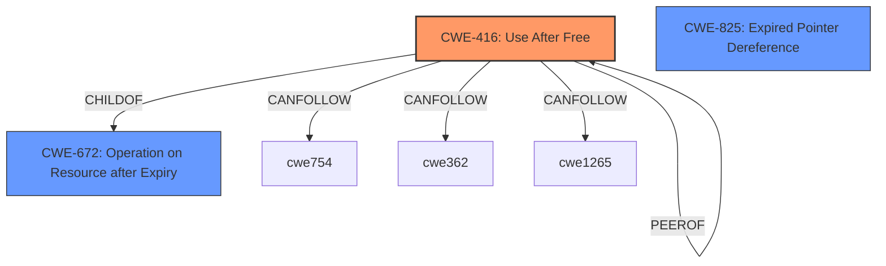

# Final Resolution for CVE-2022-1308

# Summary
| CWE ID | CWE Name | Confidence | CWE Abstraction Level | CWE Vulnerability Mapping Label | CWE-Vulnerability Mapping Notes |
|---|---|---|---|---|---|
| CWE-416 | Use After Free | 1.0 | Variant | Primary | Allowed |

## Evidence and Confidence

*   **Confidence Score:** 1.0
*   **Evidence Strength:** HIGH

## Relationship Analysis
The primary relationship considered was the explicit naming of the vulnerability as a Use-After-Free. While other CWEs might contribute to the circumstances leading to the **weakness**, **CWE-416** directly addresses the core issue. The variant level of abstraction is appropriate here, given the direct identification of the **weakness**.

## Vulnerability Chain
The vulnerability chain starts with the **root cause**, which is the **improper management of memory** within the BFCache. Specifically, memory is freed while still being referenced. This leads to **CWE-416 (Use After Free)**, where the dangling pointer is subsequently dereferenced, potentially causing **heap corruption** and leading to arbitrary code execution.

## Summary of Analysis
The initial analysis and the criticism both align in identifying **CWE-416 (Use After Free)** as the primary **weakness**. The vulnerability description explicitly mentions "use after free in BFCache," which provides strong evidence for this classification. The content summary of the CVE reference links further confirms the **root cause** as "Use after free in BFCache".

The graph relationships support this decision, as **CWE-416** is a Variant-level CWE, offering the desired specificity. The MITRE mapping guidance designates its usage as "ALLOWED," solidifying its appropriateness.

The other CWEs identified by the retriever (e.g., **CWE-843 (Access of Resource Using Incompatible Type ('Type Confusion'))**) are not explicitly mentioned in the vulnerability description. While they could potentially contribute to the vulnerability in certain scenarios, there is insufficient evidence to include them as primary or secondary CWEs.

Therefore, the final determination is to classify this vulnerability as **CWE-416 (Use After Free)**. This decision is based on the strong evidence provided in the vulnerability description and the CVE reference links, as well as the mapping guidance for **CWE-416**.