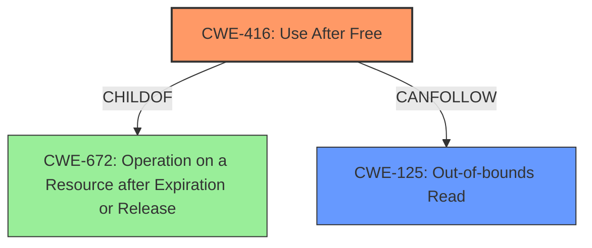

# Final Resolution for CVE-2022-1310

# Summary
| CWE ID | CWE Name | Confidence | CWE Abstraction Level | CWE Vulnerability Mapping Label | CWE-Vulnerability Mapping Notes |
|---|---|---|---|---|---|
| **CWE-416** | **Use After Free** | 0.95 | Variant | Allowed | Primary CWE |
| **CWE-125** | **Out-of-bounds Read** | 0.6 | Base | Allowed | Secondary Candidate |

## Evidence and Confidence

*   **Confidence Score:** 0.9
*   **Evidence Strength:** HIGH

## Relationship Analysis
The primary relationship impacting the decision is the hierarchical relationship where CWE-416 (Use After Free) is a variant of CWE-672 (Operation on a Resource after Expiration or Release). This confirms that CWE-416 is at an appropriate level of specificity. Additionally, the CanFollow relationship from CWE-416 to CWE-125 supports the secondary classification, indicating that a use-after-free can lead to an out-of-bounds read.

## Vulnerability Chain
The vulnerability chain starts with the **Use After Free** (**CWE-416**) in regular expressions within Google Chrome. This occurs when memory is accessed after it has been freed. The crafted HTML page serves as the input, potentially leading to heap corruption, which, in turn, can lead to an out-of-bounds read (**CWE-125**). The root cause is the improper handling of memory after it has been released.

## Summary of Analysis
The initial analysis and criticism both strongly support the primary classification of **CWE-416** (**Use After Free**). The vulnerability description explicitly states "**Use after free** in regular expressions," providing direct evidence. The CVE reference also confirms this. The secondary classification of **CWE-125** (**Out-of-bounds Read**) is considered because the exploitation of the UAF might result in reading memory outside the intended buffer, although this is less direct.

The graph relationships confirm that **CWE-416** is a specific type of resource management error (child of **CWE-672**), and it can potentially lead to **CWE-125**.

The decision to classify primarily as **CWE-416** is based on the direct evidence from the vulnerability description. The high confidence score (0.95) reflects this strong evidence. **CWE-125** is included as a secondary candidate because it represents a potential consequence of the **use after free**, but the confidence is lower (0.6) due to its less direct nature. Both CWEs are at appropriate levels of specificity, with **CWE-416** being a Variant and **CWE-125** being a Base CWE.