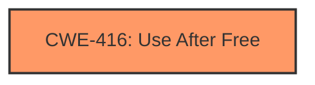

# Final Resolution for CVE-2022-1313

# Summary
| CWE ID | CWE Name | Confidence | CWE Abstraction Level | CWE Vulnerability Mapping Label | CWE-Vulnerability Mapping Notes |
|---|---|---|---|---|---|
| CWE-416 | Use After Free | 1.0 | Variant | Primary | Allowed |

## Evidence and Confidence

*   **Confidence Score:** 1.0
*   **Evidence Strength:** HIGH

## Relationship Analysis
The primary relationship considered was the direct match between the vulnerability description and the definition of **CWE-416: Use After Free**. While other CWEs such as **CWE-362: Concurrent Execution using Shared Resource with Improper Synchronization ('Race Condition')** and **CWE-415: Double Free** were considered due to their potential relationship to memory management issues, they were ultimately deemed not directly applicable based on the available evidence.

## Vulnerability Chain
The vulnerability chain starts with a crafted HTML page, which triggers a **use after free** condition in tab groups. This leads to heap corruption, potentially allowing a remote attacker to exploit the system. The chain is: Crafted HTML -> **CWE-416: Use After Free** -> Heap Corruption -> Remote Code Execution.

## Summary of Analysis
The initial analysis correctly identified **CWE-416: Use After Free** as the primary **weakness**. The criticism suggested explicitly discarding other potential CWEs and elaborating on mitigations. Based on the vulnerability description ("**use after free** in tab groups") and the CVE Reference Links Content Summary identifying "**Use after free**" as both the root cause and a **weakness**, **CWE-416** is the most appropriate classification. The other CWEs, while potentially related to memory management issues, lack direct evidence in the provided description. The analysis focuses on the explicit "**use after free**" condition, which is best represented by **CWE-416**, a Variant level CWE, offering the optimal level of specificity. The evidence is strong and directly supports the selection of **CWE-416**.