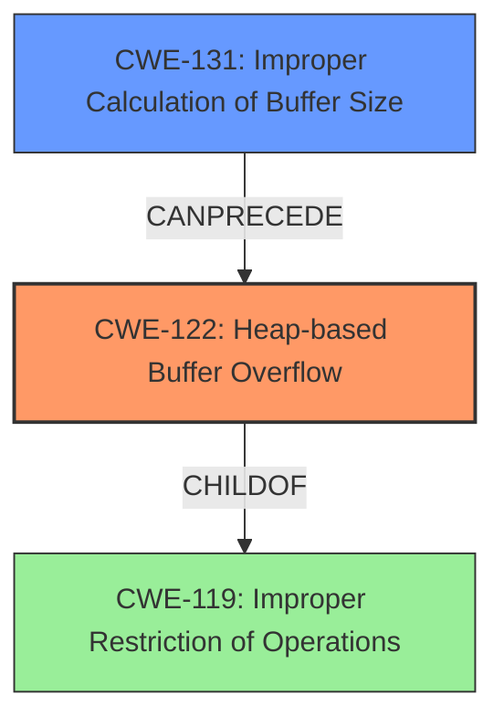

# Final Resolution for CVE-2022-1354

# Summary
| CWE ID | CWE Name | Confidence | CWE Abstraction Level | CWE Vulnerability Mapping Label | CWE-Vulnerability Mapping Notes |
|---|---|---|---|---|---|
| CWE-122 | CWE-122: Heap-based Buffer Overflow | 0.95 | Variant | Primary | Allowed. Vulnerability description explicitly states a heap buffer overflow in `TIFFReadRawDataStriped()`. Caused by writing beyond the allocated buffer in the heap. Mitigation: Use languages/compilers with bounds checking; safe string handling libraries; compiler-based overflow detection; input validation. |
| CWE-131 | CWE-131: Improper Calculation of Buffer Size | 0.75 | Base | Secondary | Allowed. It is likely the `TIFFReadRawDataStriped()` function miscalculates the buffer size to be allocated, which then leads to the heap buffer overflow. Mitigation: Validate quantity before allocating resources, perform range checks on input. |

## Evidence and Confidence

*   **Confidence Score:** 0.90
*   **Evidence Strength:** HIGH

## Relationship Analysis
The primary weakness is CWE-122 (**CWE-122: Heap-based Buffer Overflow**), a variant that is a child of the more general **CWE-119: Improper Restriction of Operations within the Bounds of a Memory Buffer**. The secondary weakness, **CWE-131: Improper Calculation of Buffer Size**, can precede the heap overflow, as an incorrect size calculation is a common cause for such overflows. The alternative CWEs, such as CWE-125, were considered but deemed less directly relevant given the explicit mention of a heap overflow. The base level of CWE-131 is appropriate as it describes the fundamental flaw in buffer size calculation.

## Vulnerability Chain
The vulnerability chain starts with **CWE-131: Improper Calculation of Buffer Size**, leading to **CWE-122: Heap-based Buffer Overflow**. The overflow then results in a crash and denial of service.

**CWE-131** (Root Cause) -> **CWE-122** (Weakness) -> Denial of Service (Impact)

## Summary of Analysis
Based on the vulnerability description and the criticism, the primary weakness is **CWE-122: Heap-based Buffer Overflow** because the vulnerability description explicitly states that a heap buffer overflow exists in Libtiffs `tiffinfo.c` within the `TIFFReadRawDataStriped()` function, "A heap buffer overflow flaw was found in Libtiffs tiffinfo.c in TIFFReadRawDataStriped() function."

The secondary weakness is **CWE-131: Improper Calculation of Buffer Size** because it is highly likely that the overflow happened because of an incorrect calculation of the buffer size. This is a common cause of buffer overflows and is a plausible scenario given the context.

The graph relationships reinforce the selection of CWE-122 as the primary issue, with CWE-131 contributing as a potential root cause. The abstraction levels are appropriate, with CWE-122 at the Variant level and CWE-131 at the Base level.
The decision is justified by the explicit mention of a heap buffer overflow and the likelihood of an incorrect size calculation leading to it. This reflects an optimal level of specificity.