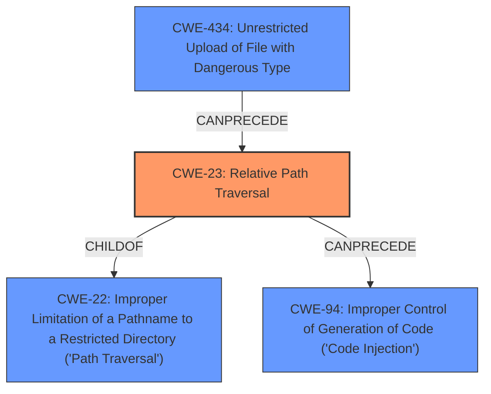

# Analysis Report for CVE-2022-1373

# Vulnerability Analysis Report: CVE-2022-1373

## Description

The restore configuration feature of Softing Secure Integration Server V1.22 is vulnerable to a directory traversal vulnerability when processing zip files. An attacker can craft a zip file to load an arbitrary dll and execute code. Using the restore configuration feature to upload a zip file containing a path traversal file may cause a file to be created and executed upon touching the disk.

## Vulnerability Description Key Phrases

**Rootcause:** improper input sanitization
**Weakness:** directory traversal
**Impact:** arbitrary dll loading and code execution
**Vector:** crafted zip file
**Attacker:** attacker
**Product:** Softing Secure Integration Server
**Version:** V1.22
**Component:** restore configuration feature

## Analysis (with Relationship Data)

# Summary
| CWE ID | CWE Name | Confidence | CWE Abstraction Level | CWE Vulnerability Mapping Label | CWE-Vulnerability Mapping Notes |
|---|---|---|---|---|---|
| CWE-23 | Relative Path Traversal | 0.95 | Base | Allowed | Primary CWE |
| CWE-94 | Improper Control of Generation of Code ('Code Injection') | 0.75 | Base | Allowed-with-Review | Secondary Candidate |
| CWE-434 | Unrestricted Upload of File with Dangerous Type | 0.70 | Base | Allowed | Secondary Candidate |

## Evidence and Confidence

*   **Confidence Score:** 0.90
*   **Evidence Strength:** HIGH

- **Analysis and Justification:**
  - *Explanation:* The vulnerability description clearly states a **directory traversal** issue when processing zip files via the "restore configuration" feature. The CVE Reference Links Content Summary explicitly mentions "Relative Path Traversal (CWE-23 [Relative Path Traversal])" and states that the application does not properly validate file paths within the uploaded zip file, allowing an attacker to specify arbitrary file paths. This aligns directly with the definition of CWE-23 [Relative Path Traversal], which describes the **improper neutralization** of special elements that can resolve to locations outside the restricted directory. The ability to load an arbitrary DLL and execute code, as a result of the **directory traversal**, is considered the impact.

  - *Relationship Analysis:* CWE-23 [Relative Path Traversal] is a Base level CWE which is the preferred level of abstraction. It is related to CWE-22 [Improper Limitation of a Pathname to a Restricted Directory ('Path Traversal')], which is a more general case of Path Traversal. The description provides sufficient detail to select CWE-23 [Relative Path Traversal] as it describes the specific case of relative path traversal.

- **Confidence Score:**
  - Confidence: 0.95 (High confidence due to direct mention of Relative Path Traversal and clear description of the vulnerability mechanism).

---

- **Analysis and Justification:**
  - *Explanation:* The vulnerability allows an attacker to craft a zip file to load an arbitrary DLL and execute code. This arises from the directory traversal issue. While the root cause is the path traversal, the ability to execute code suggests a potential for **code injection** due to the ability to load arbitrary DLLs. Given that the vulnerability allows for the uploading of a crafted zip file that results in code execution, CWE-94 [Improper Control of Generation of Code ('Code Injection')] is a possible secondary CWE. This is further supported because the vulnerability's impact is code execution via DLL loading. However, it is a secondary impact as the **directory traversal** is the main weakness that enables this. MITRE's guidance marks CWE-94 [Improper Control of Generation of Code ('Code Injection')] as ALLOWED-WITH-REVIEW, as it is frequently misused for code execution without identifying a root cause. In this case, the root cause is path traversal, but the resulting code execution is a significant impact.

  - *Relationship Analysis:* CWE-94 [Improper Control of Generation of Code ('Code Injection')] is related to CWE-74 [Improper Neutralization of Special Elements] as it is a child of it.

- **Confidence Score:**
  - Confidence: 0.75 (Medium-High confidence. The code execution is a definite impact, but it is enabled by the path traversal vulnerability.)

---

- **Analysis and Justification:**
  - *Explanation:* The description mentions that an attacker can upload a crafted zip file. This is related to CWE-434 [Unrestricted Upload of File with Dangerous Type] because it is related to uploading files with dangerous types. However, the primary issue is the **directory traversal**, not the unrestricted file upload itself, which is why it is a secondary issue.

  - *Relationship Analysis:* CWE-434 [Unrestricted Upload of File with Dangerous Type] is related to CWE-669.

- **Confidence Score:**
  - Confidence: 0.70 (Medium Confidence, the unrestricted upload plays a role, but it is secondary to the traversal)

## Criticism of Analysis

Okay, let's review the CWE analysis provided, focusing on accuracy, completeness, and adherence to CWE guidelines.

**Overall Assessment:**

The analysis is generally good, demonstrating a solid understanding of CWE concepts. The primary CWE (CWE-23) is well-justified, and the secondary CWEs are reasonable considerations. The confidence scores are appropriate. The detailed analysis and justification for each CWE show a clear thought process.

**Detailed Review:**

**1. CWE-23: Relative Path Traversal (Primary CWE)**

*   **Confidence:** 0.95 (High)
*   **Assessment:** Excellent.
*   **Justification:** The analysis correctly identifies the root cause as the improper neutralization of path traversal sequences in filenames within the uploaded ZIP file.  The vulnerability allows an attacker to write files outside the intended directory. The evidence cited from the CVE Reference Links directly supports this. The analysis correctly identifies CWE-23 as a base-level CWE and acknowledges the relationship to the more general CWE-22. The mention of "Zip Slip" as an alternative term is helpful.
*   **Mapping Guidance Adherence:** Correctly follows the "Allowed" usage for CWE-23.
*   **Potential Mitigations:** The mitigations listed in the CWE specification are relevant and appropriate. Input validation, especially using allowlists and canonicalization, is key to preventing this vulnerability.
*   **Minor Suggestion:** Consider also mentioning the mitigation strategy of extracting the zip file contents to a temporary directory outside of the intended root directory, performing all validations, and *then* moving the validated files to their final destination. This can add another layer of safety.

**2. CWE-94: Improper Control of Generation of Code ('Code Injection') (Secondary CWE)**

*   **Confidence:** 0.75 (Medium-High)
*   **Assessment:** Good, but requires careful consideration.
*   **Justification:**  The analysis correctly points out that the ability to load and execute arbitrary DLLs stems from the path traversal. Code execution is a *significant impact* of the vulnerability, but the core *weakness* is the path traversal. The analysis also highlights the nuances of CWE-94 being ALLOWED-WITH-REVIEW.  The analysis also correctly identified CWE-74 [Improper Neutralization of Special Elements] as a parent of it.
*   **Mapping Guidance Adherence:** Correctly notes the "Allowed-with-Review" usage and explains the rationale. This shows an understanding of the potential for misapplication of CWE-94.
*   **Potential Mitigations:** The listed mitigations are appropriate: refactoring to avoid dynamic code generation, sandboxing, and stringent input validation.
*   **Suggestion:** Emphasize that this CWE should only be considered because the *direct impact* is arbitrary code execution via DLL loading. The underlying weakness enabling it is still path traversal.  It's a subtle but important distinction. Ensure the report emphasizes path traversal as the primary weakness and code execution as a high-severity impact.

**3. CWE-434: Unrestricted Upload of File with Dangerous Type (Secondary CWE)**

*   **Confidence:** 0.70 (Medium)
*   **Assessment:** Reasonable, but weakest of the three.
*   **Justification:** The reasoning is that the attacker uploads a crafted zip file, which can be considered a dangerous type in this context. However, the core problem is not that *any* dangerous file is uploaded, but that the *contents* of the ZIP file can specify where those files are extracted (leading to path traversal). MITRE even lists CWE-23 [Relative Path Traversal] as a common cause of exploitation of this weakness. Because of that, it is a reasonable but weaker secondary candidate.
*   **Mapping Guidance Adherence:** Correctly follows the "Allowed" usage.
*   **Potential Mitigations:** The listed mitigations are appropriate (generate unique filenames, restrict file types, store files outside the web root).
*   **Suggestion:** Emphasize that this CWE is *only* relevant because of the interplay with the path traversal. If the application only extracted files to a fixed, safe directory, then simply uploading a DLL wouldn't be a vulnerability. It's the *combination* that makes it dangerous. Also, consider noting that even if the application *did* validate the archive content, the path traversal weakness would still exist. You could upload a zip containing only safe filetypes but still be able to write it to arbitrary locations.

**General Comments & Improvements:**

1.  **Clarity on Chaining/Relationships:** While the analysis mentions relationships between CWEs (parent/child), consider explicitly stating how these CWEs *chain* together in the specific vulnerability. For example: "The application's failure to properly neutralize path traversal sequences (CWE-23) allows attackers to write arbitrary files, including DLLs, to the system, leading to the potential for code execution (CWE-94)."

2.  **Emphasis on "Control Sphere" (CWE-668):** For CWE-434, briefly explain how it relates to CWE-668, "Exposure of Resource to Wrong Sphere". The unrestricted file upload allows a resource (the DLL) to be placed into a sphere (a directory where it can be executed) that the attacker controls, thus violating the intended control sphere. Even though it isn't a primary CWE, this link helps to understand the underlying principles.

3.  **Exploitability:** While implicitly covered, it would be helpful to briefly discuss the exploitability of the vulnerability. For example, how likely is it that an attacker can successfully craft a malicious ZIP file? What are the common techniques used to bypass path traversal defenses?

4.  **Defense in Depth:** In the mitigations section, consider recommending a defense-in-depth approach. For example: "Implement robust input validation (CWE-20) to prevent path traversal (CWE-23).  Additionally, run the application with the least privileges necessary and consider using a sandbox environment (CWE-243) to limit the impact of a successful attack."

**Revised Summary Table (incorporating suggestions):**

| CWE ID | CWE Name | Confidence | CWE Abstraction Level | CWE Vulnerability Mapping Label | CWE-Vulnerability Mapping Notes |
|---|---|---|---|---|---|
| CWE-23 | Relative Path Traversal | 0.95 | Base | Allowed | Primary CWE. Improper neutralization of path traversal sequences allows writing files outside the intended directory. |
| CWE-94 | Improper Control of Generation of Code ('Code Injection') | 0.75 | Base | Allowed-with-Review | Secondary Candidate. The *impact* of the path traversal is arbitrary code execution via DLL loading. Use with caution; path traversal is root cause. |
| CWE-434 | Unrestricted Upload of File with Dangerous Type | 0.70 | Base | Allowed | Secondary Candidate. The ability to upload a ZIP file contributes to the exploit, but the primary vulnerability is path traversal. Relates to CWE-668, as it places resources (DLLs) into an unintended control sphere. |

By addressing these suggestions, the analysis can be further strengthened and provide a more comprehensive understanding of the vulnerability.

## Final Resolution

# Summary
| CWE ID | CWE Name | Confidence | CWE Abstraction Level | CWE Vulnerability Mapping Label | CWE-Vulnerability Mapping Notes |
|---|---|---|---|---|---|
| **CWE-23** | **Relative Path Traversal** | 0.95 | Base | Allowed | Primary CWE. Improper neutralization of path traversal sequences allows writing files outside the intended directory. |
| CWE-94 | Improper Control of Generation of Code ('Code Injection') | 0.75 | Base | Allowed-with-Review | Secondary Candidate. The *impact* of the path traversal is arbitrary code execution via DLL loading. Use with caution; path traversal is root cause. |
| CWE-434 | Unrestricted Upload of File with Dangerous Type | 0.70 | Base | Allowed | Secondary Candidate. The ability to upload a ZIP file contributes to the exploit, but the primary vulnerability is path traversal. Relates to CWE-668, as it places resources (DLLs) into an unintended control sphere. |

## Evidence and Confidence

*   **Confidence Score:** 0.95
*   **Evidence Strength:** HIGH

## Relationship Analysis
The primary weakness is **CWE-23** [Relative Path Traversal], which is a base CWE. It has a parent **CWE-22** [Improper Limitation of a Pathname to a Restricted Directory ('Path Traversal')]. The attack involves uploading a zip file, which is related to **CWE-434** [Unrestricted Upload of File with Dangerous Type]. The path traversal allows the attacker to write a DLL to disk and execute it, which is code injection and is represented by **CWE-94** [Improper Control of Generation of Code ('Code Injection')].

## Vulnerability Chain
The vulnerability chain begins with the unrestricted upload of a zip file (**CWE-434** [Unrestricted Upload of File with Dangerous Type]). The application fails to properly neutralize path traversal sequences within the zip file (**CWE-23** [Relative Path Traversal]). This allows an attacker to write a malicious DLL to an arbitrary location on the file system. When the application accesses or executes this DLL, it results in arbitrary code execution (**CWE-94** [Improper Control of Generation of Code ('Code Injection')]). The root cause is the path traversal, and the impact is code execution.

## Summary of Analysis
The initial analysis and criticism both agree that **CWE-23** [Relative Path Traversal] is the primary weakness. The vulnerability description explicitly mentions a "directory traversal vulnerability" and that an attacker can "craft a zip file to load an arbitrary dll and execute code." The evidence clearly points to the improper handling of file paths within the uploaded zip file, which is a hallmark of **CWE-23** [Relative Path Traversal].

**CWE-94** [Improper Control of Generation of Code ('Code Injection')] is a secondary candidate because the path traversal leads to code execution. However, the root cause is the path traversal itself. **CWE-434** [Unrestricted Upload of File with Dangerous Type] is also a secondary candidate because the vulnerability involves uploading a zip file. However, the key issue is not the unrestricted upload itself, but rather the improper handling of file paths within the zip file.

The graph relationships confirm that **CWE-23** [Relative Path Traversal] is the most specific and appropriate classification. It is a base CWE, which is the preferred level of abstraction. The relationships also show that **CWE-23** [Relative Path Traversal] can lead to **CWE-94** [Improper Control of Generation of Code ('Code Injection')] and is facilitated by **CWE-434** [Unrestricted Upload of File with Dangerous Type]. I agree with the initial analysis and the suggestions in the criticism. The selected CWEs are at the optimal level of specificity based on the available evidence.

*Report generated on 2025-03-17 03:16:02*
